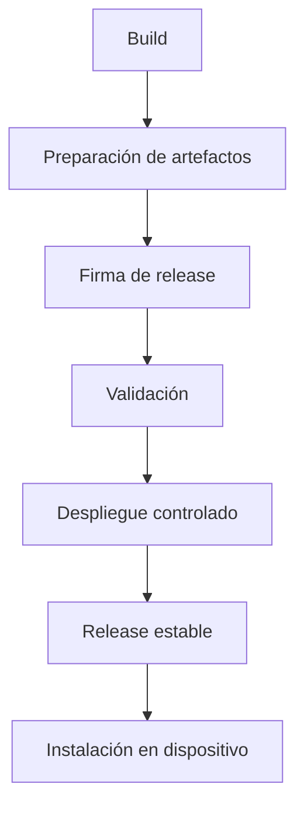

Arquitectura OTA define cómo Enigm OS entrega software confiable a dispositivos elegibles mediante releases controladas.

## Resumen

OTA existe para entregar actualizaciones auténticas e íntegras a dispositivos autorizados. No todos los dispositivos deben recibir cada release automáticamente.

## Objetivos de diseño

- Entrega segura de software.
- Autenticidad de release.
- Integridad de artefactos.
- Elegibilidad de dispositivo.
- Despliegues controlados.
- Verificación del cliente antes de instalar.

## Ciclo de vida de la versión

Etapas conceptuales:

1. Creación de build.
2. Preparación de artefactos.
3. Creación de manifiesto.
4. Firma de release.
5. Registro de release.
6. Validación.
7. Despliegue controlado.
8. Release estable.
9. Instalación en dispositivo.

## Elegibilidad del dispositivo

La elegibilidad puede depender de identidad de dispositivo, integridad, enrolamiento, canal de release, política de rollout y Remote Attestation.

## Verificación del cliente

El cliente OTA no debe confiar ciegamente en disponibilidad de actualización. Debe verificar autenticidad, integridad, compatibilidad, política y restricciones de rollback antes de instalar.

## Despliegues controlados

La plataforma soporta modelos como borrador, validación, despliegue limitado, despliegue estable y despliegue de seguridad.

## Relación con la confianza

Trust Security Center evalúa integridad local. OTA evalúa elegibilidad y entrega de software. Son sistemas relacionados pero distintos.

Consulta [Seguridad OTA](/es/os/ota-security) y [Limitaciones de plataforma](/es/legal/limitations).
