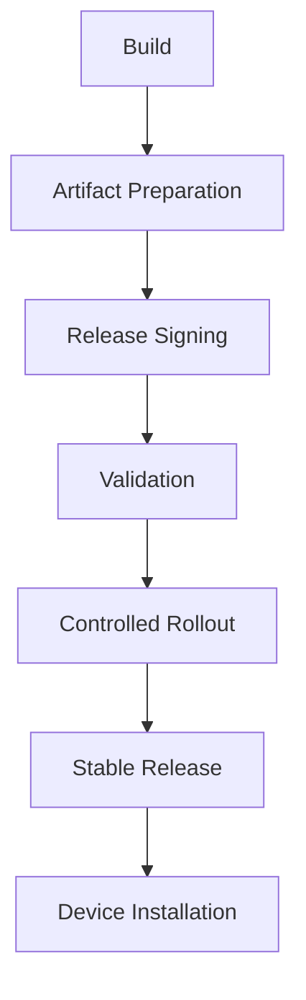

OTA Architecture define cómo Enigm OS entrega software confiable a dispositivos elegibles mediante releases controladas.

## Overview

OTA existe para entregar actúalizaciones autenticas e integras a dispositivos autorizados. No todos los dispositivos deben recibir cada release automaticamente.

## Design Objectives

- Entrega segura de software.
- Autenticidad de release.
- Integridad de artifacts.
- Elegibilidad de dispositivo.
- Rollouts controlados.
- Verificacion cliente antes de instalar.

## Release Lifecycle

Etapas conceptuales:

1. Build creation.
2. Artifact preparation.
3. Manifest creation.
4. Release signing.
5. Release registration.
6. Validation.
7. Controlled rollout.
8. Stable release.
9. Device installation.

## Device Eligibility

La elegibilidad puede depender de identidad de dispositivo, integridad, enrolamiento, canal de release, política de rollout y Remote Attestation.

## Client Verification

El cliente OTA no debe confiar ciegamente en disponibilidad de update. Debe verificar autenticidad, integridad, compatibilidad, política y rollback constraints antes de instalar.

## Controlled Rollouts

La plataforma soporta modelos cómo draft, validation, límited rollout, stable rollout y security rollout.

## Relationship With Trust

Trust Security Center evalua integridad local. OTA evalua elegibilidad y entrega de software. Son sistemas relaciónados pero distintos.

Consulta [OTA Security](/es/os/ota-security) y [Platform Limitations](/es/legal/limitations).
