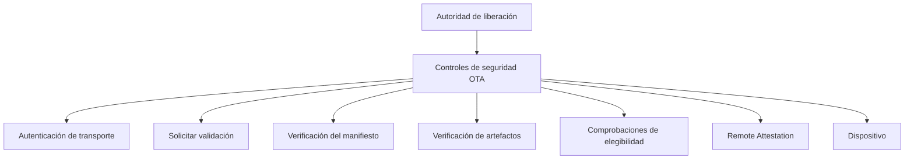
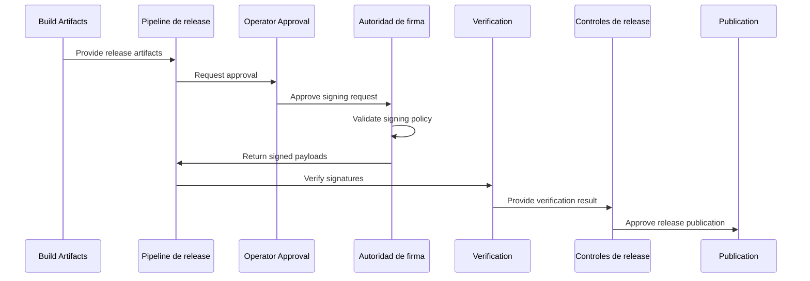
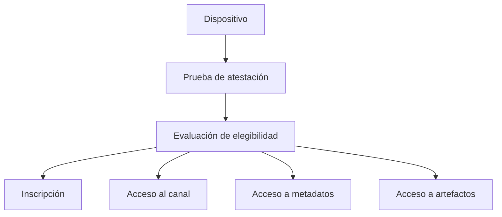

Enigm OS La seguridad OTA es una arquitectura de defensa en capas. Se basa en múltiples controles independientes en la autenticación de transporte, la validación de solicitudes, la confianza del manifiesto, la verificación de artefactos, la elegibilidad del dispositivo, Remote Attestation y Hardware-Backed Signing.

Esta página consolida el modelo de seguridad OTA, la arquitectura de firma y el modelo Remote Attestation.

## Resumen

La seguridad OTA reduce el riesgo de entrega de software al separar la autoridad de lanzamiento, el manejo de solicitudes, la confianza de los metadatos, la integridad de los artefactos, la elegibilidad del dispositivo y la verificación del lado del dispositivo.

El diagrama describe las responsabilidades de seguridad en lugar de la topología de implementación.

## Objetivos de seguridad

La seguridad OTA está diseñada para admitir:

- Autenticidad de release.
- Liberación de integridad.
- Elegibilidad del dispositivo.
- Solicitar autenticación.
- Resistencia a la repetición.
- Gobernanza del despliegue.
- Reducción de riesgos en la cadena de suministro de software.
- Correlación de dispositivos que preservan la privacidad.
- Verificación independiente antes de la instalación.

## Modelo de defensa en profundidad

La seguridad de OTA se basa en múltiples controles independientes. Ningún control aislado debe considerarse suficiente.

### Capa 1: Autenticación de transporte

La autenticación de transporte protege los canales de comunicación y reduce el riesgo de manipulación de la red.

Esta capa respalda:

- Transporte autenticado.
- Protected canales de comunicación.
- Solicitar autenticación.

La autenticación de transporte por sí sola no es suficiente para establecer la confianza en la liberación.

### Capa 2: Verificación de solicitud

La verificación de solicitudes garantiza que las solicitudes OTA se validen antes de que se devuelva la información de publicación.

Esta capa respalda:

- Solicitud de validación.
- Validación de frescura.
- Resistencia a la repetición.
- Solicitar integridad.

La verificación de la solicitud se evalúa con Device Trust, Elegibilidad de OTA y Remote Attestation cuando se requiere evidencia de integridad del dispositivo.

### Capa 3: Confianza del manifiesto

La confianza del manifiesto protege los metadatos de la versión.

Esta capa respalda:

- Metadatos de lanzamiento firmados.
- Autenticidad de release.
- Autorización de liberación.

La verificación de manifiesto no reemplaza la verificación de artefactos.

### Capa 4: Verificación de artefactos

La verificación de artefactos protege la carga útil de la actualización.

Esta capa respalda:

- Verificación de hash.
- Validación de integridad.
- Detección de corrupción.

La integridad de los artefactos reduce el riesgo de contenido de actualización dañado o modificado. No reemplaza la firma de producción ni la elegibilidad del dispositivo.

### Capa 5: Elegibilidad del dispositivo

La elegibilidad del dispositivo determina si un dispositivo debe recibir una versión determinada.

Esta capa respalda:

- Estado de inscripción.
- Device Trust.
- Elegibilidad del canal.
- Política de despliegue.

La elegibilidad del dispositivo es independiente de la verificación de artefactos.

### Capa 6: Remote Attestation

Remote Attestation es una señal de elegibilidad adicional.

Esta capa respalda:

- Validación de integridad del dispositivo.
- Verificación de inscripción.
- Protected decisiones de acceso a metadatos.
- Decisiones de acceso a artefactos privados.
- Decisiones sensibles del canal de implementación.

Remote Attestation complementa los controles OTA; no hace que los metadatos sin firmar, los artefactos sin firmar, la autenticación de transporte débil o la política de despliegue no controlado sean aceptables.

### Capa 7: Firma de producción

La firma de producción establece un origen de lanzamiento confiable.

Esta capa respalda:

- Autorización de liberación.
- Hardware-Backed Signing.
- Origen de lanzamiento confiable.

La firma de producción es un control de autenticidad de la versión. La entrega OTA no reemplaza la firma y los dispositivos solo deben tratar las versiones como de confianza cuando la verificación requerida tiene éxito.

## Autoridades firmantes

Enigm OS separa las autoridades firmantes por propósito.

### Autoridad actual: Autoridad de firma del manifiesto OTA

La Autoridad de firma de manifiestos OTA autoriza los manifiestos OTA y publica metadatos.

Esta autoridad es responsable de:

- Autorización del manifiesto.
- Autorización de metadatos.
- Autenticidad de release de los metadatos.
- Evidencia de aprobación de metadatos de release OTA.

Esta autoridad no es la misma que la autoridad de firma de la versión de producción de destino.

### Autoridad objetivo: Autoridad de firma de release de producción

La Autoridad de firma de lanzamientos de producción es la autoridad de destino para la firma de artefactos de lanzamiento y imágenes de producción.

Esta autoridad está destinada a ser responsable de:

- Firma de imagen de producción.
- Firma de carga útil OTA.
- Artefactos de lanzamiento críticos para la firma.
- Autorización de salida a producción.

Esta autoridad está destinada a operar a través de un HSM físico dedicado y debe permanecer distinta de la Autoridad de firma del manifiesto OTA.

## Modelo de firma de manifiesto OTA de producción actual

El modelo OTA Enigm OS actual utiliza la firma de manifiesto fuera de línea de clave de seguridad de hardware respaldada por PIV.

Este modelo proporciona:

- Firma fuera de línea respaldada por hardware.
- Participación del operador físico.
- Material clave no exportable.
- Autorización de manifiestos y metadatos.
- Separación de los flujos de trabajo de firma de comunicados.

El modelo actual autoriza manifiestos y metadatos OTA. Proporciona autenticidad de lanzamiento para la capa de manifiesto, no autoridad de firma de imágenes de producción completa.

### Material de firma protegido

La clave de firma del manifiesto no debe almacenarse en repositorios de Git, variables CI/CD, scripts de compilación, estaciones de trabajo de desarrolladores, almacenamiento de objetos en línea ni artefactos de lanzamiento.

La autoridad de firma sigue estando respaldada por hardware y mediada por el operador. Los sistemas que preparan manifiestos pueden solicitar la firma, pero no deben obtener acceso a material de clave privada.

## Arquitectura objetivo HSM de firma de release

La arquitectura de firma de release de producción Enigm OS de destino está diseñada para utilizar un HSM físico dedicado.

La arquitectura de destino está diseñada para respaldar:

- Claves de producción no exportables.
- Autorización de liberación.
- Firma de imagen de producción.
- Firma de carga útil OTA.
- Artefactos de lanzamiento críticos para la firma.

Las capacidades de gobernanza de producción previstas incluyen:

- Doble mando.
- Aprobación pluripartidista.
- Registros de auditoría.
- Ceremonias claves.
- Procedimientos de copia de seguridad seguros.
- Gobernanza de liberación.

La autoridad de firma de release de producción de destino no es la misma autoridad que la autoridad de firma de manifiesto OTA actual. La autoridad de destino está destinada a actuar como raíz de confianza de la autorización de release para los artefactos de producción.

## Límite de confianza de firma de producción

La firma de producción tiene un límite de confianza claro.

### Dentro del límite de confianza

- Físico HSM.
- Claves privadas no exportables.
- Políticas de firma aprobadas.
- Operadores autenticados.
- Registros de auditoría.
- Ceremonias claves.

### Fuera del límite de confianza

- Sistemas de build.
- Corredores de CI.
- Depósitos de artefactos.
- Servicios OTA.
- Estaciones de trabajo de desarrollador.
- Repositorios de fuentes.
- Lanzar guiones.

Los sistemas fuera del límite de confianza pueden solicitar firmas pero nunca deben acceder a claves privadas.

## Flujo de firma

El flujo de firma conceptual es:

1. Se producen artefactos de construcción.
2. La canalización de lanzamiento prepara las cargas útiles de firma.
3. Se produce la aprobación del operador.
4. La autoridad firmante valida la política.
5. Firmar carteles de autoridad.
6. Se produce la verificación.
7. Se ejecutan las puertas de liberación.
8. Se publica el comunicado.

## Remote Attestation

Remote Attestation respalda las decisiones de elegibilidad basadas en evidencia de seguridad producida por el dispositivo.

Dentro del modelo Enigm OS OTA, Remote Attestation ayuda a determinar si un dispositivo es elegible para:

- Inscríbete.
- Registro.
- Acceder a metadatos de actualización protegidos.
- Recibir artefactos de actualización privados.
- Acceda a canales de implementación sensibles.

Remote Attestation es un control de elegibilidad de producción para flujos de trabajo protegidos seleccionados. Esta documentación no afirma que cada dispositivo de producción esté certificado en cada solicitud.

## Evidencia de atestación

La evidencia de certificación puede incluir:

- Señales de identidad de dispositivos respaldadas por hardware.
- Señales de integridad del dispositivo.
- Estado del software verificado.
- Estado de bloqueo del dispositivo.
- Identidad de build.
- Nivel de parche.
- Modelo de dispositivo.
- Elegibilidad del dispositivo.
- Señales de frescura.

La evidencia de certificación se interpreta como evidencia de seguridad para las decisiones de elegibilidad. No sustituye a la verificación de manifiesto, la verificación de artefactos ni la firma de lanzamiento.

## Requisitos de verificación

Los requisitos de verificación de backend incluyen:

- Atestación de autenticidad.
- Validez de la cadena de certificados.
- Raíz de confianza.
- Integridad del dispositivo.
- Vinculación de matrícula.
- Encuadernación del mango del dispositivo que preserva la privacidad.
- Frescura.
- Elegibilidad del canal.
- Elegibilidad del dispositivo.

Las condiciones de rechazo conceptual incluyen cadena de confianza no válida, dispositivo no compatible, compilación no elegible, certificación obsoleta, intento de reproducción o falla de elegibilidad.

## Protección de repetición

La evidencia de certificación es sensible a la frescura.

El servidor puede requerir:

- Nonce.
- Reto-respuesta.
- Vinculación de transacciones.

Los controles de frescura reducen el riesgo de evidencia reutilizada. La protección de reproducción se evalúa junto con la autenticación de solicitudes, la integridad de las solicitudes y la elegibilidad del dispositivo.

## Protección de relé

Una certificación válida demuestra que el hardware elegible produjo la evidencia. No prueba automáticamente que el solicitante actual sea el mismo dispositivo registrado.

Los enlaces adicionales pueden incluir:

- Vinculación de matrícula.
- Encuadernación del mango del dispositivo.
- Vinculación de identidad de transporte.
- Solicitud vinculante.

La protección de retransmisión reduce el riesgo cuando se envía, reutiliza o presenta evidencia válida fuera del contexto esperado del dispositivo.

## Modelo de privacidad

La seguridad OTA utiliza Privacy-Preserving Device Handles para la correlación de dispositivos y minimiza la telemetría del dispositivo requerida para la elegibilidad.

La seguridad OTA no pretende recopilar:

- Contenido del mensaje.
- Contenido multimedia.
- Datos de contacto.
- Telemetría del comportamiento del usuario.
- Conversaciones de usuarios.
- Material de clave privada.

El almacenamiento a largo plazo debería preferir los resultados de las políticas en lugar de las cargas útiles de certificación sin procesar.

## Modelo de amenaza

Los controles de seguridad y firma OTA tienen como objetivo mitigar:

- Robo de clave privada.
- Compromiso de CI.
- Compromiso de la estación de trabajo del desarrollador.
- Compromiso del repositorio.
- Firma no autorizada.
- Mal uso de la clave de prueba.
- Reposición de artefactos.
- Metadatos de lanzamiento modificados.
- Repetición de pruebas de elegibilidad obsoletas.

Los riesgos residuales incluyen:

- Código fuente malicioso.
- Abuso de operador autorizado.
- Política mal configurada.
- Defectos de verificación.
- Compromiso de autoridad de firma.
- Software vulnerable liberado a través de procesos autorizados.
- Futuras vulnerabilidades desconocidas.

Hardware-Backed Signing reduce la exposición de claves y admite la autorización de release, pero no prueba que el software lanzado esté libre de defectos o lógica maliciosa introducida antes de la firma.

## Relación con Trust Security Center

Trust Security Center evalúa la integridad local.

Remote Attestation evalúa la elegibilidad de OTA.

Estos sistemas tienen diferentes propósitos:

- Trust Security Center proporciona visibilidad de la postura del dispositivo local.
- Remote Attestation proporciona evidencia de elegibilidad evaluada por el servidor para flujos de trabajo seleccionados.

## Relación con OTA Architecture

OTA Architecture rige el ciclo de vida de la versión, la implementación, la verificación del cliente y el flujo de instalación.

La seguridad de OTA define los controles en capas que protegen la confianza, la elegibilidad, la firma y la certificación de la versión.

Ver [Arquitectura OTA](/es/os/ota-architecture).

## Limitaciones

Ver [Limitaciones de la plataforma](/es/legal/limitations).
