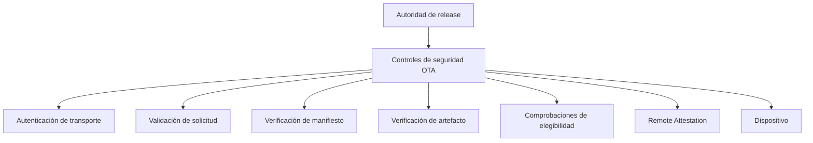

Seguridad OTA es una arquitectura de defensa en profundidad. No depende de un único mecanismo.

## Resumen

El modelo combina transporte autenticado, verificación de solicitudes, manifiestos firmados, integridad de artefactos, elegibilidad de dispositivo, Remote Attestation y Hardware-Backed Signing.

## Capas de seguridad

1. **Autenticación de transporte**: canales protegidos y autenticación de solicitudes.
2. **Verificación de solicitud**: validación, frescura, integridad y resistencia a repetición.
3. **Confianza del manifiesto**: metadatos de release firmados y autorizados.
4. **Verificación de artefactos**: hashes, integridad y detección de corrupción.
5. **Elegibilidad del dispositivo**: enrolamiento, canal, Device Trust y política de despliegue.
6. **Remote Attestation**: señal adicional de elegibilidad e integridad.
7. **Firma de producción**: origen autorizado de release.

## Autoridades de firma

La arquitectura separa dos autoridades:

- **Current Production OTA Manifest Signing Authority**: autorización de manifiestos y metadatos OTA.
- **Target Production Release-Signing Authority**: autoridad objetivo para firma de imágenes, payloads y artefactos críticos de release.

No deben confundirse ni presentarse como la misma autoridad.

## Modelo actual de firma de manifiestos OTA

El modelo actual utiliza firma offline respaldada por hardware para manifiestos. El material privado no debe residir en repositorios, CI/CD variables, scripts de build, estaciones de trabajo, almacenamiento en cloud ni artefactos.

## Arquitectura objetivo de firma de versiones con HSM

La arquitectura objetivo usa una autoridad física dedicada con claves no exportables, aprobaciones, auditoría, ceremonias de claves, copia de seguridad segura y gobernanza de release.

## Remote Attestation

Remote Attestation está diseñado como capa de hardening de producción. Puede utilizarse para determinar elegibilidad de enrolamiento, registro, acceso a metadatos protegidos, artefactos privados o canales sensibles.

Remote Attestation complementa, pero no reemplaza, transporte autenticado, manifiestos firmados, verificación de artefactos, firma hardware-backed, política de despliegue o controles de enrolamiento.

## Modelo de privacidad

OTA usa Privacy-Preserving Device Handles y telemetría mínima. Las decisiones de elegibilidad deben evitar recolección innecesaria de identidad.

Consulta [Limitaciones de plataforma](/es/legal/limitations).
