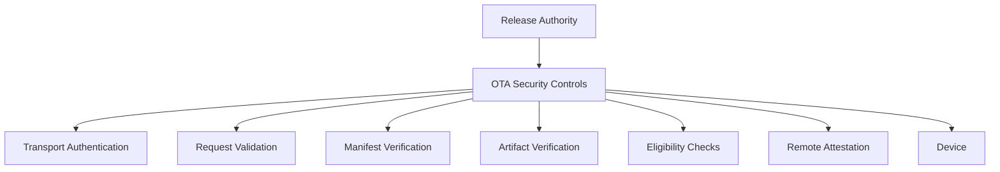

OTA Security es una arquitectura de defensa en profundidad. No depende de un unico mecanismo.

## Overview

El modelo combina transporte autenticado, verificacion de requests, manifests firmados, integridad de artifacts, elegibilidad de dispositivo, Remote Attestation y Hardware-Backed Signing.

## Security Layers

1. **Transport authentication**: canales protegidos y request authentication.
2. **Request verification**: validacion, freshness, integridad y resistencia a replay.
3. **Manifest trust**: metadata de release firmada y autorizada.
4. **Artifact verification**: hashes, integridad y detección de corrupcion.
5. **Device eligibility**: enrolamiento, canal, Device Trust y rollout policy.
6. **Remote Attestation**: señal adicional de elegibilidad e integridad.
7. **Production signing**: origen autorizado de release.

## Signing Authorities

La arquitectura separa dos autoridades:

- **Current Production OTA Manifest Signing Authority**: autorización de manifests y metadata OTA.
- **Target Production Release-Signing Authority**: autoridad objetivo para signing de imagenes, payloads y artifacts críticos de release.

No deben confundirse ni presentarse como la misma autoridad.

## Current OTA Manifest Signing Model

El modelo actúal utiliza signing offline hardware-backed para manifests. El material privado no debe residir en repositorios, CI/CD varíables, scripts de build, workstations, storage cloud ni artifacts.

## Target Production HSM Release-Signing Architecture

La arquitectura objetivo usa una autoridad física dedicada con claves no exportables, aprobaciones, auditoría, ceremonias de claves, backup seguro y gobernanza de release.

## Remote Attestation

Remote Attestation está diseñado cómo hardening layer de produccion. Puede utilizarse para determinar elegibilidad de enrolamiento, registro, acceso a metadata protegida, artifacts privados o canales sensibles.

Remote Attestation complementa, pero no reemplaza, transporte autenticado, manifests firmados, verificacion de artifacts, signing hardware-backed, rollout policy o controles de enrolamiento.

## Privacy Model

OTA usa Privacy-Preserving Device Handles y telemetria minima. Las decisiones de elegibilidad deben evitar recolección innecesaria de identidad.

Consulta [Platform Limitations](/es/legal/limitations).
