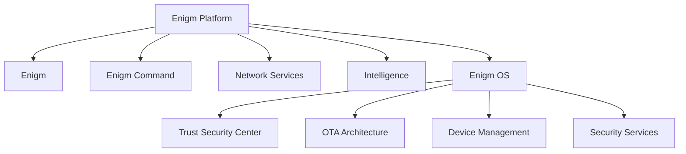

Enigm OS es una plataforma de dispositivo seguro. No es el producto principal de Enigm; el producto principal orientado al usuario sigue siendo Enigm.

## Overview

Enigm OS proporciona una capa adicional de confianza de dispositivo, endurecimiento de plataforma y seguridad operativa para usuarios que lo requieren.

## Design Objectives

Enigm OS está diseñado para:

- Reducir superficie de ataque.
- Proporcionar señales de Device Trust.
- Aplicar una experiencia de dispositivo controlada.
- Reforzar políticas de red y privacidad.
- Soportar actúalizaciones verificadas.
- Integrarse con Enigm App y Enigm Command.

## Security Philosophy

Enigm OS no sustituye cifrado de extremo a extremo, decisiones de confianza del usuario, arquitectura de mensajería segura ni conciencia de seguridad.

Proporciona endurecimiento, señales de confianza, controles adicionales y experiencia reducida.

## Relationship With Enigm

Enigm App sigue siendo el centro de mensajería privada. Enigm OS refuerza el endpoint cuando está disponible.

## Relationship With Enigm Command

Enigm Command puede usar estado de Enigm OS para visibilidad de dispositivo, gestión controlada, estado de confianza y reportes de seguridad.

## Relationship With Intelligence

Enigm Intelligence puede consumir señales de seguridad autorizadas. No inspecciona contenido protegido.

Consulta [Platform Limitations](/es/legal/limitations).
