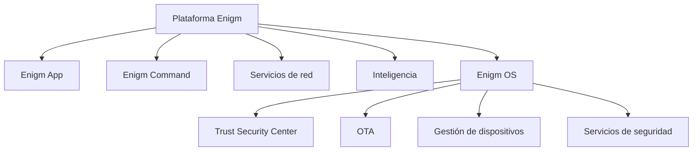

Enigm OS es una plataforma de dispositivo seguro dedicada dentro del ecosistema Enigm. Está diseñado para proporcionar una capa adicional de Device Trust, endurecimiento de la plataforma y seguridad operativa para usuarios e implementaciones que requieren un entorno de dispositivo controlado.

Enigm OS no es el producto principal de Enigm. Enigm App sigue siendo el principal producto de cara al usuario para mensajería segura, llamadas seguras, flujos de trabajo de cuentas, asociación de dispositivos e interacción principal del usuario.

## Resumen

Enigm OS proporciona controles de seguridad a nivel de dispositivo que pueden fortalecer el ecosistema Enigm donde se requiere una capa de dispositivo segura dedicada.

Enigm OS es:

- Una plataforma de dispositivo segura dedicada.
- Una fuente de señales Device Trust.
- Una capa de endurecimiento de plataforma.
- Una experiencia de dispositivo controlado.
- Un host para controles de seguridad adicionales del dispositivo.

Enigm OS no es:

- Un reemplazo para Enigm App.
- Un sustituto del cifrado de extremo a extremo.
- Un sustituto de la arquitectura de mensajería segura.
- Un sustituto de las decisiones de confianza de los usuarios.
- Un sustituto de la concienciación sobre la seguridad.

## Objetivos de diseño

Enigm OS está diseñado para:

- Proporcionar protección de plataforma para dispositivos compatibles.
- Proporcionar señales Device Trust a Enigm App y Enigm Command.
- Reducir la superficie de ataque a través de una experiencia de dispositivo controlada.
- Admite capacidades de dispositivos administrados.
- Admite visibilidad Trust Security Center.
- Admite seguridad OTA y verificación de actualizaciones.
- Admite controles de privacidad y red a nivel de dispositivo.
- Admite seguridad operativa para usuarios que requieren una capa de dispositivo segura dedicada.

## Filosofía de seguridad

Enigm OS sigue un modelo de defensa en profundidad. Agrega controles a nivel de dispositivo a la arquitectura Enigm más amplia en lugar de reemplazar la criptografía a nivel de aplicación o las decisiones de confianza a nivel de usuario.

La filosofía de seguridad es:

- Mantenga Enigm App como el producto principal de cara al usuario.
- Utilice Enigm OS para fortalecer Device Trust donde esté desplegado.
- Mantenga los controles del dispositivo separados del texto en claro de los mensajes.
- Trate la postura del SO como una señal adicional, no como una garantía universal.
- Preservar la auditabilidad de los dispositivos administrados y los cambios de estado relevantes para la seguridad.

## Device Trust

Enigm OS puede contribuir con señales de Device Trust a Enigm App, Enigm Command y a los flujos de trabajo de dispositivos administrados.

Las señales Device Trust pueden incluir:

- Postura Trust Security Center.
- Estado de gestión del dispositivo.
- Estado de la política de red.
- Estado del modo de privacidad.
- Estado de verificación OTA.
- Resultado Remote Attestation cuando se requiere evidencia de integridad del dispositivo.
- Estado del servicio de seguridad.

Device Trust no reemplaza a Account Trust. Una sesión de cuenta válida y un estado de dispositivo confiable son conceptos separados.

## Endurecimiento de la plataforma

Enigm OS proporciona protección de plataforma para implementaciones compatibles.

El endurecimiento de la plataforma puede incluir:

- Experiencia de dispositivo controlado.
- Superficie de ataque reducida.
- Aplicación del servicio de seguridad.
- Controles de políticas de red.
- Controles de privacidad.
- Controles de inicio y configuración.
- Verificación de actualización.
- Integración de gestión de dispositivos.

El endurecimiento de la plataforma tiene como objetivo reducir el riesgo. No elimina todos los riesgos de los endpoints.

## Capacidades de dispositivos administrados

Enigm OS puede admitir capacidades de dispositivos administrados para implementaciones que requieren control del ciclo de vida del dispositivo.

Las capacidades del dispositivo administrado pueden incluir:

- Estado de inscripción del dispositivo.
- Estado de revocación del dispositivo.
- Estado de sustitución del dispositivo.
- Informes de seguridad del dispositivo.
- Estado de la política gestionada.
- Soporte de borrado remoto cuando esté habilitado.
- Visibilidad Enigm Command.

Las capacidades de los dispositivos administrados deben permanecer separadas del acceso a texto en claro de mensajes. La administración de dispositivos no es un mecanismo para eludir el cifrado de un extremo a otro.

## Relación con Enigm App

Enigm App sigue siendo el principal producto de cara al usuario.

Enigm OS puede proporcionar una postura adicional del dispositivo y señales de refuerzo a Enigm App cuando se implemente. Estas señales pueden informar Device Trust, la elegibilidad para mensajes seguros, la elegibilidad para llamadas seguras y la política de dispositivos administrados.

Enigm App la mensajería segura y las llamadas seguras deben seguir siendo modelos de seguridad a nivel de aplicación. Enigm OS puede fortalecer la postura de los endpoints, pero no reemplaza el material de claves protegido, el cifrado de extremo a extremo, los flujos de trabajo de verificación ni las decisiones de confianza del usuario.

## Relación con el ecosistema Enigm

Enigm OS se integra con varios componentes del ecosistema Enigm.

### Enigm Command

Enigm Command puede usar el estado del dispositivo Enigm OS para obtener visibilidad confiable del dispositivo, operaciones administradas del dispositivo, revisión del ciclo de vida del dispositivo e informes de seguridad.

### Trust Security Center

Trust Security Center proporciona una postura de seguridad del dispositivo visible para el usuario y revisable por el administrador.

### OTA

OTA proporciona ciclo de vida de actualización, firma, verificación, revisión de versiones y comportamiento de despliegue controlado para actualizaciones Enigm OS.

### Gestión de dispositivos

La administración de dispositivos admite capacidades de inscripción, revocación, reemplazo, generación de informes y dispositivos administrados.

### Enigm Intelligence

Enigm Intelligence puede consumir telemetría de seguridad aprobada y señales de postura del dispositivo para respaldar la monitorización de seguridad, la evaluación de riesgos y la respuesta defensiva.

### VPN y servicios de red

VPN Service, Proxy Network, Enigm eSIM y Tor Gateway son componentes de plataforma separados. Enigm OS puede proporcionar políticas de red a nivel de dispositivo o señales de postura, pero los servicios de red y las rutas de acceso web seleccionadas siguen siendo distintas de la confianza del sistema operativo y la criptografía a nivel de aplicación.

Ver [Limitaciones de la plataforma](/es/legal/limitations).

## Referencias al modelo de amenazas

Las áreas relevantes del modelo de amenazas incluyen eludir la política Enigm OS, el abuso del ciclo de vida del dispositivo, la falla de integridad de OTA, el abuso Enigm Command, el compromiso de cuentas y aplicaciones, el uso indebido de las políticas de red y la pérdida de visibilidad de la auditoría.
