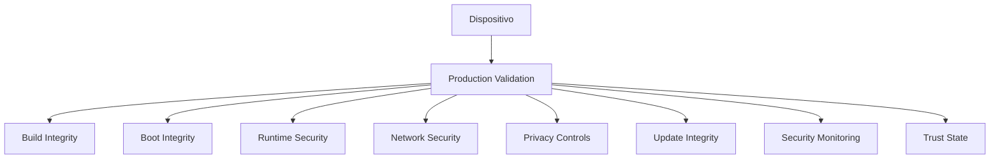

Los controles de producción definen categorías de validación que deben satisfacerse para considerar un dispositivo alíneado con la postura de seguridad de producción de Enigm OS.

No exponen scripts, propiedades exactas, umbrales ni detalles internos.

## Categorías de controles

### Control 1: Integridad de build

Objetivos: build de producción, release confiable y procedencia autorizada.

### Control 2: Integridad de arranque

Objetivos: software verificado, cadena de arranque confiable e integridad de dispositivo.

### Control 3: Seguridad en ejecución

Objetivos: servicios de seguridad operativos, cumplimiento de política y confianza runtime.

### Control 4: Configuración de plataforma

Objetivos: configuración segura, exposición restringida y estado controlado.

### Control 5: Seguridad de red

Objetivos: configuración de red confiable, DNS seguro y cumplimiento de política de red.

### Control 6: Exposición de aplicaciones

Objetivos: superficie de aplicaciónes controlada, funciónalidad privilegiada restringida y reducción de superficie de ataque.

### Control 7: Controles de privacidad

Objetivos: sensores protegidos, disponibilidad de funciones de privacidad y visibilidad de seguridad.

### Control 8: Gestión de dispositivos

Objetivos: cumplimiento gestionado donde aplique, visibilidad de ciclo de vida y reporte de seguridad.

### Control 9: Integridad de actualización

Objetivos: elegibilidad OTA, autenticidad e integridad de update.

### Control 10: Monitorización de seguridad

Objetivos: evaluación de confianza, findings y visibilidad de integridad.

## Modelo de evidencias

La validación usa señales de seguridad, estado del dispositivo, evaluaciones de confianza, controles de cumplimiento y resultados de política.

Pasar Production Gates mejora confianza, pero no garantiza ausencia de vulnerabilidades.

Consulta [Limitaciones de plataforma](/es/legal/limitations).
