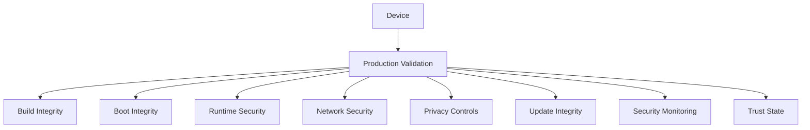

Production Gates definen categorias de validacion que deben satisfacerse para considerar un dispositivo alíneado con la postura de seguridad de produccion de Enigm OS.

No exponen scripts, propiedades exactas, umbrales ni detalles internos.

## Gate Categories

### Gate 1: Build Integrity

Objetivos: build de produccion, release confiable y procedencia autorizada.

### Gate 2: Boot Integrity

Objetivos: software verificado, cadena de arranque confiable e integridad de dispositivo.

### Gate 3: Runtime Security

Objetivos: servicios de seguridad operativos, cumplimiento de política y confianza runtime.

### Gate 4: Platform Configuration

Objetivos: configuración segura, exposición restringida y estado controlado.

### Gate 5: Network Security

Objetivos: configuración de red confiable, DNS seguro y cumplimiento de política de red.

### Gate 6: Application Exposure

Objetivos: superficie de aplicaciónes controlada, funciónalidad privilegiada restringida y reducción de superficie de ataque.

### Gate 7: Privacy Controls

Objetivos: sensores protegidos, disponibilidad de funciónes de privacidad y visibilidad de seguridad.

### Gate 8: Device Management

Objetivos: cumplimiento gestionado donde aplique, visibilidad de ciclo de vida y reporte de seguridad.

### Gate 9: Update Integrity

Objetivos: elegibilidad OTA, autenticidad e integridad de update.

### Gate 10: Security Monitoring

Objetivos: evaluación de confianza, findings y visibilidad de integridad.

## Evidence Model

La validacion usa señales de seguridad, estado del dispositivo, evaluaciónes de confianza, checks de cumplimiento y resultados de política.

Pasar Production Gates mejora confianza, pero no garantiza ausencia de vulnerabilidades.

Consulta [Platform Limitations](/es/legal/limitations).
