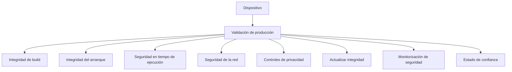

Las controles de producción definen las condiciones que deben cumplirse antes de que se pueda considerar que un dispositivo cumple con la postura de seguridad de producción Enigm OS prevista.

El modelo de puerta de producción describe objetivos de seguridad y categorías de validación. No es una publicación de lógica de validación interna, comprobaciones ejecutables o valores de plataforma de bajo nivel.

## Resumen

Las controles de producción proporcionan un modelo estructurado para evaluar si un dispositivo Enigm OS se alinea con la postura de seguridad de producción prevista.

El modelo se centra en:

- Integridad de build.
- Integridad del arranque.
- Seguridad en tiempo de ejecución.
- Configuración de la plataforma.
- Seguridad de la red.
- Exposición de la aplicación.
- Controles de privacidad.
- Gestión de dispositivos.
- Actualizar la integridad.
- Monitorización de seguridad.

El diagrama es conceptual y representa categorías de validación a nivel de arquitectura pública.

## Filosofía de controles de producción

Las controles de producción se basan en el principio de que la confianza en la producción requiere múltiples categorías de validación independientes.

El modelo tiene como objetivo:

- Reducir la dependencia de una única señal de seguridad.
- Mejorar la confianza en la postura de seguridad del dispositivo.
- Apoyar la evaluación constante de la preparación para la producción.
- Admite visibilidad Trust Security Center.
- Admite OTA y actualiza la confianza.
- Admite revisión de dispositivos administrados.
- Evite tratar el estado de producción como una decisión única.

Pasar una puerta significa que se cumple el objetivo de seguridad relevante según el modelo de validación de producción. No significa que se elimine el riesgo.

## Categorías de controles

### Control 1: Integridad de build

Propósitos:

- Construcción de producción.
- Estado de lanzamiento confiable.
- Procedencia de emisión autorizada.

Build Integrity evalúa si el software del dispositivo corresponde a un estado de lanzamiento de producción autorizado.

### Control 2: Integridad de arranque

Propósitos:

- Estado del software verificado.
- Cadena de arranque de confianza.
- Integridad del dispositivo.

Boot Integrity evalúa si el dispositivo se inicia desde un estado de software confiable esperado.

### Control 3: Seguridad en ejecución

Propósitos:

- Servicios de seguridad operativos.
- Cumplimiento de políticas.
- Confianza en tiempo de ejecución.

Runtime Security evalúa si los servicios de seguridad requeridos y las condiciones de la política de tiempo de ejecución funcionan según lo esperado.

### Control 4: Configuración de plataforma

Propósitos:

- Configuración centrada en la seguridad.
- Exposición restringida.
- Estado controlado de la plataforma.

La configuración de la plataforma evalúa si la configuración del dispositivo se alinea con la plataforma segura controlada prevista del dispositivo.

### Control 5: Seguridad de red

Propósitos:

- Configuración de red confiable.
- Resolución de nombres segura.
- Cumplimiento de políticas de red.

Network Security evalúa si la postura de la red del dispositivo es compatible con el modelo de privacidad y seguridad de la red Enigm OS.

### Control 6: Exposición de aplicaciones

Propósitos:

- Superficie de aplicación controlada.
- Funcionalidad privilegiada restringida.
- Superficie de ataque reducida.

La exposición de aplicaciones evalúa si el dispositivo limita la exposición de aplicaciones innecesarias y funciones privilegiadas.

### Control 7: Controles de privacidad

Propósitos:

- Sensores Protected.
- Disponibilidad de la función de privacidad.
- Visibilidad de seguridad.

Los controles de privacidad evalúan si las protecciones de privacidad a nivel del dispositivo están disponibles y son visibles como se esperaba.

### Control 8: Gestión de dispositivos

Propósitos:

- Cumplimiento del dispositivo administrado.
- Visibilidad del ciclo de vida del dispositivo.
- Informes de seguridad.

La administración de dispositivos evalúa la situación de los dispositivos administrados para los dispositivos inscritos. Es aplicable donde la capacidad del dispositivo administrado está habilitada.

### Control 9: Integridad de actualización

Propósitos:

- Elegibilidad para OTA.
- Actualizar autenticidad.
- Actualizar la integridad.

Update Integrity evalúa si el ciclo de vida de la actualización y la postura de actualización del dispositivo se alinean con los requisitos de seguridad de Enigm OS OTA.

### Control 10: Monitorización de seguridad

Propósitos:

- Evaluación de confianza.
- Hallazgos de seguridad.
- Visibilidad de la integridad del dispositivo.

Security Monitoring evalúa si las señales de postura del dispositivo se pueden evaluar y revelar a través del modelo de visibilidad de seguridad.

## Modelo de validación de producción

La validación de producción debe evaluar el dispositivo en todas las categorías de puertas en lugar de depender de una única condición de aprobación o falla.

Las categorías de validación deben admitir:

- Decisiones Device Trust.
- Decisiones de preparación de producción.
- Informes de postura de seguridad.
- Revisión de dispositivos administrados.
- Elegibilidad de OTA y postura de actualización.
- Evaluación del estado Trust Security Center.

La validación de la producción debe seguir siendo de alto nivel en la documentación pública. La mecánica de validación exacta, los valores de la plataforma y la lógica de puerta interna no se publican.

## Propósitos de seguridad

El Modelo de controles de producción está diseñado para:

- Definir la postura de seguridad de producción esperada.
- Apoyar la evaluación consistente del cumplimiento del dispositivo.
- Reducir el riesgo de estados de dispositivos no administrados.
- Mejorar la confianza en el software y la confianza en el tiempo de ejecución.
- Soporte de visibilidad de seguridad para usuarios y administradores.
- Soporte de actualización y gobierno del ciclo de vida.
- Mantenga el cumplimiento del dispositivo separado de la confidencialidad de los mensajes.

Las controles de producción no proporciona acceso al texto claro de los mensajes y no reemplazan el cifrado de extremo a extremo Enigm App.

## Modelo de evidencia

La validación de la producción debe basarse en:

- Señales de seguridad.
- Estado del dispositivo.
- Evaluaciones de confianza.
- Controles de cumplimiento.
- Resultados de las políticas.

La evidencia de producción está destinada a respaldar el estado de confianza, la revisión del cumplimiento y la visibilidad de la seguridad. No debe incluir contenido de mensajes, contenido multimedia, contenido de llamadas, archivos adjuntos, documentos o conversaciones de usuarios.

## Relación con Trust Security Center

Trust Security Center consume señales de seguridad.

Las controles de producción definen la postura de seguridad esperada.

Estos sistemas están relacionados pero tienen diferentes propósitos:

- Las Controles de producción definen las categorías y objetivos de cumplimiento de producción esperado.
- Trust Security Center evalúa y presenta el estado local Device Trust.

Trust Security Center puede revelar resultados o hallazgos relacionados con la postura de producción, pero no es una publicación de lógica de puerta.

## Relación con OTA

OTA aporta autenticidad del software, integridad de las actualizaciones, elegibilidad y entrega controlada.

Production Gates contribuye al cumplimiento del dispositivo.

Estos sistemas son complementarios:

- OTA ayuda a garantizar que se entregue y verifique software confiable.
- Las controles de producción ayudan a evaluar si el dispositivo permanece alineado con la postura de seguridad de producción prevista.

La seguridad OTA no reemplaza la validación del cumplimiento de la producción, y Production Gates no reemplaza la firma OTA ni la verificación del cliente.

## Relación con la gestión de dispositivos

La administración de dispositivos puede utilizar información de postura de producción para los dispositivos administrados inscritos cuando esté habilitado.

Los flujos de trabajo de dispositivos administrados pueden utilizar una postura relacionada con el control para admitir:

- Visibilidad del ciclo de vida del dispositivo.
- Informes de seguridad.
- Revisión del dispositivo.
- Operaciones remotas donde estén habilitadas.

La gestión administrativa de dispositivos debe permanecer separada de la confidencialidad de los mensajes. La visibilidad del cumplimiento de la producción no proporciona acceso a texto claro de mensajes.

Ver [Limitaciones de la plataforma](/es/legal/limitations).
