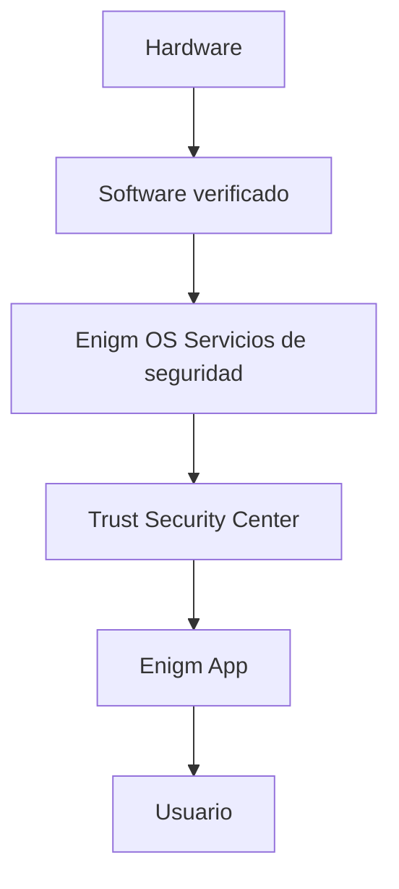

Enigm OS es una plataforma de dispositivo seguro controlado dentro del ecosistema Enigm. Está diseñado para proporcionar Device Trust adicional, endurecimiento de plataforma y control de seguridad para usuarios e implementaciones que requieren una capa de dispositivo segura dedicada.

Enigm OS no es el producto principal de Enigm. Enigm App sigue siendo el principal producto de cara al usuario para mensajería segura, llamadas seguras, flujos de trabajo de cuentas e interacción del usuario. Enigm OS fortalece el entorno del dispositivo en el que pueden operar Enigm App y los flujos de trabajo de dispositivos administrados.

## Resumen

Enigm OS establece Device Trust a través de múltiples capas de seguridad independientes. Estas capas están diseñadas para hacer observable el estado del dispositivo, hacer cumplir la política de seguridad, reducir la exposición innecesaria del sistema y admitir operaciones controladas de actualización y ciclo de vida del dispositivo.

La arquitectura se centra en:

- Integridad del dispositivo.
- Estado del software verificado.
- Material de la llave Protected.
- Endurecimiento del sistema operativo.
- Controles de red y políticas.
- Visibilidad Trust Security Center.
- Soporte de seguridad a nivel de aplicación.
- Requisitos de liberación de producción controlados.

Enigm OS no reemplaza el cifrado de extremo a extremo, el material de claves Enigm App protegido, los flujos de trabajo de verificación de usuarios ni los controles de seguridad a nivel de cuenta.

## Objetivos de seguridad

Los principales objetivos de seguridad de Enigm OS son:

- Proporcionar una plataforma de dispositivo segura y controlada para implementaciones compatibles.
- Establecer Device Trust utilizando señales de seguridad en capas.
- Reducir la superficie de ataque mediante el endurecimiento de la plataforma.
- Hacer cumplir los valores predeterminados centrados en la seguridad.
- Admite la gestión segura de dispositivos y las operaciones del ciclo de vida.
- Soporte de visibilidad postural Trust Security Center.
- Admite la verificación de actualizaciones OTA protegidas y el comportamiento de implementación controlada.
- Preservar la separación entre la administración del dispositivo y la confidencialidad de los mensajes.

Estos objetivos están diseñados para respaldar la revisión de seguridad, el gobierno empresarial y el control operativo a nivel de arquitectura pública.

## Arquitectura de seguridad

La arquitectura de seguridad Enigm OS se organiza en torno al estado del dispositivo, la confianza del software, la aplicación de políticas y la visibilidad de la seguridad de cara al usuario.

A alto nivel:

- La integridad del hardware y del dispositivo proporciona la base Device Trust de nivel más bajo.
- El estado del software verificado proporciona seguridad de que el dispositivo ejecuta software de producción confiable.
- El refuerzo del sistema operativo reduce la exposición a capacidades innecesarias y valores predeterminados inseguros.
- Los controles de red y políticas limitan el comportamiento del dispositivo según la política de seguridad.
- Trust Security Center presenta la postura de seguridad y el estado de confianza a los usuarios y administradores.
- Enigm App utiliza criptografía a nivel de aplicación y material de clave protegido independientemente de los controles a nivel del sistema operativo.

El diagrama es conceptual. Describe el flujo de confianza a nivel de arquitectura pública.

## Límites de confianza

Enigm OS separa los siguientes dominios de confianza:

- Integridad del hardware y del dispositivo.
- Estado del software verificado.
- Servicios de seguridad del sistema operativo.
- Trust Security Center visibilidad postural.
- Enigm App flujos de trabajo criptográficos.
- Decisiones de los usuarios y acciones de verificación.
- Enigm Command gestión del ciclo de vida del dispositivo.
- Ciclo de vida de verificación y liberación OTA.

Estos límites son importantes porque ninguna capa se considera suficiente para lograr una confianza total en la plataforma. Device Trust se construye a partir de múltiples señales y la confidencialidad a nivel de aplicación permanece separada de la administración del dispositivo.

La visibilidad administrativa de la posición del dispositivo no equivale al acceso al texto en claro del mensaje Enigm App.

## Modelo de Device Trust

Device Trust en Enigm OS se basa en múltiples capas de seguridad independientes.

Los aportes relevantes de confianza incluyen:

- Arranque verificado.
- Integridad del dispositivo.
- Estado del software confiable.
- Material de la llave Protected.
- Cumplimiento de políticas.
- Estado del servicio de seguridad.
- Postura Trust Security Center.
- Estado de verificación OTA.
- Estado del dispositivo administrado cuando esté habilitado.

Device Trust no es un reclamo binario único. Es un modelo de postura de seguridad que puede informar a Enigm App, Enigm Command, los flujos de trabajo de dispositivos administrados y los procesos de revisión empresarial.

Device Trust también sigue siendo distinto de Account Trust. Un dispositivo puede estar asociado con una cuenta de Enigm, pero la autorización de la cuenta y la posición del dispositivo son conceptos de seguridad separados.

## Endurecimiento de la plataforma

Enigm OS proporciona protección de plataforma para implementaciones que requieren un entorno de dispositivo controlado.

El endurecimiento de la plataforma incluye:

- Superficie de ataque reducida.
- Experiencia de dispositivo controlado.
- Capacidades restringidas del sistema.
- Exposición controlada de la aplicación.
- Valores predeterminados centrados en la seguridad.
- Controles de privacidad y red gestionados.
- Configuración controlada y comportamiento de incorporación.
- Aplicación del servicio de seguridad.

Estos controles están diseñados para reducir el riesgo y limitar el comportamiento inseguro del dispositivo. No eliminan el riesgo de comprometer los endpoints y deben evaluarse junto con el comportamiento del usuario, el estado de la cuenta y los controles a nivel de aplicación.

## Capas de seguridad

Enigm OS utiliza un modelo de seguridad en capas.

### Capa 1: Integridad del hardware y del dispositivo

La capa de integridad del hardware y del dispositivo proporciona la base para Device Trust. Admite la evaluación de si el dispositivo permanece en un estado de confianza esperado antes de que las decisiones de seguridad de nivel superior dependan de él.

Esta capa es relevante para el material de clave protegido, la postura del dispositivo y las decisiones Device Trust administradas.

### Capa 2: Arranque verificado y confianza del software

La capa de confianza de software y arranque verificado tiene como objetivo garantizar que los dispositivos de producción funcionen desde un estado de software confiable.

Esta capa respalda la confianza de que los controles de seguridad, la verificación de actualizaciones y los informes Trust Security Center se basan en el entorno de software esperado.

### Capa 3: Endurecimiento del sistema operativo

La capa de refuerzo del sistema operativo reduce la exposición innecesaria y admite valores predeterminados centrados en la seguridad.

Esta capa incluye experiencia controlada del dispositivo, capacidades restringidas del sistema, exposición controlada de aplicaciones y aplicación de servicios de seguridad.

### Capa 4: Controles de red y políticas

La capa de control de políticas y redes restringe el comportamiento del dispositivo de acuerdo con la política de seguridad.

Esta capa puede admitir el estado de la política de red, el comportamiento del modo de privacidad, la política de dispositivo administrado y la aplicación a nivel de dispositivo relevante para las implementaciones empresariales.

Los controles de red no reemplazan el cifrado de extremo a extremo Enigm App ni el material de clave protegido.

### Capa 5: Trust Security Center

Trust Security Center proporciona una postura de seguridad visible para el usuario y revisable por el administrador.

### Capa 6: Seguridad a nivel de aplicación

La seguridad a nivel de aplicaciones sigue siendo esencial.

Enigm App utiliza material de claves protegido, almacenamiento seguro del dispositivo, cifrado de extremo a extremo, flujos de trabajo de verificación, seguridad de la cuenta y asociación de dispositivos de confianza. Enigm OS puede proporcionar señales de confianza y refuerzo de endpoints adicionales, pero la seguridad de Enigm App no depende únicamente de la confianza del sistema operativo.

## Requisitos de seguridad de producción

Las implementaciones de producción Enigm OS deben regirse por requisitos de seguridad controlados.

Los requisitos de producción conceptuales incluyen:

- Estado del dispositivo bloqueado.
- Estado del software verificado.
- Firma de producción.
- Cadena de actualización Protected.
- Aplicación de políticas de seguridad.
- Comportamiento de implementación controlado.
- Revisión del ciclo de vida del versión.
- Visibilidad Trust Security Center.
- Controles del ciclo de vida de la administración de dispositivos cuando estén habilitados.

Estos requisitos tienen como objetivo evitar la deriva en la producción no administrada y preservar la confianza en el estado del dispositivo implementado. Los procedimientos de validación exactos no están documentados públicamente.

## Relación con Enigm App

Enigm App sigue siendo el principal producto de cara al usuario.

Enigm OS puede fortalecer el entorno del dispositivo utilizado por Enigm App a través de la postura del dispositivo, la aplicación de políticas, el endurecimiento de la plataforma y el estado del servicio de seguridad. Estas señales pueden respaldar decisiones de dispositivos de confianza, comportamiento de dispositivos administrados, elegibilidad de mensajería segura, elegibilidad de llamadas seguras y revisión empresarial.

Enigm OS no proporciona acceso a texto en claro de mensajes. La confidencialidad de los mensajes Enigm App depende del cifrado a nivel de aplicación, el material de clave protegido, la asociación de dispositivos de confianza y los flujos de trabajo de verificación.

## Relación con Trust Security Center

Trust Security Center es la superficie de postura de seguridad de cara al usuario y revisable por el administrador para Enigm OS.

Su objetivo es exponer el estado de confianza de alto nivel, la postura del dispositivo, el estado de la política, el estado del servicio de seguridad y los indicadores de seguridad relevantes. Proporciona visibilidad de la seguridad del dispositivo sin convertir la administración de dispositivos en acceso a mensajes.

Trust Security Center no reemplaza los flujos de trabajo de verificación criptográfica en Enigm App.

## Relación con OTA

OTA es la arquitectura de actualización controlada para Enigm OS.

OTA admite el ciclo de vida de la versión, la firma, la verificación de actualizaciones, la implementación controlada, la verificación del cliente y la política de seguridad con reconocimiento de reversión. La cadena de actualización es parte del modelo de confianza Enigm OS porque la seguridad del dispositivo depende del estado del software de producción confiable.

OTA no reemplaza la evaluación Device Trust. Contribuye al estado del software confiable como una capa en la arquitectura de seguridad más amplia.

Ver [Limitaciones de la plataforma](/es/legal/limitations).
