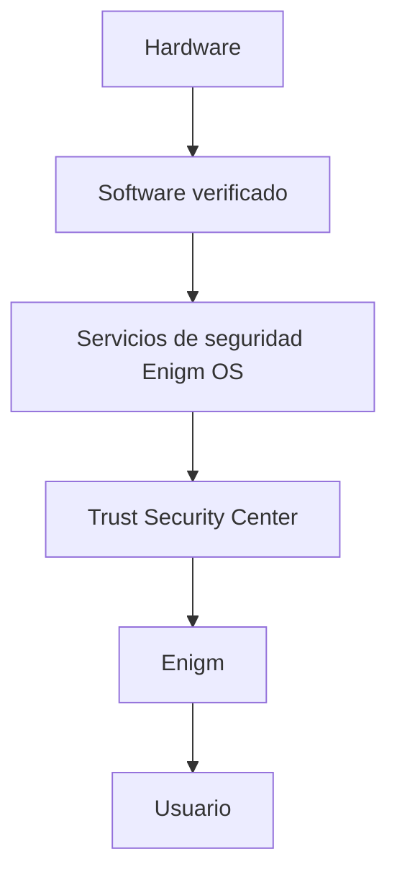

Enigm OS establece confianza de dispositivo mediante capas independientes de integridad, software verificado, endurecimiento y servicios de seguridad.

## Resumen

Enigm OS es una plataforma de dispositivo seguro controlado dentro del ecosistema Enigm. No se documenta como una distribución genérica.

## Objetivos de seguridad

- Establecer Device Trust.
- Reducir superficie de ataque.
- Reforzar integridad de software.
- Aplicar configuraciónes seguras.
- Proporcionar visibilidad mediante Trust Security Center.
- Mantener actualizaciones protegidas.

## Capas de seguridad

Las capas de alto nivel son:

1. Hardware e integridad de dispositivo.
2. Verified boot y confianza de software.
3. Endurecimiento del sistema operativo.
4. Controles de red y política.
5. Trust Security Center.
6. Seguridad de aplicación.

## Modelo de confianza del dispositivo

Device Trust combina señales como integridad de dispositivo, estado de software verificado, material de claves protegido, cumplimiento de política y servicios de seguridad.

Device Trust no equivale a Account Trust, Remote Attestation, OTA Eligibility ni autorización administrativa.

## Endurecimiento de plataforma

El endurecimiento reduce capacidades innecesarias, exposición de aplicaciónes y superficie de sistema. Los valores por defecto se orientan a seguridad.

## Requisitos de seguridad de producción

La postura de producción requiere estado bloqueado, software verificado, signing de producción, cadena de actúalizacion protegida y cumplimiento de políticas.

Consulta [Controles de producción](/es/os/production-gates) y [Limitaciones de plataforma](/es/legal/limitations).
