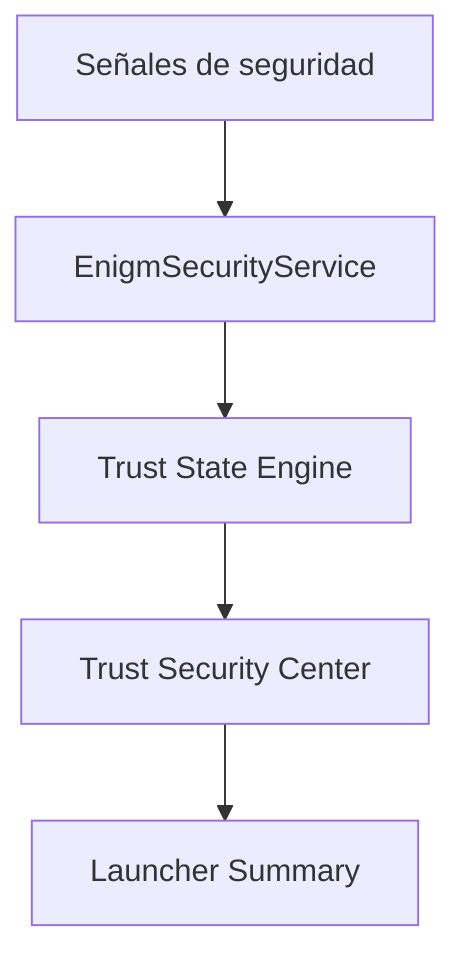

Trust Security Center es el sistema local de evaluación de confianza de dispositivo en Enigm OS.

No es antivirus, no es una puntuacion numerica y no utiliza porcentajes.

## Overview

Trust Security Center evalua señales independientes del dispositivo y presenta estados claros al usuario.

## Architecture

## Trust States

Estados internos:

- `PROTECTED`
- `REVIEW_REQUIRED`
- `INACTIVE`

Estados visibles:

- Protected.
- Review Required.
- Inactive.

## Protected

Todas las protecciónes críticas están activas y funciónan cómo se espera.

Mensaje ejemplo: "All critical Enigm OS protections are operating normally."

## Review Required

Una o mas protecciónes críticas están degradadas, no disponibles o requieren atencion.

Mensaje ejemplo: "One or more critical protections require attention."

## Inactive

Trust no puede determinar de forma fiable la integridad del dispositivo porque servicios críticos no están disponibles.

Mensaje ejemplo: "Trust cannot currently evaluate device integrity."

## Findings

Cada finding debe incluir severidad, descripcion, recomendacion y fuente.

Severidades:

- Info.
- Low.
- Medium.
- High.
- Critical.

## Privacy Model

Trust Security Center no intenta inspeccionar mensajes, llamadas, adjuntos, multimedia, documentos ni conversaciones.

Opera sobre señales de seguridad del dispositivo, no sobre contenido de usuario.

## Launcher Integration

- Protected -> Device Protected.
- Review Required -> Device At Risk.
- Inactive -> Protection Inactive.

Consulta [Platform Limitations](/es/legal/limitations).
