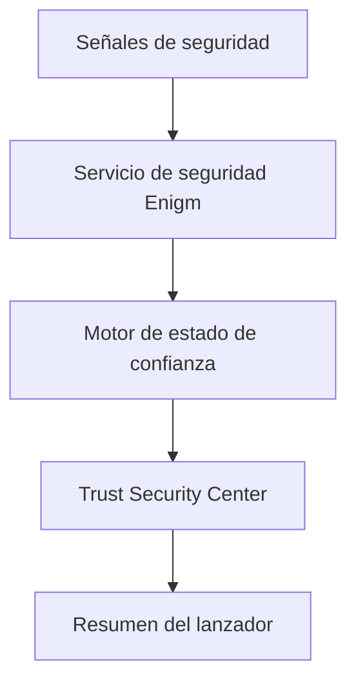

Trust Security Center es el sistema de evaluación local Device Trust para Enigm OS. Evalúa las señales de seguridad del dispositivo, determina un estado de confianza, presenta los hallazgos al usuario y expone la postura resumida de los flujos de trabajo del dispositivo.

Trust Security Center no es un antivirus. No es una puntuación de seguridad numérica, una clasificación basada en porcentajes ni un escáner de amenazas de uso general. Es una superficie Device Trust para Enigm OS.

## Resumen

Trust Security Center evalúa múltiples señales de seguridad e integridad de dispositivos independientes para determinar si el dispositivo local está funcionando en un estado de confianza esperado.

El sistema utiliza tres resultados de confianza interna:

- `PROTECTED`
- `REVIEW_REQUIRED`
- `INACTIVE`

Los estados correspondientes visibles para el usuario son:

- Protected
- Review Required
- Inactive

Trust Security Center no inspecciona el contenido del mensaje, el contenido de la llamada, los archivos adjuntos, los documentos ni las conversaciones de los usuarios. Opera con señales de seguridad del dispositivo en lugar de con el contenido del usuario.

## Objetivos de diseño

Trust Security Center está diseñado para:

- Proporcionar un estado Device Trust local claro.
- Hallazgos de seguridad superficiales que requieren la atención del usuario o administrador.
- Soporte de visibilidad postural Enigm OS.
- Admite resúmenes de confianza a nivel de iniciador.
- Admite flujos de trabajo de dispositivos administrados cuando esté habilitado.
- Mantenga la postura del dispositivo separada de la confidencialidad del mensaje.
- Evite puntuaciones numéricas, porcentajes o calificaciones.
- Evite exponer lógica de detección sensible en documentación pública.

## Arquitectura

Trust Security Center se basa en la evaluación de la señal de seguridad del dispositivo local.

Conceptualmente:

- `EnigmSecurityService` recopila y normaliza las señales de seguridad locales.
- Trust State Engine evalúa la postura de seguridad normalizada.
- Trust Security Center presenta el estado y los hallazgos de Device Trust.
- El resumen del iniciador muestra un estado de protección del dispositivo conciso.

La arquitectura está orientada al dispositivo local. No proporciona acceso a texto claro de mensajes y no funciona como un sistema de inspección de contenido.

## Modelo de evaluación de confianza

La evaluación de la confianza se basa en múltiples señales independientes y no en un único indicador.

Ejemplos de categorías de señales evaluadas incluyen:

- Integridad del dispositivo.
- Estado del software verificado.
- Cumplimiento de la política de seguridad.
- Protected estado de la red.
- Estado de gestión del dispositivo.
- Estado del servicio de seguridad.

Trust Security Center está diseñado para identificar si las protecciones críticas Enigm OS están activas, degradadas, no disponibles o no se pueden medir actualmente.

La evaluación de confianza debe permanecer separada de la confidencialidad del mensaje Enigm App. Un estado Device Trust puede informar los flujos de trabajo del dispositivo, pero no otorga acceso administrativo al contenido cifrado.

## Estados de confianza

Trust Security Center define tres resultados oficiales de confianza.

### Protected

Estado interno: `PROTECTED`

Estado visible para el usuario: Protected

Protected significa que todas las protecciones críticas Enigm OS están activas y funcionando como se esperaba.

Ejemplo de cara al usuario:

> Todas las protecciones críticas Enigm OS están funcionando con normalidad.

Integración del lanzador:

- Protected -> Device Protected

### Review Required

Estado interno: `REVIEW_REQUIRED`

Estado visible para el usuario: Review Required

Review Required significa que una o más protecciones críticas están degradadas, no disponibles o requieren atención del usuario.

Ejemplo de cara al usuario:

> Una o más protecciones críticas requieren atención.

Integración del lanzador:

- Review Required -> Device At Risk

### Inactive

Estado interno: `INACTIVE`

Estado visible para el usuario: Inactive

Inactive significa que Trust Security Center no puede determinar de manera confiable la integridad del dispositivo porque los servicios de confianza críticos no están disponibles.

Ejemplo de cara al usuario:

> Actualmente, Trust no puede evaluar la integridad del dispositivo.

Integración del lanzador:

- Inactive -> Protection Inactive

## Hallazgos de seguridad

Los hallazgos de Trust Security Center explican por qué el dispositivo se encuentra en un estado de confianza determinado y qué acción puede ser necesaria.

Cada hallazgo debe contener:

- Gravedad.
- Descripción.
- Recomendación.
- Fuente.

Las gravedades admitidas son:

- Info.
- Low.
- Medium.
- High.
- Critical.

La gravedad de la búsqueda se utiliza para comunicar la relevancia de la seguridad. No es una puntuación numérica, un porcentaje o una calificación.

## Guía del usuario

La orientación debería:

- Describa el problema en términos comprensibles para el usuario.
- Explique por qué puede ser necesaria atención.
- Recomendar una próxima acción segura.
- Evite revelar comportamientos sensibles de las reglas.
- Evite dar a entender que un Estado garantiza una protección completa.

Ejemplos:

- Un dispositivo Protected aún puede verse afectado por decisiones inseguras del usuario o sistemas externos vulnerables.
- Un dispositivo Review Required necesita atención antes de ser tratado como de plena confianza para flujos de trabajo confidenciales.
- Un dispositivo Inactive no debe considerarse confiable hasta que se restablezcan los servicios de confianza.

## Relación con Enigm OS

Trust Security Center es una superficie de seguridad central Enigm OS.

Evalúa la postura del dispositivo, presenta el estado de confianza y admite la visibilidad local del estado del dispositivo relevante para la seguridad. Funciona con servicios de seguridad Enigm OS, aplicación de políticas, controles de red, estado de administración de dispositivos y señales de confianza de actualización.

Trust Security Center no reemplaza el endurecimiento Enigm OS. Informa y explica el estado de confianza; Enigm OS proporciona los controles de plataforma subyacentes.

## Relación con Enigm App

Enigm App sigue siendo el principal producto de cara al usuario para mensajería segura, llamadas seguras, flujos de trabajo de cuentas e interacción del usuario.

Trust Security Center proporciona información sobre la postura del dispositivo que informa las decisiones de confianza de Enigm App cuando se implementa Enigm OS. Por ejemplo, el estado Device Trust puede informar si un dispositivo debe considerarse elegible para flujos de trabajo confidenciales.

Trust Security Center no inspecciona:

- Contenido del mensaje.
- Contenido multimedia.
- Llamar contenido.
- Adjuntos.
- Documentos.
- Conversaciones de usuarios.

Trust opera con señales de seguridad del dispositivo en lugar de con el contenido del usuario.

## Relación con la gestión de dispositivos

Trust Security Center puede admitir flujos de trabajo de dispositivos administrados donde el usuario u organización habilita las capacidades del dispositivo administrado.

Las integraciones relevantes pueden incluir:

- Estado de inscripción del dispositivo.
- Estado de gestión del dispositivo.
- Estado de cumplimiento de la política.
- Estado del servicio de seguridad.
- Informes de postura del dispositivo.
- Preparación de borrado remoto cuando esté habilitado.

La visibilidad de la administración de dispositivos no es visibilidad de los mensajes. Los flujos de trabajo de dispositivos administrados no deben omitir el cifrado de extremo a extremo Enigm App ni proporcionar acceso administrativo al texto claro de los mensajes.

## Modelo de privacidad

Trust Security Center está diseñado en torno a la evaluación de la postura del dispositivo, no a la inspección del contenido.

Los principios de privacidad incluyen:

- Evaluar las señales de seguridad del dispositivo en lugar del contenido del usuario.
- Evitar la exposición innecesaria de metadatos de identidad.
- Mantener el contenido de mensajes, medios, llamadas, archivos adjuntos, documentos y conversaciones fuera del modelo de evaluación de confianza.
- Comparta información de postura solo cuando sea necesario para los flujos de trabajo de cuentas o dispositivos compatibles.

Trust Security Center expone resúmenes de postura de alto nivel a los componentes del ecosistema Enigm como Enigm Command o flujos de trabajo de dispositivos administrados. Dichos resúmenes deben limitarse al estado de seguridad y no deben incluir contenido del usuario.

Ver [Limitaciones de la plataforma](/es/legal/limitations).
