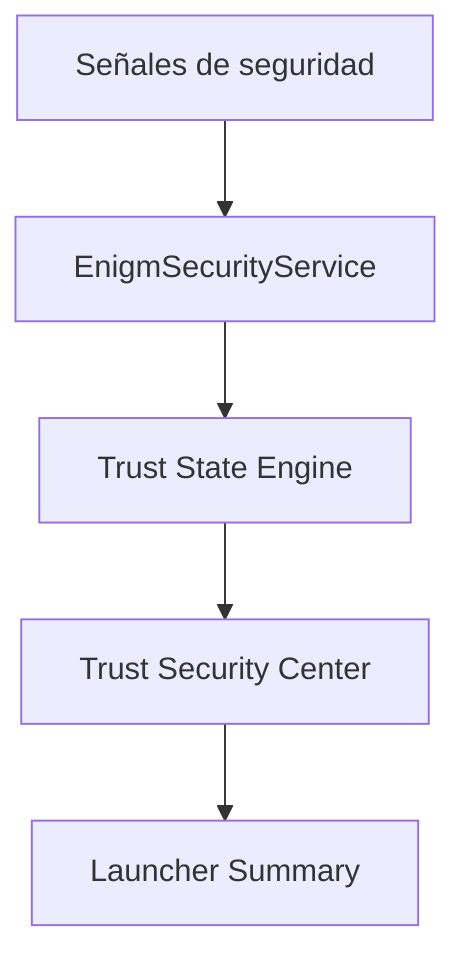

Trust Security Center es el sistema local de evaluación de confianza de dispositivo en Enigm OS.

No es antivirus, no es una puntuación numérica y no utiliza porcentajes.

## Resumen

Trust Security Center evalúa señales independientes del dispositivo y presenta estados claros al usuario.

## Arquitectura

## Estados de confianza

Estados internos:

- `PROTECTED`
- `REVIEW_REQUIRED`
- `INACTIVE`

Estados visibles:

- Protected.
- Review Required.
- Inactive.

## Protected

Todas las protecciones críticas están activas y funcionan como se espera.

Mensaje ejemplo: "All critical Enigm OS protections are operating normally."

## Review Required

Una o más protecciones críticas están degradadas, no disponibles o requieren atención.

Mensaje ejemplo: "One or more critical protections require attention."

## Inactive

Trust no puede determinar de forma fiable la integridad del dispositivo porque servicios críticos no están disponibles.

Mensaje de ejemplo: "Trust cannot currently evaluate device integrity."

## Hallazgos

Cada hallazgo debe incluir severidad, descripción, recomendación y fuente.

Severidades:

- Info.
- Low.
- Medium.
- High.
- Critical.

## Modelo de privacidad

Trust Security Center no intenta inspeccionar mensajes, llamadas, adjuntos, multimedia, documentos ni conversaciones.

Opera sobre señales de seguridad del dispositivo, no sobre contenido de usuario.

## Integración con Launcher

- Protected -> Device Protected.
- Review Required -> Device At Risk.
- Inactive -> Protection Inactive.

Consulta [Limitaciones de plataforma](/es/legal/limitations).
