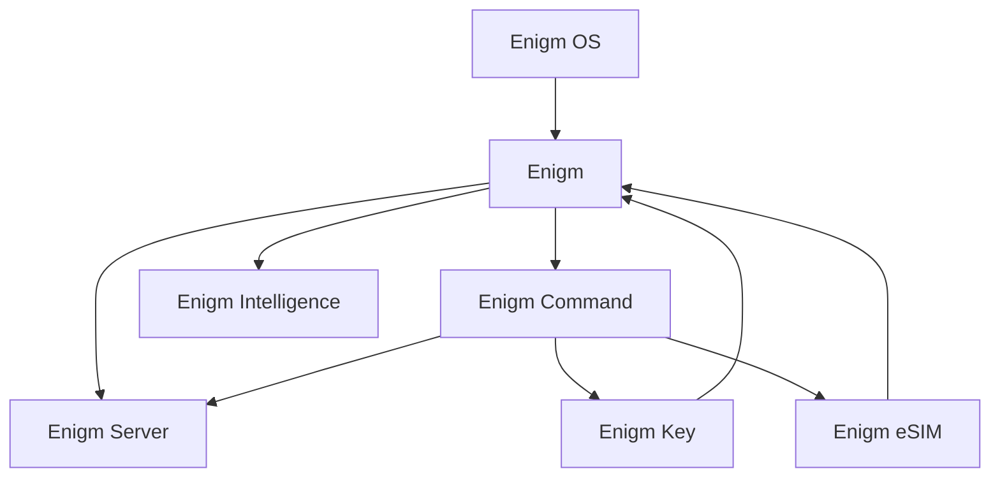

La arquitectura de Enigm se organiza alrededor de productos con límites de confianza separados.

## Productos

Los productos principales son:

- Enigm.
- Enigm Command.
- Enigm Server.
- Enigm OS.
- Enigm Key.
- Enigm eSIM.

Componentes de soporte como VPN Service, Proxy Network, Tor Gateway, privacidad de pagos, Threat Intelligence Platform y Enyra amplían capacidades sin cambiar la taxonomía de producto.

## Modelo de arquitectura

## Límites de confianza

La arquitectura separa:

- Confianza de cuenta.
- Confianza de dispositivo.
- Administración.
- Confidencialidad de mensajes.
- Elegibilidad OTA.
- Remote Attestation.
- Inteligencia de seguridad.

## Arquitectura de privacidad

Enigm aplica minimización de datos, minimización de identidad, reducción de metadatos, identificadores privacy-preserving y retención limitada.

Los metadatos se minimizan, se limitan por propósito, se protegen por control de acceso y se cifran parcialmente donde el dominio lo soporta.

## Límite administrativo

Enigm Command y Enigm Server gestionan ciclo de vida, dispositivos, sesiones, productos y disponibilidad de contenido cifrado. No proporcionan acceso a texto claro ni claves privadas.

## Referencias de seguridad

Consulta [Modelo de seguridad](/es/security/security-model), [Privacidad](/es/security/privacy), [Criptografía](/es/security/cryptography) y [Limitaciones de plataforma](/es/legal/limitations).
