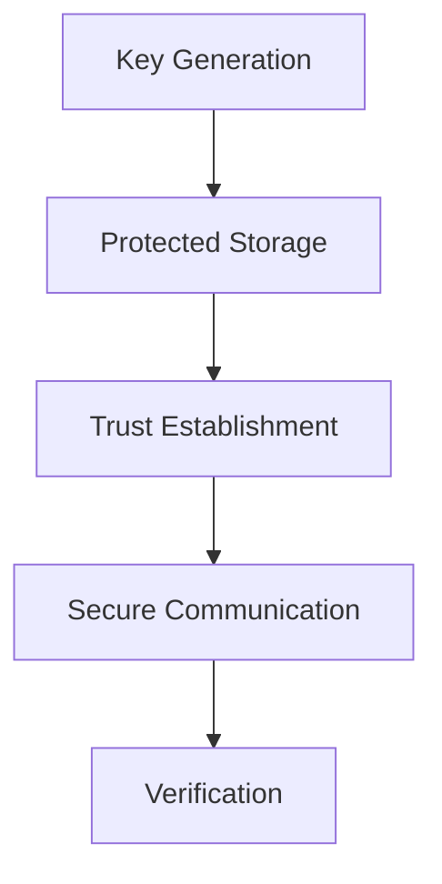

La criptografía de Enigm proporciona confidencialidad, integridad, autenticidad, establecimiento de confianza y entrega segura de software.

## Cryptographic Objectives

- Confidencialidad de contenido.
- Integridad de mensajes y artifacts.
- Autenticidad de dispositivos, releases y metadata.
- Confianza ligada a dispositivo.
- Verificacion de contactos, dispositivos y software.
- Agilidad criptográfica.

## Principles

Enigm aplica minima exposición de claves, Device-Bound Trust, protección hardware-backed donde está disponible, separación de dominios de confianza y defensa en profundidad.

## End-to-End Encryption

La mensajería de Enigm usa protecciónes de extremo a extremo. Los sistemas administrativos no proporcionan acceso a texto claro.

## Post-Quantum Cryptography

Enigm incorpora algoritmos criptográficos post-cuánticos estandarizados por NIST como parte de su arquitectura criptográfica.

Esto no significa que Enigm este certificado, aprobado o auditado por NIST.

## Key Lifecycle

El ciclo de vida incluye generacion, protección, rotacion, reemplazo y revocacion.

Las claves se generan en el dispositivo y el material privado está destinado a permanecer asociado a dispositivos de confianza.

## Secure Storage

En iOS se utilizan Keychain y Secure Enclave dónde están disponibles. En Android se utiliza platform keystore y protección hardware-backed donde está disponible.

## Verification Workflows

La verificacion puede establecer confianza entre usuarios, dispositivos, contactos y releases.

## OTA Cryptography

OTA utiliza release signing, manifest verification, artifact verification y eligibility controls.

Consulta [Platform Limitations](/es/legal/limitations).
