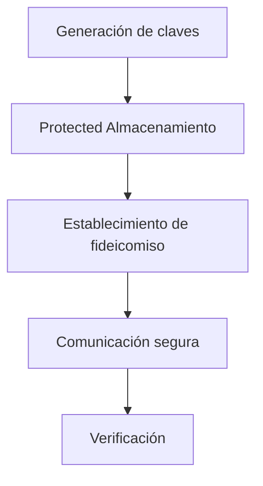

Enigm utiliza criptografía para proporcionar confidencialidad, autenticidad, integridad y establecimiento de confianza en múltiples componentes del ecosistema.

Este documento define la arquitectura criptográfica pública, los objetivos, los supuestos de confianza y los principios del ciclo de vida de Enigm en un nivel de arquitectura adecuado para revisión externa.

## Resumen

La criptografía se utiliza en Enigm App, Enigm OS, seguridad OTA, Device Trust, comunicaciones seguras y verificación de liberación.

Soporte de controles criptográficos:

- Confidencialidad.
- Integridad.
- Autenticidad.
- Device Trust.
- Entrega segura de software.
- Verificación.
- Constitución de fideicomisos.
- Resiliencia a largo plazo frente al riesgo futuro de transición criptográfica.

El diagrama es conceptual y describe el ciclo de vida criptográfico a nivel de arquitectura pública.

## Propósitos criptográficos

La arquitectura criptográfica Enigm está diseñada para respaldar:

- Confidencialidad de las comunicaciones protegidas y datos sensibles.
- Integridad de mensajes, publicaciones, metadatos y artefactos relevantes para la seguridad.
- Autenticidad de dispositivos, lanzamientos y partes de confianza.
- Device Trust a través de material clave protegido y flujos de trabajo de establecimiento de confianza.
- Entrega segura de software mediante firma y verificación de versiones.
- Verificación de usuarios, dispositivos y estado de lanzamiento.

La criptografía se trata como parte de un modelo más amplio de defensa en profundidad. Se combina con seguridad del dispositivo, controles de identidad, Trust Security Center, seguridad OTA, política de red y gobernanza.

## Principios criptográficos

El diseño criptográfico de Enigm se guía por:

- Mínima exposición del material clave.
- Confianza vinculada al dispositivo.
- Protección respaldada por hardware cuando esté disponible.
- Separación de dominios de confianza.
- Agilidad criptográfica.
- Defensa en profundidad.
- Verificación ante acciones sensibles a la confianza.
- Separación entre administración y acceso a texto claro.

Estos principios tienen como objetivo reducir la exposición de las claves, limitar las suposiciones de confianza y preservar los límites de seguridad independientes en todo el ecosistema.

## Modelo de algoritmo público

La documentación criptográfica pública de Enigm identifica familias de algoritmos y objetivos de seguridad sin exponer mensajes de protocolo, parámetros sensibles a la implementación, formatos de clave, rutas de almacenamiento interno o secretos operativos.

A nivel de arquitectura pública, Enigm utiliza:

- **AES-256** para cifrado simétrico de contenido y datos protegidos donde se requiere cifrado simétrico.
- **ML-KEM**, el mecanismo de encapsulación de claves estandarizado NIST derivado de CRYSTALS-Kyber, para objetivos de establecimiento de claves poscuánticos.
- **ML-DSA**, el algoritmo de firma digital estandarizado NIST derivado de CRYSTALS-Dilithium, para objetivos de firma poscuánticos.
- **TLS 1.3** para protección de transporte autenticado donde se requiere seguridad de la capa de transporte.
- **Administración de claves respaldada por HSM** para almacenamiento de claves protegidas, control de acceso, rotación y auditabilidad de claves criptográficas administradas.
- **Controles de distribución secretos** para reducir la dependencia de una única ubicación de clave recuperable o un único componente administrativo.

La documentación pública puede hacer referencia a Kyber y Dilithium porque esos nombres aparecen en los productos de Enigm y en los documentos técnicos. Los nombres estandarizados NIST correspondientes son ML-KEM y ML-DSA.

Este modelo público no divulga conjuntos de parámetros, tamaños de clave más allá de las familias de algoritmos nombrados públicamente, formatos de mensajes, funciones de derivación, secuenciación de protocolos ni detalles de implementación criptográfica desplegable.

## Cifrado de extremo a extremo

La mensajería Enigm se basa en protecciones criptográficas de un extremo a otro.

El modelo de mensajería segura está diseñado para que el texto claro de los mensajes esté disponible solo para puntos finales de confianza autorizados. El almacenamiento del lado del servidor, cuando es necesario para la entrega, almacena datos de mensajes cifrados en lugar de contenido de texto claro de mensajes.

Los sistemas administrativos no proporciona acceso de texto claro a los mensajes.

El cifrado de extremo a extremo está separado de los controles de privacidad de la red, como VPN, infraestructura de proxy, configuración del tráfico y transporte seguro. Estos controles resuelven diferentes problemas de seguridad y deberían evaluarse juntos en lugar de tratarse como sustitutos.

A nivel de arquitectura pública, la mensajería segura de Enigm combina cifrado de contenido simétrico, objetivos de establecimiento de claves post-cuánticas, objetivos de firma post-cuánticas, material de claves protegido, confianza vinculada al dispositivo y flujos de trabajo de verificación.

La confidencialidad de los mensajes depende de los dispositivos terminales autorizados y del material de claves protegido. Los sistemas del lado del servidor, los flujos de trabajo Enigm Command, los administradores Enigm Server, los sistemas de monitorización y los sistemas operativos no deben convertirse en rutas de acceso de texto claro.

## Cifrado de contenido simétrico

Enigm utiliza AES-256 para cifrado simétrico cuando el contenido o los datos protegidos requieren cifrado simétrico.

El cifrado simétrico se utiliza para proteger:

- Contenido del mensaje.
- Contenido del archivo adjunto.
- Contenido multimedia.
- Datos que requieren almacenamiento cifrado o protección de transporte.
- Cargas útiles sensibles a la seguridad donde el cifrado simétrico es apropiado.

La documentación pública no revela modos de cifrado, manejo de nonce, comportamiento de relleno, estructura de carga útil, detalles de derivación de claves o formatos de mensajes internos.

AES-256 protege el contenido solo cuando se combina con una administración de claves correcta, dispositivos de confianza, flujos de trabajo autenticados, controles del ciclo de vida y validación de implementación.

## Gestión de claves respaldada por HSM

Enigm utiliza administración de claves respaldada por HSM para claves criptográficas administradas que requieren almacenamiento protegido, control de acceso, rotación y auditabilidad.

A nivel de arquitectura pública, la gestión de claves respaldada por HSM admite:

- Protected almacenamiento de material de claves gestionado.
- Uso controlado de claves mediante operaciones autorizadas.
- Rotación de claves y gestión del ciclo de vida.
- Separación de funciones para la administración de claves.
- Auditabilidad de operaciones clave relevantes para la seguridad.
- Reducción de la exposición del material clave al tiempo de ejecución de la aplicación y a los flujos de trabajo administrativos.

La gestión de claves respaldada por HSM está separada del material de claves privadas mantenido en el punto final. También está separado del Modelo de Distribución Secreta.

La administración de claves respaldada por HSM protege las claves de plataforma administradas y las operaciones criptográficas sensibles a la seguridad. No debe describirse como un mecanismo que otorga a los administradores de Enigm acceso al texto claro de mensajes, texto claro de archivos adjuntos, comunicaciones de usuarios o material de clave privada en poder de dispositivos de usuarios de confianza.

La documentación pública no revela detalles de la relación con terceros HSM, identificadores de claves, jerarquía de claves, programas de rotación, políticas de acceso, procedimientos operativos, ubicaciones de almacenamiento interno o configuraciones de administración de claves sensibles a la implementación.

## Criptografía poscuántica

Enigm incorpora algoritmos criptográficos poscuánticos estandarizados por NIST como parte de su arquitectura criptográfica.

El objetivo es la resiliencia criptográfica a largo plazo. La criptografía poscuántica tiene como objetivo reducir el riesgo de avances futuros contra los supuestos criptográficos tradicionales de clave pública.

La arquitectura poscuántica de Enigm utiliza las siguientes familias de algoritmos públicos:

- **ML-KEM / Kyber** para objetivos de establecimiento clave poscuánticos.
- **ML-DSA / Dilithium** para objetivos de firma poscuánticos.

NIST FIPS 203 especifica ML-KEM, que se deriva de CRYSTALS-Kyber. NIST FIPS 204 especifica ML-DSA, que se deriva de CRYSTALS-Dilithium.

La criptografía poscuántica se utiliza como parte de una arquitectura más amplia. No reemplaza Device Trust, el almacenamiento de claves protegido, el cifrado de extremo a extremo, los flujos de trabajo de verificación, la gobernanza de la seguridad ni el refuerzo de terminales.

Este documento describe la criptografía poscuántica a nivel de arquitectura pública y evita detalles de implementación criptográfica desplegable.

## Establecimiento de clave post-cuántica

El establecimiento de claves poscuánticas se utiliza para respaldar objetivos de confidencialidad a largo plazo para flujos de trabajo de comunicación protegidos.

A nivel de arquitectura pública, el modelo de establecimiento clave está diseñado para:

- Establecer contexto criptográfico entre los participantes autorizados.
- Admite flujos de trabajo de comunicación y mensajes protegidos.
- Reducir la dependencia únicamente de los supuestos clásicos de clave pública.
- Respaldar la agilidad criptográfica a medida que evolucionan los estándares y los requisitos de implementación.
- Preservar la separación entre el material de claves mantenido en el punto final y los sistemas de entrega del lado del servidor.

La documentación pública no divulga transcripciones de intercambio, detalles de derivación de claves, conjuntos de parámetros, comportamiento de enrutamiento interno, comportamiento de negociación de dispositivos o secuenciación de protocolos sensibles a la implementación.

## Firmas poscuánticas

Los flujos de trabajo de firma poscuánticos se utilizan para respaldar los objetivos de autenticidad e integridad.

A nivel de arquitectura pública, Enigm utiliza objetivos de firma ML-DSA/Dilithium para respaldar:

- Autenticidad del mensaje.
- Integridad del mensaje.
- Verificación de que los datos protegidos no han sido alterados en tránsito.
- Establecimiento de confianza entre participantes o dispositivos esperados.
- Flujos de trabajo de verificación sensibles a la seguridad donde las firmas poscuánticas son apropiadas.

La documentación pública no revela formatos de carga útil de firma, transcripciones de verificación, contextos de firma específicos de implementación, identificadores internos ni material de firma operativo.

## Modelo de distribución secreto

Enigm utiliza un modelo de distribución secreto para reducir la dependencia de una única ubicación de clave recuperable o un único componente administrativo.

El modelo tiene como objetivo garantizar que el material criptográfico protegido o el contexto de autorización no queden expuestos a través de un sistema del lado del servidor, un administrador, una capa de almacenamiento o un flujo de trabajo operativo.

A nivel de arquitectura pública, la distribución secreta admite:

- Separación de dominios de confianza.
- Exposición reducida de un solo punto.
- Controles clave del ciclo de vida.
- Separación de límites de recuperación.
- Resistencia al acceso administrativo unilateral a texto claro.

La documentación pública no revela umbrales divididos, roles de los participantes, lógica de reconstrucción, ubicaciones de almacenamiento, sistemas internos de manejo de secretos ni procedimientos operativos.

La distribución secreta no otorga a los administradores de Enigm acceso al texto claro de los mensajes. Es un control de defensa en profundidad que complementa el material de claves protegido en el punto final, el cifrado de extremo a extremo y Device Trust.

La administración de claves respaldada por HSM y la distribución de secretos tienen diferentes propósitos. La administración de claves respaldada por HSM protege las claves administradas y las operaciones criptográficas controladas; La distribución secreta reduce la dependencia de una única ubicación secreta recuperable o de una ruta de recuperación administrativa unilateral.

## Datos en reposo

Los datos manejados por Enigm se cifran en reposo de acuerdo con el producto, el almacenamiento y el dominio de seguridad aplicables.

A nivel de arquitectura pública, la protección de datos en reposo incluye:

- Cifrado a nivel de datos donde los registros protegidos requieren cifrado.
- Cifrado de almacenamiento de plataforma según el dominio de almacenamiento aplicable.
- Cifrado de disco o capa de almacenamiento según el dominio de almacenamiento aplicable.
- Hashing para datos que no requieren reversibilidad.
- Controles de rotación de claves y ciclo de vida.
- Gestión de claves respaldada por HSM para claves de plataforma administradas cuando corresponda.

Cuando se utiliza hash para datos no reversibles, debe combinarse con controles adecuados de protección y salazón. La documentación pública no revela detalles de construcción de hash, mecanismos de generación de sal, esquemas de almacenamiento ni detalles de implementación de administración de claves.

El cifrado en reposo no es lo mismo que el cifrado de extremo a extremo. El cifrado de datos en reposo protege los datos almacenados dentro de los dominios operativos y de almacenamiento, mientras que el cifrado de extremo a extremo protege el contenido del mensaje de modo que el texto claro esté disponible solo para puntos finales de confianza autorizados.

## Datos en tránsito

Enigm utiliza protección de transporte autenticada cuando se requiere seguridad de la capa de transporte.

A nivel de arquitectura pública, la protección del transporte incluye:

- TLS 1.3 para canales de transporte protegidos.
- Compatibilidad con TLS 1.2 solo cuando sea necesaria para clientes admitidos y restringida a conjuntos de cifrado sólidos aprobados.
- Rutas de comunicación autenticadas.
- Transporte de carga útil cifrado.
- Solicitar controles de integridad cuando sea necesario.
- Separación entre seguridad del transporte y confidencialidad del contenido de los mensajes.

El cifrado de transporte protege las rutas de comunicación, pero no reemplaza el cifrado de extremo a extremo, el material de claves protegido, Device Trust ni los flujos de trabajo de verificación.

## Seguridad del transporte web público

Las superficies web públicas están protegidas con una estricta base de seguridad en el transporte.

A nivel de arquitectura pública, esta línea base incluye:

- Certificados TLS emitidos para nombres de host proxy públicos.
- Gestión automatizada del ciclo de vida de los certificados para nombres web públicos.
- Seguridad de transporte estricta HTTP para acceso web público.
- HSTS edad máxima de 6 meses.
- Cobertura de subdominio HSTS habilitada.
- Hola de cliente cifrado habilitado para clientes compatibles y rutas de acceso web públicas.
- Selección de autoridad certificadora gestionada a través de flujos de trabajo de emisión de certificados públicos aprobados.

Client Hello cifrado mejora la privacidad durante los protocolos de enlace TLS admitidos al cifrar el mensaje ClientHello, incluida la indicación del nombre del servidor que, de otro modo, sería visible en el protocolo de enlace.

Los controles de transporte web público son independientes del cifrado de extremo a extremo Enigm App. Protegen las rutas de acceso web públicas y transportan metadatos para clientes compatibles, pero no reemplazan el cifrado de mensajes, Device Trust, el material de clave protegido ni los flujos de trabajo de verificación.

La documentación pública no revela nombres de autoridades de certificación, nombres de relaciones de borde público, nombres de host internos, dominios no públicos, topología de enrutamiento privado, elementos internos de automatización de certificados ni detalles de implementación operativa.

## TLS Línea base de Cipher Suite

Para la compatibilidad de TLS 1.2 en rutas web públicas admitidas, Enigm utiliza una línea base de conjunto de cifrado fuerte y restringida.

La línea base de compatibilidad pública TLS 1.2 incluye:

| Conjunto de cifrado | Versión mínima TLS | Autenticación |
| --- | --- | --- |
| ECDHE-ECDSA-AES128-GCM-SHA256 | TLS 1.2 | ECDSA |
| ECDHE-ECDSA-CHACHA20-POLY1305 | TLS 1.2 | ECDSA |
| ECDHE-RSA-AES128-GCM-SHA256 | TLS 1.2 | RSA |
| ECDHE-RSA-CHACHA20-POLY1305 | TLS 1.2 | RSA |
| ECDHE-ECDSA-AES256-GCM-SHA384 | TLS 1.2 | ECDSA |
| ECDHE-RSA-AES256-GCM-SHA384 | TLS 1.2 | RSA |

TLS 1.3 sigue siendo la base de transporte preferida para clientes compatibles.

La documentación del conjunto de cifrado se limita a la postura del transporte web público. No debe interpretarse como una divulgación de la topología del servicio interno, los puntos finales privados, los aspectos internos del protocolo de aplicación o los detalles del protocolo de cifrado de mensajes.

## Ciclo de vida clave

Las claves criptográficas se gestionan mediante eventos del ciclo de vida.

El ciclo de vida clave incluye:

- Generación.
- Protección.
- Rotación.
- Reemplazo.
- Revocación.

Los controles del ciclo de vida de las claves tienen como objetivo garantizar que las claves se creen en contextos de confianza, se protejan durante el uso, se reemplacen cuando sea necesario y dejen de ser de confianza después de la revocación.

Las decisiones clave sobre el ciclo de vida pueden aplicarse a claves de mensajería, claves Device Trust, claves de firma de liberación, claves de firma de manifiesto y otro material criptográfico utilizado por los componentes de Enigm.

La gestión del ciclo de vida de las claves se evalúa junto con la protección respaldada por hardware cuando esté disponible, el almacenamiento protegido del dispositivo, la gestión de claves respaldada por HSM, el ajuste de claves, la rotación, la revocación y los controles de distribución secreta.

## Confianza vinculada al dispositivo

El material de clave privada está destinado a permanecer asociado con dispositivos de confianza.

La confianza vinculada al dispositivo admite:

- Asociación de dispositivos de confianza.
- Acceso seguro a mensajería.
- Flujos de trabajo de llamadas seguros.
- Establecimiento multi-Device Trust.
- Revocación del dispositivo.
- Trust Security Center y flujos de trabajo de dispositivos administrados.

La confianza vinculada al dispositivo no significa que se confíe permanentemente en un dispositivo. Device Trust puede cambiar según eventos del ciclo de vida, revocación, reemplazo, postura de seguridad o decisiones políticas.

## Almacenamiento seguro

Los mecanismos de almacenamiento del dispositivo Protected se utilizan para la protección de claves privadas.

Cuando esté disponible, se utiliza protección respaldada por hardware. En plataformas móviles compatibles, el almacenamiento seguro puede utilizar almacenamiento protegido proporcionado por la plataforma y capacidades de protección de claves respaldadas por hardware.

Cuando los límites del hardware no puedan almacenar directamente material criptográfico de mayor tamaño, se podrá utilizar un envoltorio protegido o material de control de acceso para proteger el material clave fuera de los límites seguros del hardware.

El material de clave privada no debe almacenarse en texto claro.

El almacenamiento seguro reduce la exposición de las claves, pero no elimina el riesgo de comprometer los terminales.

En iOS, Enigm App utiliza protección respaldada por Keychain y Secure Enclave cuando esté disponible y sea apropiado. En Android, Enigm App utiliza protección respaldada por Keystore de Android, incluida la protección respaldada por Keystore o StrongBox respaldada por hardware según la clase de dispositivo y la capacidad de implementación.

## Flujos de trabajo de verificación

La verificación se puede utilizar para establecer confianza entre dispositivos, usuarios y versiones.

Los flujos de trabajo de verificación pueden admitir:

- Establecimiento Device Trust.
- Verificación de contacto o dispositivo.
- Inscripción multidispositivo.
- Controles de autenticidad de release.
- Verificación del manifiesto.
- Verificación de artefactos.
- Revisión del estado de confianza.

La verificación tiene como objetivo reducir la dependencia de la confianza implícita. No reemplaza la concienciación del usuario, la seguridad del dispositivo ni el material clave protegido.

## Criptografía OTA

La seguridad OTA utiliza controles criptográficos para proteger la confianza en la versión y la entrega de software.

La criptografía OTA incluye:

- Firma de comunicados.
- Verificación del manifiesto.
- Verificación de artefactos.
- Controles de elegibilidad.

La firma de la autorización establece la autenticidad de la autorización. La verificación de manifiesto protege los metadatos de la versión. La verificación de artefactos protege el contenido actualizado. Los controles de elegibilidad ayudan a determinar si un dispositivo debe recibir una autorización.

La criptografía OTA no reemplaza el arranque verificado, Remote Attestation, las controles de producción, la evaluación Device Trust ni la verificación del cliente.

## Agilidad criptográfica

La agilidad criptográfica es un objetivo de diseño.

La arquitectura criptográfica de Enigm debería respaldar la revisión y evolución de:

- Selección de algoritmo.
- Requisitos clave del ciclo de vida.
- Requisitos de migración poscuántica.
- Flujos de trabajo de firma y verificación.
- Capacidades de almacenamiento seguro.
- Requisitos de protección del transporte.
- Requisitos de firma de release.
- Requisitos de gestión de claves respaldados por HSM.

La agilidad criptográfica no significa una sustitución incontrolada de algoritmos. Los cambios en la arquitectura criptográfica deben revisarse mediante desarrollo seguro, gobernanza de seguridad, controles de liberación y procesos de garantía.

## Limitaciones criptográficas

La criptografía protege los datos y las relaciones de confianza, pero no elimina todos los riesgos de seguridad.

La criptografía no protege contra:

- Ingeniería social.
- Usuarios maliciosos de confianza.
- Puntos finales comprometidos.
- Futuras vulnerabilidades desconocidas.
- Usuarios autorizados que divulgan texto claro.
- Grabación externa o captura fuera de los controles de Enigm.
- Prácticas operativas débiles fuera de los límites criptográficos.
- Implementación incorrecta de algoritmos que de otro modo serían apropiados.
- Políticas o controles de ciclo de vida mal configurados.

La criptografía debe evaluarse como parte de la arquitectura de seguridad más amplia de Enigm, que incluye Device Trust, identidad segura, Trust Security Center, seguridad OTA, política de red, respuesta a incidentes y gobernanza de seguridad.

## Referencias de estándares públicos

Las referencias de estándares públicos relevantes incluyen:

- [NIST FIPS 203: Estándar de mecanismo de encapsulación de claves basado en celosía de módulo](https://csrc.nist.gov/pubs/fips/203/final)
- [NIST FIPS 204: Estándar de firma digital basado en celosía de módulo](https://csrc.nist.gov/pubs/fips/204/final)

Las referencias a los estándares NIST significan que Enigm incorpora algoritmos criptográficos poscuánticos estandarizados por NIST como parte de su arquitectura criptográfica. No significan que NIST haya certificado, aprobado, auditado o respaldado a Enigm como producto.

## Evaluación criptográfica

La arquitectura criptográfica de Enigm se evalúa mediante procesos de revisión de seguridad privada. La evidencia de evaluación criptográfica actual está disponible para clientes empresariales, auditores y socios técnicos bajo NDA a través del proceso de revisión de seguridad de Enigm.

El alcance de la evaluación incluye implementación de cifrado de extremo a extremo, integración de criptografía poscuántica, administración de claves, protección de claves vinculadas al dispositivo, confianza en múltiples dispositivos, mensajería segura, llamadas seguras, firma OTA y flujos de trabajo de verificación.

Enigm no publica públicamente el informe completo de evaluación criptográfica porque puede contener hallazgos confidenciales, historial de remediación, detalles del protocolo o información de implementación. Cuando se apruebe para distribución pública, Enigm puede proporcionar el alcance de la evaluación, el período del informe, un resumen de alto nivel, categorías de estado de remediación o material de resumen ejecutivo.
