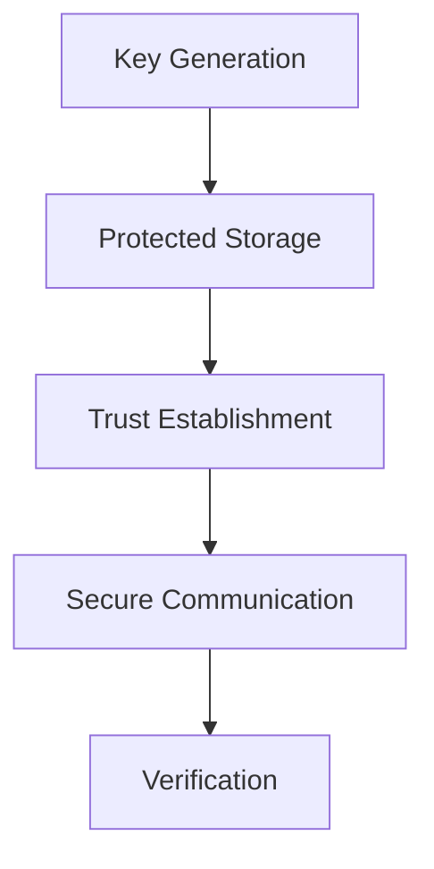

La criptografía de Enigm proporciona confidencialidad, integridad, autenticidad, establecimiento de confianza y entrega segura de software.

## Objetivos criptográficos

- Confidencialidad de contenido.
- Integridad de mensajes y artefactos.
- Autenticidad de dispositivos, releases y metadatos.
- Confianza ligada a dispositivo.
- Verificacion de contactos, dispositivos y software.
- Agilidad criptográfica.

## Principios

Enigm aplica mínima exposición de claves, Device-Bound Trust, protección hardware-backed donde está disponible, separación de dominios de confianza y defensa en profundidad.

## Cifrado de extremo a extremo

La mensajería de Enigm usa protecciones de extremo a extremo. Los sistemas administrativos no proporcionan acceso a texto claro.

## Criptografía post-cuántica

Enigm incorpora algoritmos criptográficos post-cuánticos estandarizados por NIST como parte de su arquitectura criptográfica.

Esto no significa que Enigm esté certificado, aprobado o auditado por NIST.

## Ciclo de vida de claves

El ciclo de vida incluye generacion, protección, rotacion, reemplazo y revocación.

Las claves se generan en el dispositivo y el material privado está destinado a permanecer asociado a dispositivos de confianza.

## Almacenamiento seguro

En iOS se utilizan Keychain y Secure Enclave dónde están disponibles. En Android se utiliza platform keystore y protección hardware-backed donde está disponible.

## Flujos de verificación

La verificación puede establecer confianza entre usuarios, dispositivos, contactos y releases.

## Criptografía OTA

OTA utiliza release signing, manifest verification, artifact verification y eligibility controls.

Consulta [Limitaciones de plataforma](/es/legal/limitations).
