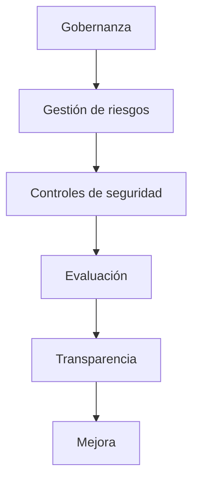
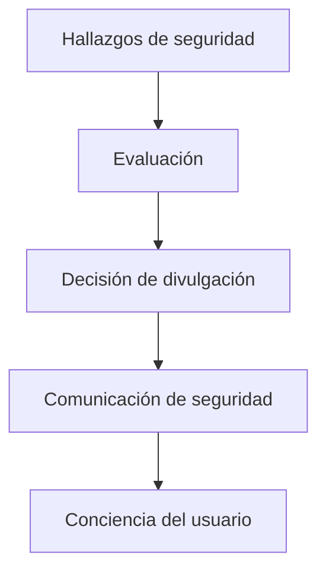

Enigm mantiene un modelo formal de gobierno de seguridad de la información destinado a respaldar la seguridad, la privacidad, la resiliencia operativa, el cumplimiento, la garantía y la mejora continua.

Esta página consolida la gobernanza pública, el cumplimiento, la evidencia de aseguramiento, el modelo de transparencia y las prácticas continuas de validación de seguridad de Enigm.

## Resumen

La gobernanza de la seguridad en Enigm se basa en la gobernanza, la gestión de riesgos, los controles de seguridad, la evaluación, la transparencia y la mejora continua.

El diagrama es conceptual y describe el ciclo de vida del aseguramiento a nivel de gobernanza pública.

## Gobernanza de seguridad

El gobierno de seguridad de Enigm define cómo se gestionan las responsabilidades de seguridad, los procesos de supervisión y revisión.

La gobernanza incluye:

- Responsabilidades de seguridad definidas.
- Supervisión de seguridad.
- Procesos de gobernanza.
- Procesos de revisión de seguridad.
- Responsabilidad por las decisiones de riesgo.
- Revisión de cambios relevantes para la seguridad.

La gobernanza de la seguridad respalda la toma de decisiones coherente y garantiza que la seguridad siga siendo parte del producto, la plataforma, la privacidad y la planificación operativa.

## Gestión de riesgos

Los riesgos de seguridad se identifican, evalúan, priorizan y abordan a través de procesos estructurados de gestión de riesgos.

La gestión de riesgos incluye:

- Identificación de riesgos de seguridad.
- Evaluación de probabilidad e impacto.
- Priorización según riesgo.
- Planificación de remediación.
- Verificación de la remediación.
- Reevaluación periódica.

La gestión de riesgos respalda la gobernanza de la seguridad al garantizar que los hallazgos, las brechas de control y los riesgos de exposición se revisen de acuerdo con su relevancia para la seguridad.

## Gestión de seguridad de la información

Enigm opera un marco de gestión de seguridad de la información diseñado para respaldar:

- Confidencialidad.
- Integridad.
- Disponibilidad.
- Gestión de riesgos.
- Mejora continua.

El marco de gestión de la seguridad de la información proporciona una estructura para la gobernanza de la seguridad, la revisión del control, las actividades de aseguramiento y las operaciones del programa de cumplimiento.

## Cumplimiento

Enigm mantiene la certificación ISO/IEC 27001:2022.

La certificación respalda la gobernanza estructurada de la seguridad de la información, la gestión de riesgos, la revisión de controles y la evaluación periódica. El alcance certificado cubre el sistema de gestión de seguridad de la información que respalda las actividades de desarrollo de aplicaciones de mensajería cifrada, incluida la gobernanza de desarrollo relacionada, la infraestructura de desarrollo de apoyo, las políticas de seguridad interna y los procesos de la empresa incluidos en el Statement of Applicability del 9 de septiembre de 2024.

El certificado público identifica:

- Organización certificada: ENIGM, LLC.
- Estándar: ISO/IEC 27001:2022.
- Fecha de emisión de la certificación: 23 de noviembre de 2024.
- Fecha de emisión del certificado original: 23 de noviembre de 2024.
- Fecha de caducidad del certificado: 22 de noviembre de 2027.
- Fecha del Statement of Applicability: 09 de septiembre de 2024.

El alcance del certificado es:

> Sistema que respalda las actividades de desarrollo de aplicaciones de mensajería cifrada, según Statement of Applicability de fecha 09/09/2024.

El certificado está disponible para revisión pública:

<Card title="Certificado ISO/IEC 27001:2022" href="https://raw.githubusercontent.com/enigm-llc/docs/main/assets/compliance/enigm-iso-27001-certificate.pdf">
  Certificado público para el sistema de gestión de seguridad de la información ENIGM, LLC.
</Card>

La certificación debe interpretarse como evidencia de un sistema formal de gestión de seguridad de la información. No debe interpretarse como una garantía de que no existen vulnerabilidades, una certificación de cada característica del producto, una certificación de cada implementación o un reemplazo de la revisión técnica de seguridad.

## Alcance de la certificación

La certificación ISO/IEC 27001:2022 se aplica al alcance certificado documentado.

El alcance certificado cubre el sistema de gestión de seguridad de la información que respalda las actividades de desarrollo de aplicaciones de mensajería cifrada, incluida la gobernanza de desarrollo relacionada, la infraestructura de desarrollo de apoyo, las políticas de seguridad interna y los procesos de la empresa incluidos en el Statement of Applicability. No certifica automáticamente cada característica individual del producto Enigm, implementación del cliente, característica futura o límite de servicio de terceros a menos que ese elemento esté incluido explícitamente en el alcance certificado aplicable.

La interpretación del alcance debe utilizar una redacción cuidadosa:

- Alcance certificado.
- Ampliación del alcance.
- Donde esté incluido.
- Sujeto al alcance de la auditoría.

Enigm puede ampliar o perfeccionar el alcance certificado con el tiempo para incluir operaciones de producción adicionales, operaciones de red, flujos de trabajo de administración de claves, gobernanza OTA y procesos de seguridad de infraestructura. Cualquier interpretación del alcance debe evaluarse de acuerdo con el alcance de auditoría aplicable, Statement of Applicability, y la evidencia del certificado público.

## Evidencia de aseguramiento

La garantía de seguridad en Enigm se basa en la gobernanza formal, la gestión de riesgos, la revisión de seguridad recurrente, la evaluación independiente y la mejora continua.

La evidencia de aseguramiento respalda la revisión de:

- Gobernanza de seguridad de la información.
- Diseño de plataforma orientada a la privacidad.
- Minimización de datos y confidencialidad de contenidos.
- Prácticas de desarrollo seguras.
- Monitorización de seguridad y preparación para incidentes.
- Revisión de arquitectura criptográfica.
- Entrega controlada de software.
- Postura de cumplimiento.

La evidencia de aseguramiento público se organiza en torno a las siguientes categorías:

| Categoría | Propósito de aseguramiento público |
| --- | --- |
| Gobernanza | Demuestra que existen responsabilidades de seguridad, supervisión y procesos de revisión. |
| Gestión de riesgos | Demuestra que los riesgos se identifican, priorizan, abordan y reevalúan. |
| Desarrollo seguro | Demuestra que el desarrollo de software incluye controles de revisión, validación y lanzamiento. |
| Criptografía | Demuestra que la arquitectura criptográfica se rige y revisa como parte de la garantía de seguridad. |
| Privacidad | Demuestra que la minimización de datos, la minimización de identidades y la reducción de metadatos son objetivos de diseño. |
| Respuesta a incidentes | Demuestra que los eventos de seguridad se manejan a través de una gobernanza de respuesta estructurada. |
| Monitorización | Demuestra que la visibilidad operativa y de seguridad respalda la investigación y la resiliencia. |
| Cumplimiento | Demuestra alineación con las prácticas formales de evaluación y gobernanza de la seguridad de la información. |

La evidencia de aseguramiento no reemplaza la debida diligencia técnica, la revisión contractual, la revisión de la implementación o la evaluación de seguridad específica del cliente.

## Evaluaciones independientes

Enigm realiza actividades de evaluación de seguridad independientes y recurrentes.

Las actividades de evaluación incluyen:

- Evaluación criptográfica privada.
- Pruebas de penetración privadas.
- Valoración de aplicaciones móviles privadas.
- Evaluación de infraestructura privada.
- Evaluaciones periódicas de seguridad.
- Evaluaciones de vulnerabilidad.
- Pruebas de seguridad adversarias.
- Revisiones de control de seguridad.
- Revisiones de exposición de infraestructura.
- Validación de postura de seguridad.
- Revisiones de configuración.

Estas actividades tienen como objetivo identificar vulnerabilidades, configuraciones incorrectas, brechas de control y riesgos de exposición en los entornos compatibles.

## Validación de seguridad continua

Enigm realiza actividades de validación de seguridad continuas y periódicas diseñadas para mejorar la responsabilidad, la postura de seguridad y la confianza pública.

Las prácticas de validación incluyen:

- Evaluación de vulnerabilidad automatizada.
- Revisiones de exposición de infraestructura.
- Validación de postura de seguridad.
- Revisiones de configuración.
- Monitorización de la superficie de ataque.
- Validación de controles de seguridad.
- Pruebas adversariales periódicas.
- Ejercicios de ataque simulados.
- Monitorización continua.
- Ciclos de revisión de seguridad.

### Evaluaciones periódicas de seguridad

Enigm realiza evaluaciones de seguridad recurrentes destinadas a identificar vulnerabilidades, configuraciones erróneas y riesgos de exposición en los entornos compatibles.

Los resultados de la evaluación orientan las prioridades de remediación, la revisión de seguridad, la planificación de versiones y la revisión de la gobernanza, cuando corresponda.

### Pruebas adversariales de seguridad

Enigm realiza ejercicios adversariales periódicos de seguridad diseñados para simular el comportamiento de los atacantes y evaluar la detección, la visibilidad y los controles defensivos.

Estos ejercicios tienen como objetivo mejorar:

- Capacidades de detección.
- Monitorización de seguridad.
- Preparación de respuesta a incidentes.
- Controles defensivos.
- Postura de seguridad.

### Validación de seguridad continua

Los controles de seguridad se revisan de forma continua mediante procesos de validación manuales y automatizados.

La validación continua respalda la concientización sobre la seguridad, la verificación del control y la mejora de la postura de seguridad de Enigm a lo largo del tiempo.

### Gobernanza

Las revisiones de seguridad se realizan periódicamente. La postura de seguridad se reevalúa periódicamente, los hallazgos se priorizan según el riesgo y las actividades de remediación se rastrean y verifican.

## Revisiones de seguridad

La postura de seguridad se revisa de forma recurrente.

Las revisiones de seguridad evalúan:

- Hallazgos de seguridad.
- Efectividad del control.
- Postura de configuración.
- Riesgos de exposición.
- Progreso de la remediación.
- Cambios relevantes para la seguridad.

Los hallazgos se priorizan según el riesgo y se abordan mediante procesos de remediación. Las actividades de remediación son rastreadas y verificadas.

## Garantía criptográfica

Enigm incorpora algoritmos criptográficos poscuánticos estandarizados por NIST como parte de su arquitectura criptográfica.

Esta afirmación significa que Enigm utiliza algoritmos criptográficos poscuánticos estandarizados NIST como parte de su arquitectura. No significa:

- NIST ha certificado Enigm.
- NIST ha aprobado Enigm como producto.
- NIST ha auditado a Enigm.
- Cada componente de Enigm utiliza el mismo mecanismo criptográfico.

La garantía criptográfica se revisa como parte de un programa de garantía de seguridad más amplio, que incluye el ciclo de vida de las claves, la confianza vinculada al dispositivo, el almacenamiento seguro, los flujos de trabajo de verificación y la entrega controlada de software.

## Garantía de privacidad

La garantía de seguridad de Enigm se evalúa en el contexto de la privacidad.

La seguridad existe para respaldar:

- Privacidad por diseño.
- Minimización de datos.
- Minimización de identidad.
- Reducción de metadatos.
- Confidencialidad del contenido.
- Privacy-Preserving Device Handles.
- Control de usuarios.

La revisión de garantía debe verificar que los controles de seguridad no creen una recopilación, retención o exposición innecesaria de contenido protegido.

Los sistemas administrativos no están destinados a proporcionar acceso en texto claro a mensajes, llamadas, medios, archivos adjuntos o conversaciones de usuarios.

## Transparencia

Enigm aborda la transparencia como una práctica de seguridad, privacidad y responsabilidad. La comunicación de seguridad pública debería mejorar la confianza, respaldar decisiones informadas y ayudar a los auditores, clientes, socios e ingenieros a comprender la postura de seguridad de Enigm.

Saldos de transparencia:

- Confianza del usuario.
- Privacidad.
- Seguridad.
- Seguridad operativa.

## Principios de transparencia de seguridad

La transparencia de seguridad de Enigm se guía por:

- Exactitud.
- Responsabilidad.
- Comunicación oportuna.
- Divulgación responsable.
- Mejora continua.
- Comunicación consciente del riesgo.
- Protección de los usuarios y la integridad de la plataforma.
- Minimización de datos y confidencialidad de contenidos.

La transparencia respalda la revisión informada sin aumentar el riesgo para los usuarios o la integridad de la plataforma.

## Avisos de seguridad

Se pueden publicar avisos de seguridad cuando vulnerabilidades, actualizaciones de seguridad o cambios de seguridad importantes afecten a la plataforma.

Los avisos pueden describir:

- Zona de seguridad afectada.
- Impacto en el usuario a un nivel adecuado.
- Mitigaciones disponibles.
- Información de actualización de seguridad.
- Acción recomendada por el usuario o administrador.

Los avisos de seguridad brindan suficiente información para respaldar decisiones informadas y al mismo tiempo evitan la exposición innecesaria de material técnico confidencial.

## Divulgación de vulnerabilidad

Enigm apoya la divulgación responsable de vulnerabilidades.

Los informes de seguridad se evalúan, validan y priorizan según el riesgo. La evaluación considera el impacto técnico, la explotabilidad, los usuarios afectados, los componentes afectados y las mitigaciones disponibles.

El manejo de la divulgación preserva la confidencialidad mientras se revisa un informe y mientras se prepara la solución.

## Divulgación responsable

Se anima a los investigadores a informar los problemas de seguridad de forma responsable.

La divulgación responsable tiene como objetivo:

- Proteger a los usuarios.
- Apoyar la remediación coordinada.
- Preservar evidencia para revisión técnica.
- Evite la publicación prematura de detalles sensibles.
- Mejorar la seguridad mediante informes constructivos.

Los informes deben incluir suficiente contexto técnico para respaldar la validación sin incluir datos confidenciales innecesarios.

## Comunicaciones de seguridad

Las comunicaciones de seguridad proporcionan suficiente información para respaldar decisiones informadas sin aumentar el riesgo para los usuarios.

Balanzas de comunicación de seguridad:

- Exactitud.
- Puntualidad.
- Impacto en el usuario.
- Seguridad operativa.
- Estado de remediación.
- Sensibilidad de la divulgación.

La comunicación puede variar según la gravedad, el impacto en el usuario, la disponibilidad de soluciones y las obligaciones legales o contractuales.

## Publicar transparencia

La plataforma puede publicar información de lanzamiento relevante para la seguridad.

La transparencia de la publicación puede incluir:

- Divulgar información.
- Mejoras de seguridad.
- Cambios relevantes para la seguridad.
- Información de actualización de seguridad.
- Orientación para usuarios o administradores.

La transparencia de la versión respalda la auditabilidad y la conciencia del usuario al tiempo que preserva los detalles confidenciales de la implementación.

## Límites de la evidencia

La evidencia de garantía pública se limita intencionalmente.

La evidencia restringida se puede manejar a través de procesos apropiados de revisión empresarial, legal, de adquisiciones o de auditoría cuando sea necesario.

## Mejora Continua

La gobernanza de la seguridad incluye:

- Revisión continua.
- Validación de controles.
- Monitorización de seguridad.
- Reevaluación de riesgos.
- Mejora del programa.
- Verificación de remediación.
- Revisión de los resultados de la evaluación.

La mejora continua garantiza que la gobernanza, los controles de seguridad y las actividades de aseguramiento evolucionen a medida que evolucionan el ecosistema de Enigm, el entorno de amenazas y los requisitos del cliente.

## Estado de implementación y validación

La documentación de Public Enigm describe los productos de producción implementados y las capacidades de producción, a menos que una sección identifique explícitamente una capa de refuerzo objetivo o un modelo de implementación con alcance.

| Área | Estado público | Modelo de Validación |
| --- | --- | --- |
| Enigm App mensajería segura, llamadas seguras, administración de claves y flujos multi-dispositivo | Implementado y en producción | Evidencia de evaluación criptográfica y de seguridad privada disponible bajo NDA. |
| VPN Service y Proxy Network | Implementado y en producción | Evidencia de evaluación de infraestructura privada disponible bajo NDA. |
| Enigm Command, Enigm Server, Enigm eSIM y Enigm Key | Implementado y en producción | Evidencia privada de revisión de productos, infraestructura y seguridad disponible bajo NDA. |
| Enigm OS, Trust Security Center, OTA Architecture, Remote Attestation y Hardware-Backed Signing | Implementado y en producción | Evidencia de evaluación de infraestructura, dispositivos, OTA y dispositivos móviles privados disponibles bajo NDA. |
| Target Production Release-Signing Authority | Arquitectura de endurecimiento de objetivos | Documentado por separado de la autoridad de firma del manifiesto OTA de producción actual. |
| Enyra y Enigm Intelligence | Implementado y en producción | Evidencia de revisión de seguridad privada disponible bajo NDA. |
| SDLC seguro y programa de gobernanza | Implementado y en producción | Certificado ISO/IEC 27001:2022 y evidencia de gobernanza disponibles. |

La evidencias de evaluación privada puede incluir evaluación criptográfica, pruebas de penetración, evaluación de aplicaciones móviles, evaluación de infraestructura y material de revisión de seguridad más amplio. No se publica públicamente cuando podría revelar hallazgos confidenciales, detalles del alcance, historial de remediación o información de implementación.

## Documentos relacionados

- [Modelo de seguridad](/es/security/security-model)
- [Privacidad](/es/security/privacy)
- [Modelo de amenaza](/es/security/threat-model)
- [Criptografía](/es/security/cryptography)
- [Informe de transparencia](/es/security/transparency-report)
- [SDLC seguro](/es/infrastructure/secure-sdlc)
- [Operaciones y resiliencia](/es/infrastructure/operations-resilience)
- [Limitaciones de la plataforma](/es/legal/limitations)
