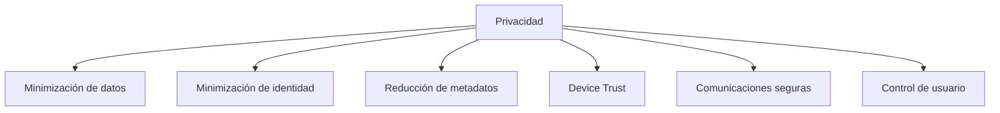

Enigm está diseñado según el principio de que la privacidad es una propiedad fundamental de la plataforma y no una característica opcional. Existen controles de seguridad para respaldar ese objetivo de privacidad al proteger la confidencialidad del contenido, reducir la exposición de la identidad, minimizar los metadatos y preservar el control del usuario.

El modelo de privacidad de Enigm se aplica en Enigm App, Enigm Command, Enigm Server, Enigm OS, Trust Security Center, VPN Service, Proxy Network, Tor Gateway, Threat Intelligence Platform, Enyra, Enigm Key, Enigm eSIM y OTA Architecture.

## Resumen

Enigm está orientado a la privacidad por diseño. El ecosistema tiene como objetivo minimizar la recopilación innecesaria, reducir la dependencia de identificadores públicos, reducir la visibilidad de los metadatos y proteger las comunicaciones de los usuarios.

Las decisiones de privacidad se evalúan junto con la arquitectura del producto, Device Trust, el diseño de la red, la gobernanza de la seguridad y los controles del ciclo de vida. Enigm utiliza cuidadosamente un lenguaje orientado a la privacidad y que minimiza la identidad; La reducción de metadatos no debe interpretarse como una garantía absoluta de identidad o análisis de tráfico.

## Privacidad por diseño

Las consideraciones de privacidad se incorporan en las decisiones de diseño de la plataforma desde el principio.

Privacidad por diseño significa:

- La privacidad se considera durante la arquitectura del producto.
- Los controles de seguridad se evalúan para determinar el impacto en la privacidad.
- La recopilación de datos se revisa con fines definidos.
- La exposición de metadatos se trata como una preocupación de seguridad y privacidad.
- La visibilidad administrativa se mantiene separada del acceso al texto claro.

## Minimización de datos

La plataforma está diseñada para recopilar y retener solo la información necesaria para operar los servicios, mantener la seguridad, respaldar la integridad de la plataforma, manejar el ciclo de vida de la cuenta y cumplir con las obligaciones legales aplicables.

Minimización de datos significa:

- Colección limitada.
- Limitación de finalidad.
- Retención mínima.
- Control de acceso.
- Revisión de seguridad del manejo de datos.
- Separación entre contenido protegido y metadatos operativos.

Los datos manejados por Enigm se cifran en reposo de acuerdo con el producto, el almacenamiento y el dominio de seguridad aplicables. El cifrado en reposo complementa, pero no reemplaza, el cifrado de extremo a extremo, Device Trust, el control de acceso, los límites de retención o los flujos de trabajo de eliminación.

## Minimización de identidad

La plataforma está diseñada para reducir la dependencia innecesaria de identificadores públicos siempre que sea posible.

El registro de cuenta estándar de Enigm utiliza un modelo que minimiza la identidad y no requiere una email, un número de teléfono ni un documento de identidad. La creación de cuentas estándar utiliza autenticación de nombre de usuario y contraseña, generación y manejo de frases de recuperación, creación de identidad local del dispositivo y asociación explícita de dispositivos de confianza.

La minimización de identidad admite:

- Reducida exposición de identificadores directos de usuario.
- Preferencia por Privacy-Preserving Device Handles cuando corresponda.
- Separación entre identidad de cuenta, Device Trust, y contenido del mensaje.
- Uso específico del contexto de identidad para flujos de trabajo autorizados.
- Reducción de metadatos de identidad innecesarios en registros operativos y de seguridad.

El diseño que minimiza la identidad no elimina todos los requisitos de identidad. Se requiere cierto contexto de identidad para la seguridad de la cuenta, la autorización, el ciclo de vida del dispositivo, la prevención de abusos, el soporte y las obligaciones de cumplimiento.

## Reducción de metadatos

Enigm incluye múltiples capas destinadas a reducir la exposición de los metadatos y la visibilidad de los patrones de comunicación.

Los controles que reducen los metadatos incluyen:

- Privacy-Preserving Device Handles.
- Separación del tráfico.
- Conformación del tráfico.
- Protecciones de red.
- Controles Device Trust.
- Minimización de datos.
- Visibilidad de seguridad con propósito limitado.

La reducción de metadatos tiene como objetivo reducir la exposición y la confianza en la inferencia de patrones de comunicación simples. No debe interpretarse como anonimato garantizado, imposible de rastrear o resistencia total al análisis de tráfico avanzado.

## Jurisdicción y alineación GDPR/RGPD

Los servidores y servicios controlados por Enigm son operados bajo la filial suiza de Enigm y bajo el gobierno legal suizo. Para las actividades de procesamiento que involucran a usuarios en la Unión Europea, Enigm está diseñado para alinearse con los principios GDPR/RGPD, incluida la limitación de propósito, minimización de datos, limitación de almacenamiento, confidencialidad, integridad y responsabilidad.

Esta declaración de gobernanza se aplica a los servicios operados por Enigm y no implica que Enigm opere una infraestructura de operador de terceros utilizada para la conectividad de capa de operador Enigm eSIM.

La selección de la región del servidor es un control de implementación y producto para entornos Enigm Server. No crea un modelo de acceso a texto claro diferente y no debilita el cifrado de extremo a extremo de Enigm, Device Trust, ni la minimización de metadatos.

## Categorías de datos

### Datos de cuenta y aplicación

Los datos de la cuenta Enigm App admiten autenticación, autorización, ciclo de vida de la cuenta, mensajería segura, llamadas seguras y administración de múltiples dispositivos. El contenido Protected permanece separado de los metadatos operativos por diseño.

Las sesiones de Enigm App están limitadas a 6 horas. El estado de la sesión se trata como un estado de acceso a la cuenta y permanece separado de Device Trust, el estado de recuperación, el material de clave protegido y el texto claro del mensaje.

Enigm App el manejo seguro de medios está diseñado para reducir la exposición innecesaria de texto claro para archivos, imágenes, videos, archivos adjuntos y otros medios multimedia compatibles. Las políticas de conversación y de grupo pueden controlar el envío, el reenvío, la eliminación y el manejo de medios sin dar a los sistemas administrativos acceso en texto claro al contenido protegido.

Los controles de resistencia a la captura reducen la captura de pantalla, la grabación de pantalla, la vista previa o la exposición a exportaciones externas según la capacidad y la política del dispositivo. Estos controles complementan el cifrado de extremo a extremo y Device Trust; no garantizan la protección contra puntos finales comprometidos, cámaras externas, usuarios autorizados maliciosos o entornos operativos modificados.

### Privacy-Preserving Device Handles

Privacy-Preserving Device Handles admite Controlled Device Management, asignación de políticas, correlación de auditoría, elegibilidad de OTA y Remote Attestation sin requerir la exposición pública de identificadores directos de dispositivos.

Su objetivo es reducir la dependencia de los identificadores públicos y al mismo tiempo preservar el ciclo de vida autorizado y la revisión de seguridad.

### Enigm OS Estado de seguridad

El estado de seguridad Enigm OS incluye la postura Trust Security Center, el estado de la política de red, el estado del modo de privacidad, el estado del ciclo de vida de la administración del dispositivo y el estado de verificación OTA. Este estado se limita a flujos de trabajo administrativos y de productos autorizados.

### Enigm Server Datos

Los datos Enigm Server admiten entornos de mensajería privados dedicados, solicitudes de unión de ID del servidor, decisiones de aprobación del administrador, membresía del servidor, controles del ciclo de vida del contenido en el ámbito del servidor, selección de la región de implementación geográfica y visibilidad de la auditoría del servidor cuando corresponda.

Los metadatos Enigm Server se minimizan y separan del contenido del mensaje protegido, el texto claro de los archivos adjuntos, las comunicaciones del usuario y el material de clave privada. Los controles del ciclo de vida del servidor afectan la disponibilidad y el ciclo de vida del contenido cifrado sin crear acceso a texto claro ni autoridad criptográfica para los administradores.

Los controles de eliminación administrativa operan sobre objetos de contenido cifrados y el estado del ciclo de vida. La eliminación afecta la disponibilidad y el ciclo de vida del contenido; no implica visibilidad de contenido, descifrado de contenido o acceso a comunicaciones protegidas.

### Metadatos de privacidad de la red

VPN Service y Proxy Network utilizan metadatos de políticas para imponer el acceso, evaluar riesgos o respaldar la resolución de problemas para la privacidad de la red y los flujos de separación de tráfico de Enigm App. Tor Gateway utiliza metadatos de políticas para rutas de acceso web públicas admitidas.

Los registros de políticas de red se minimizan, tienen un propósito limitado y se separan del contenido de mensajes, llamadas, medios y archivos adjuntos. Es posible que se requieran identificadores operativos limitados para enrutamiento, manejo de solicitudes, autenticación, prevención de abusos, monitorización de seguridad y disponibilidad. Estos identificadores permanecen minimizados, protegidos y ajustados a su propósito operativo.

### Enigm eSIM Datos

Enigm eSIM utiliza un modelo de gestión del ciclo de vida y compras del lado de Enigm que minimiza la identidad para la conectividad móvil solo de datos. El flujo de trabajo del lado de Enigm no recopila verificación KYC, email, número de teléfono ni documento de identidad.

Los metadatos del ciclo de vida de Enigm eSIM siguen limitados a la operación de conectividad, la asociación de cuentas de Enigm, los derechos, el soporte y las necesidades de seguridad. El estado de conectividad permanece separado del texto claro del mensaje, el contenido de la llamada segura, los medios, los archivos adjuntos, las conversaciones de los usuarios y el material de clave privada.

Los registros de tráfico de la capa del operador, los registros de asignación de IP del lado del operador, los registros de acceso de radio, los registros de enrutamiento de paquetes, los registros de conexión del operador, los registros de itinerancia del operador y los registros de uso de la red del operador están fuera de las categorías de metadatos mantenidos por Enigm cuando los genera o retiene un proveedor de infraestructura de telecomunicaciones independiente.

### Datos de inteligencia sobre amenazas

Threat Intelligence Platform y Enyra procesan señales de seguridad para detección, evaluación de riesgos y decisiones de bloqueo. El manejo de inteligencia utiliza un contexto de seguridad minimizado, Privacy-Preserving Device Handles donde se requiere correlación de dispositivos y límites de revisión de acceso controlado.

### Registros de auditoría

Los registros de auditoría respaldan la revisión del cumplimiento, la investigación, la responsabilidad Controlled Device Management, Enigm Command, la revisión de la versión OTA y la revisión de la política de red. Los registros de auditoría proporcionan evidencia útil sin almacenar contenido protegido innecesario.

Los registros de auditoría y los metadatos de seguridad utilizan protección en capas, incluido el cifrado parcial cuando lo admite el dominio de almacenamiento relevante y Privacy-Preserving Device Handles cuando se requiere correlación de dispositivos. No contienen texto claro de mensajes, texto claro de archivos adjuntos, contenido de llamadas seguras, conversaciones de usuarios ni material de clave privada.

## Principios de manejo

### Limitación del propósito

Los datos se utilizan para fines definidos de producto, seguridad, legales, administrativos u operativos. Los nuevos usos se revisan antes de su implementación.

### Limitación de acceso

El acceso tiene un alcance según el contexto de identidad, Privacy-Preserving Device Handles, categoría de recurso, estado de política y función operativa. El acceso Enigm Command es auditable.

### Limitación de retención

La retención se define por categoría y se compara con los requisitos legales, de seguridad y del producto. La retención sigue los principios de mínima retención y limitación de propósito.

### Limitación de divulgación

La documentación pública, los ejemplos, los registros y los mensajes de error evitan el contenido protegido, el material de credenciales, los metadatos de identidad innecesarios y los detalles operativos confidenciales.

## Control de usuario

Los usuarios mantienen el control de sus dispositivos, identidades y comunicaciones a través de la inscripción explícita del dispositivo, la revisión y revocación del dispositivo, las decisiones sobre el ciclo de vida de la cuenta, el modo de privacidad, los flujos de trabajo de verificación, la caducidad de los mensajes y los controles de manejo seguro.

El control del usuario debe ser comprensible y procesable sin necesidad de que los usuarios comprendan la mecánica interna del sistema.

## Comunicaciones seguras

Las protecciones de confidencialidad respaldan las comunicaciones privadas.

Las comunicaciones seguras se basan en:

- Cifrado de extremo a extremo.
- Material de la llave Protected.
- Asociación de dispositivos de confianza.
- Flujos de trabajo de verificación.
- Manejo seguro de mensajes y archivos adjuntos.
- Separación entre sistemas administrativos y acceso a texto claro.

Los sistemas administrativos no están destinados a proporcionar acceso en texto claro a mensajes, llamadas, medios, archivos adjuntos o conversaciones de usuarios.

## Seguridad como habilitador de privacidad

Existen controles de seguridad para respaldar los objetivos de privacidad.

Los ejemplos incluyen:

- Integridad del dispositivo.
- Entrega de software confiable.
- Cifrado de extremo a extremo.
- Remote Attestation.
- Hardware-Backed Signing.
- Postura Trust Security Center.
- Gestión segura de dispositivos.
- Infraestructura de despliegue controlado.

La seguridad ayuda a preservar la privacidad al reducir el acceso no autorizado, limitar la exposición, respaldar decisiones de confianza sobre dispositivos y proteger la integridad del software y las comunicaciones.

## Consideraciones empresariales y de socios

Las implementaciones empresariales pueden requerir controles de privacidad adicionales, configuraciones de retención, evidencia de administración de dispositivos, evidencia de políticas de red, evidencia de revisión OTA o restricciones de políticas. Estos controles preservan los mismos principios de minimización de datos y confidencialidad del contenido.

Actualmente, Enigm no proporciona flujos de trabajo de exportación de datos de usuarios. La revisión empresarial debe considerar la exportación como no disponible.

## Mejora Continua

La privacidad es un objetivo continuo más que una característica estática.

La mejora continua incluye:

- Revisión de los controles de privacidad y seguridad.
- Reducir la recopilación de datos innecesaria con el tiempo.
- Mejora de los controles reductores de metadatos.
- Reevaluación de la exposición de la identidad.
- Revisar las prácticas de retención y eliminación.
- Mejorar los controles de seguridad que apoyan la privacidad.

El ecosistema Enigm continúa evolucionando hacia una menor exposición, una mayor confidencialidad y un mejor control del usuario a medida que cambian las capacidades de la plataforma y las condiciones de amenaza.
