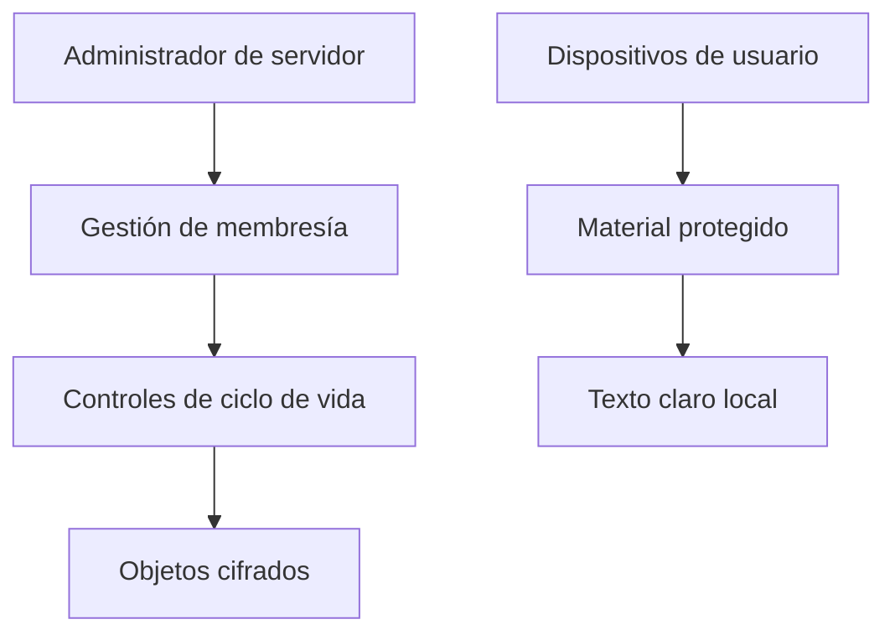

Enigm Server es un entorno dedicado de mensajería privada para usuarios aprobados. Puede utilizarlo un usuario individual o una empresa.

Enigm Server se compra y crea desde Enigm Command. El usuario puede elegir región disponible actualmente entre Estados Unidos, Europa o Asia.

## Resumen

Enigm Server proporciona:

- Entorno dedicado para el usuario o empresa.
- ID de servidor para solicitudes de unión.
- Aprobacion de solicitudes por administrador.
- Gestión de membresía.
- Borrado de contenido cifrado dentro del servidor.
- Eliminación del entorno completo.

## Modelo de membresía

El administrador comparte el ID del servidor. Los usuarios solicitan unirse y el administrador acepta o rechaza la solicitud.

Dentro de Enigm Server existen dos tipos de rol: administrador y usuario.

## Límites administrativos

La administración de Enigm Server y la confidencialidad de contenido son dominios separados.

Los administradores pueden gestionar ciclo de vida y disponibilidad de contenido cifrado dentro del servidor. No reciben acceso a texto claro de mensajes, adjuntos, multimedia, comunicaciones de usuarios ni claves criptográficas.

Los administradores pueden:

- Invitar usuarios.
- Eliminar usuarios.
- Gestiónar membresía.
- Borrar contenido cifrado del servidor.
- Borrar mensajes cifrados del servidor.
- Borrar multimedia cifrada del servidor.
- Borrar contenido generado por un usuario dentro del servidor.
- Borrar todo el contenido cifrado de un usuario dentro del servidor.
- Borrar todo el contenido cifrado del entorno.
- Eliminar el entorno de servidor completo.

La eliminación afecta disponibilidad y ciclo de vida. No implica visibilidad, descifrado ni acceso a texto claro.

## Ciclo de vida del contenido

Los mensajes y multimedia dentro de Enigm Server siguen la misma vida máxima que la mensajería de Enigm: hasta 30 dias, o el tiempo menor definido por la conversacion o el usuario.

El usuario puede borrar contenido manualmente de forma inmediata.

## Modelo de privacidad

Enigm Server reduce exposición mediante entorno dedicado, control de membresía, minimización de datos, identificadores privacy-preserving y separación entre administración y contenido.

Consulta [Limitaciones de plataforma](/es/legal/limitations).
