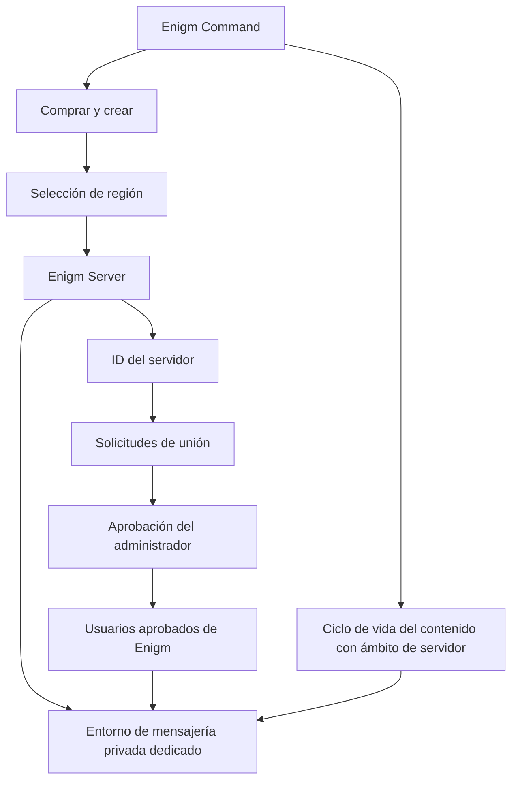
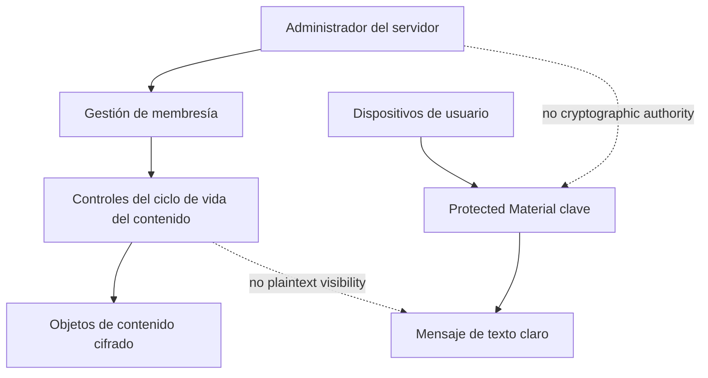

Enigm Server es el producto de entorno de mensajería privada dedicado en el ecosistema Enigm. Permite a un usuario individual, equipo u organización crear un entorno de mensajería privado controlado para usuarios aprobados de Enigm mientras preserva el cifrado de extremo a extremo Enigm App, Device Trust, el material clave protegido y los límites de confidencialidad del contenido.

Enigm Server se compra, crea y administra desde Enigm Command. No es el VPN Service, ni el Proxy Network, ni el Tor Gateway.

## Resumen

Enigm Server proporciona control a nivel de cliente sobre un entorno de mensajería privada dedicado.

Soporta:

- Entornos de mensajería privada dedicados para usuarios individuales u organizaciones.
- Compra y creación de servidores desde Enigm Command.
- Región de implementación geográfica seleccionada por el usuario.
- Solicitudes de unión basadas en ID del servidor.
- Revisión y aprobación del administrador de solicitudes de unión.
- Control de membresía del servidor.
- Eliminación de usuarios aprobados del entorno del servidor.
- Separación de roles simple entre el administrador del servidor y los usuarios del servidor.
- Controles del ciclo de vida del contenido en el ámbito del servidor.
- Control de disponibilidad de mensajes y medios.
- Eliminación de objetos cifrados alojados en el servidor según la política.
- Eliminación de mensajes cifrados y multimedia en el ámbito del servidor según la política.
- Eliminación de contenido cifrado generado por un usuario específico dentro del entorno del servidor.
- Eliminación de todo el contenido cifrado dentro del entorno del servidor dedicado.
- Eliminación total del contenido del servidor cuando la propiedad y la política lo permitan.
- Gestión del ciclo de vida del servidor.
- Visibilidad de la auditoría del servidor cuando corresponda.

El diagrama es conceptual. Muestra las responsabilidades del producto, no la topología de implementación.

## Modelo de compra y propiedad

Enigm Server se compra y crea a través de Enigm Command.

El modelo de propiedad respalda:

- Usuarios individuales.
- Equipos.
- Organizaciones.
- Clientes empresariales.

El comprador o propietario asignado se vuelve responsable del ciclo de vida del servidor dentro del límite autorizado Enigm Command. La propiedad proporciona autoridad administrativa sobre el ciclo de vida del entorno del servidor dedicado. No proporciona acceso en texto claro a mensajes, archivos adjuntos, multimedia, comunicaciones de usuarios, material de claves protegidas ni autoridad criptográfica.

El estado de compra Enigm Server es el estado del ciclo de vida comercial. La autorización comercial es independiente de Account Trust, Device Trust, aprobación de membresía, política de conversación y acceso a contenido protegido.

## Modelo empresarial y de adquisiciones

Enigm Server está diseñado para clientes que requieren un entorno de mensajería privado dedicado con membresía controlada y administración del ciclo de vida del servidor.

Las propiedades relevantes para la empresa incluyen:

- Entorno de mensajería dedicado con ámbito de servidor.
- Categoría de región pública seleccionada por el usuario.
- Titularidad administrativa a través de Enigm Command.
- Solicitudes de acceso basadas en ID del servidor.
- Aprobación del administrador antes de la activación de la membresía.
- Modelo de roles sencillo con administrador y usuarios.
- Controles del ciclo de vida del contenido cifrado en el ámbito del servidor.
- Separación entre administración y confidencialidad de mensajes.
- Auditar la visibilidad del ciclo de vida y los eventos de membresía cuando corresponda.

La adquisición empresarial, la aprobación comercial o el estado de suscripción no deben tratarse como autorización de acceso a mensajes. El estado de la cuenta Enigm App, Device Trust, el material clave protegido, la membresía del servidor y la política de conversación siguen siendo necesarios para los flujos de trabajo protegidos.

## ¿Qué es Enigm Server?

Enigm Server es un entorno de mensajería privada dedicado para usuarios, equipos y organizaciones que requieren un contexto controlado con alcance de servidor dentro del ecosistema Enigm.

Está diseñado para respaldar:

- Entornos de mensajería privada controlados por el cliente.
- Gestión del ciclo de vida del servidor dedicado.
- Control del propietario del servidor o administrador autorizado.
- Flujos de trabajo de solicitud de unión basados ​​en ID del servidor.
- Aprobación del administrador para los usuarios que solicitan acceso a un entorno con ámbito de servidor.
- Revisión y eliminación de membresía.
- Roles de membresía simples: administrador y usuarios.
- Controles del ciclo de vida del servidor para mensajes y multimedia.
- Reducción de la exposición de los metadatos de actividad y membresía del servidor.
- Separación de espacios de mensajes globales Enigm App.

Enigm Server proporciona control sobre la membresía del servidor y el ciclo de vida del contenido cifrado en el ámbito del servidor. No cambia el modelo fundamental de mensajería segura Enigm App.

## Qué no es Enigm Server

Enigm Server no es:

- El VPN Service.
- El Proxy Network.
- El Tor Gateway.
- Una puerta de enlace de red.
- Un reemplazo para la mensajería segura Enigm App.
- Evitar el cifrado de extremo a extremo.
- Un mecanismo para que los administradores lean el texto claro de mensajes privados.
- Un mecanismo para que los administradores reciban texto claro de archivos adjuntos.
- Un mecanismo para que los administradores reciban las comunicaciones de los usuarios.
- Un mecanismo para que los administradores reciban claves criptográficas.
- Un reemplazo para Device Trust o material de clave protegido.

La administración del servidor debe permanecer separada del material de clave privada y del texto claro de los mensajes.

## Relación con Enigm App

Enigm sigue siendo el principal producto de mensajería privada y la principal experiencia de aplicación para el usuario.

Los usuarios aprobados de Enigm acceden a entornos de mensajería con ámbito de servidor a través de Enigm App cuando el estado de la cuenta, Device Trust, la membresía del servidor y la política del servidor lo permiten.

Los controles Enigm App siguen siendo aplicables dentro de los entornos Enigm Server:

- Mensajería segura.
- Llamadas seguras según política del producto.
- Material de la llave Protected.
- Dispositivos de confianza.
- Flujos de trabajo multidispositivo.
- Caducidad del mensaje.
- Flujos de trabajo de verificación.
- Confidencialidad del contenido.

Enigm Server no reemplaza el cifrado de extremo a extremo Enigm App. La membresía del servidor y la política del servidor afectan el acceso al entorno y la disponibilidad del contenido cifrado; no crean acceso a texto claro, acceso a texto claro a archivos adjuntos, acceso a comunicación de usuario ni acceso a clave criptográfica para administradores de servidores.

## Relación con Enigm Command

Enigm Command es el panel de control web y la superficie administrativa de Enigm Server.

Enigm Command admite:

- compra de Enigm Server y gestión.
- Creación de servidor dedicado.
- Selección de región de despliegue geográfico.
- Gestión del ciclo de vida del servidor.
- Visibilidad de ID del servidor para solicitudes de unión de usuarios.
- Revisión y aprobación de solicitudes de incorporación.
- Gestión de acceso de usuarios para servidores dedicados.
- Control de membresía del servidor.
- Controles del ciclo de vida del contenido dentro de servidores dedicados.
- Flujos de trabajo de eliminación remota de contenido propiedad del servidor.
- Eliminación de contenido cifrado generado por los usuarios dentro de ese entorno de servidor.
- Eliminación de todo el contenido cifrado que pertenece a un usuario específico dentro de ese entorno de servidor.
- Eliminación de todo el contenido cifrado dentro del entorno del servidor dedicado.
- Eliminación de todo el entorno del servidor.
- Visibilidad de la auditoría del servidor cuando corresponda.

Las acciones administrativas Enigm Command deben permanecer autenticadas, autorizadas, con alcance y auditables.

## Ciclo de vida del servidor dedicado

El ciclo de vida de Enigm Server se gestiona a través de Enigm Command.

Las etapas del ciclo de vida incluyen:

1. Solicitud de compra o aprovisionamiento de servidor.
2. Creación de servidor dedicado.
3. Selección de la región de implementación geográfica.
4. Asignación de propietario o administrador del servidor.
5. Disponibilidad de ID del servidor para flujos de trabajo de unión aprobados.
6. Revisión de la solicitud de incorporación del usuario.
7. Activación de membresía después de la aprobación del administrador.
8. Gestión de políticas en el ámbito del servidor.
9. Gestión del ciclo de vida del contenido.
10. Suspensión, eliminación o retiro del servidor según política.

Los registros del ciclo de vida deben minimizarse y conservarse únicamente para fines operativos, de seguridad, legales o de cumplimiento definidos.

## Selección de región geográfica

Enigm Server admite la selección de región de implementación geográfica seleccionada por el usuario.

La selección de regiones está destinada a respaldar:

- Control del cliente sobre la ubicación del servidor.
- Latencia y requisitos operativos.
- Consideraciones regulatorias o contractuales.
- Planificación de políticas en el ámbito del servidor.

Las categorías de regiones públicas actuales incluyen:

- Estados Unidos.
- Europa.
- Asia.

La selección de región es un control de implementación y producto. No cambia el modelo de gobierno legal de Enigm: los servidores y servicios controlados por Enigm son operados bajo la subsidiaria suiza de Enigm y el gobierno legal suizo.

La selección de región no crea acceso a texto claro para administradores, sistemas operativos, entornos de hospedaje o flujos de trabajo legales. Enigm Server permanece sujeto a Enigm App cifrado de extremo a extremo, Device Trust, material de clave protegido y controles del ciclo de vida del contenido cifrado con alcance del servidor.

La documentación pública no revela la topología de implementación, detalles de la relación con terceros, ubicaciones de servidores, mecanismos de enrutamiento o infraestructura operativa.

## Solicitudes de inscripción y membresía

Enigm Server utiliza un flujo de trabajo de membresía basado en ID de servidor.

El administrador del servidor puede compartir la ID del servidor con los usuarios previstos. Los usuarios solicitan acceso al entorno del servidor dedicado y el administrador revisa y acepta la solicitud antes de activar la membresía.

El ID del servidor es un localizador de solicitudes de unión, no una credencial de acceso. La posesión de una identificación de servidor no otorga membresía, no elude la aprobación del administrador, no establece Device Trust y no brinda acceso a contenido cifrado.

El propietario del servidor o administrador autorizado puede:

- Comparta la ID del servidor con los usuarios previstos.
- Revisar las solicitudes de unión pendientes.
- Aceptar o rechazar solicitudes de unión.
- Eliminar usuarios aprobados.
- Controlar la membresía del servidor.
- Restringir el acceso futuro según la política del servidor.

Los usuarios aprobados siguen siendo usuarios de Enigm. La membresía en un entorno Enigm Server no elimina los requisitos de cuenta Enigm App, Device Trust, administración de claves o mensajería segura.

## Modelo de roles

Enigm Server utiliza un modelo de roles simple.

El modelo de roles incluye:

- **Administrador**: el propietario del servidor o administrador autorizado responsable del ciclo de vida del servidor, la revisión de solicitudes de ingreso, el control de membresía y los controles del ciclo de vida del contenido cifrado en el ámbito del servidor.
- **Usuarios**: usuarios aprobados de Enigm que participan en el entorno del servidor dedicado según la política del servidor.

Enigm Server no define roles públicos adicionales en esta documentación. La autoridad administrativa sigue limitada a los controles de disponibilidad y ciclo de vida. No proporciona acceso a texto claro, acceso a texto claro a archivos adjuntos, acceso a comunicación de usuario, acceso a clave privada ni autoridad criptográfica.

## Ciclo de vida del contenido con ámbito de servidor

Enigm Server admite controles del ciclo de vida del contenido en el ámbito del servidor.

Estos controles están destinados a gestionar la disponibilidad de contenido cifrado dentro del entorno del servidor dedicado. Pueden incluir:

- Controles del ciclo de vida del contenido propiedad del servidor.
- Eliminación de contenido cifrado.
- Control de disponibilidad de mensajes y medios.
- Eliminación del entorno del servidor.
- Eliminación de objetos cifrados alojados en el servidor.
- Eliminación de mensajes cifrados en el ámbito del servidor.
- Eliminación de multimedia cifrado con ámbito de servidor.
- Eliminación de contenido cifrado generado por los usuarios dentro de ese entorno de servidor.
- Eliminación de todo el contenido cifrado que pertenece a un usuario específico dentro de ese entorno de servidor.
- Eliminación de todo el contenido cifrado dentro del entorno del servidor dedicado.
- Eliminación del ciclo de vida según política.

Los administradores pueden gestionar el ciclo de vida y la disponibilidad del contenido cifrado en el ámbito del servidor.

Los controles de eliminación administrativa operan sobre objetos de contenido cifrados y el estado del ciclo de vida. La eliminación afecta la disponibilidad y el ciclo de vida del contenido. La eliminación no implica visibilidad del contenido, descifrado del contenido, acceso al texto claro del mensaje, acceso al texto claro del archivo adjunto, acceso a la comunicación del usuario o acceso a la clave criptográfica.

Los mensajes cifrados en el ámbito del servidor, los archivos adjuntos cifrados, los multimedia cifrados y el contenido cifrado generado por el usuario siguen el mismo modelo de vida útil del contenido que la mensajería segura de Enigm. La duración máxima es de 30 días, a menos que la política de conversación defina una duración más corta o que los usuarios autorizados eliminen el contenido antes.

## Eliminación de mensajes y medios

El propietario del servidor o el administrador autorizado puede eliminar cualquier contenido cifrado con ámbito de servidor dentro de ese entorno de servidor dedicado de acuerdo con la política del servidor.

Los flujos de trabajo de eliminación pueden incluir:

- Eliminación de mensajes cifrados en el ámbito del servidor.
- Eliminación de multimedia cifrado con ámbito de servidor.
- Eliminación de contenido cifrado generado por los usuarios dentro de ese entorno de servidor.
- Eliminación de contenido cifrado generado por cualquier usuario aprobado dentro de ese entorno de servidor.
- Eliminación de todo el contenido cifrado que pertenece a un usuario específico dentro de ese entorno de servidor.
- Eliminación de todo el contenido cifrado dentro del entorno del servidor dedicado.
- Eliminación de objetos cifrados alojados en el servidor.
- Flujos de trabajo de eliminación remota de contenido propiedad del servidor.

Los controles administrativos no otorgan acceso al texto claro del mensaje, al texto claro del archivo adjunto, a las comunicaciones del usuario ni al material de clave privada.

## Eliminación completa del servidor

Enigm Server admite la eliminación completa del servidor cuando la propiedad y la política lo permitan.

La eliminación completa tiene como objetivo respaldar:

- Retiro de servidores.
- Cierre del entorno iniciado por el cliente.
- Eliminación de objetos cifrados con ámbito de servidor.
- Membresía del servidor y cierre del ciclo de vida de la solicitud de unión.
- Reducción de la retención innecesaria después de que el servidor ya no sea necesario.
- Eliminación de todo el entorno del servidor.

La eliminación total del servidor debe preservar los límites legales, de seguridad, de cumplimiento y operativos aplicables.

La eliminación total del servidor afecta el ciclo de vida y la disponibilidad del entorno del servidor dedicado. No proporciona acceso al texto claro de los mensajes, al texto claro de los archivos adjuntos, a las comunicaciones del usuario, a las claves criptográficas ni al material de claves protegidas.

## Límites administrativos

La administración de Enigm Server y la confidencialidad del contenido son dominios de confianza separados.

La autoridad administrativa permite el control del ciclo de vida. No proporciona visibilidad de mensajes, autoridad criptográfica, acceso a texto claro de archivos adjuntos, acceso a comunicación de usuario ni acceso a texto claro de mensajes.

Los administradores pueden:

- Invitar a los usuarios.
- Eliminar usuarios.
- Administrar la membresía del servidor.
- Gestionar el ciclo de vida y la disponibilidad del contenido cifrado en el servidor.
- Eliminar contenido cifrado con ámbito de servidor.
- Eliminar mensajes cifrados con ámbito de servidor.
- Eliminar multimedia cifrado con ámbito de servidor.
- Eliminar el contenido cifrado generado por los usuarios dentro de ese entorno de servidor.
- Eliminar todo el contenido cifrado que pertenece a un usuario específico dentro de ese entorno de servidor.
- Eliminar todo el contenido cifrado dentro del entorno del servidor dedicado.
- Eliminar todo el entorno del servidor.

Los límites administrativos incluyen:

- La administración del servidor es independiente del texto claro del mensaje Enigm App.
- El control del ciclo de vida del servidor está separado del material de clave privada.
- La gestión de membresía del servidor está separada de Device Trust.
- La propiedad del servidor es independiente del acceso en texto claro al contenido del usuario.
- La autorización Enigm Command es independiente del cifrado de extremo a extremo.
- Los controles de eliminación administrativa operan sobre objetos de contenido cifrados y el estado del ciclo de vida.
- Los controles administrativos no otorgan acceso al texto claro del mensaje, al texto claro del archivo adjunto, a las comunicaciones del usuario ni al material de clave privada.

El diagrama es conceptual. Muestra que la autoridad del administrador y la confidencialidad de los mensajes permanecen separadas. Los controles de eliminación administrativa operan sobre objetos de contenido cifrados y el estado del ciclo de vida, mientras que el texto claro de los mensajes sigue dependiendo de los dispositivos de usuario de confianza y del material de claves protegido.

## Consideraciones de privacidad

Enigm Server sigue la arquitectura de privacidad de Enigm.

Las consideraciones de privacidad incluyen:

- Minimizar la exposición de la membresía del servidor.
- Minimizar los metadatos del ciclo de vida del servidor.
- Utilice Privacy-Preserving Device Handles para la correlación del dispositivo donde se requiere el estado del dispositivo.
- Separar los metadatos del ámbito del servidor del contenido del mensaje protegido.
- Limitar la visibilidad administrativa al ciclo de vida requerido y al contexto de políticas.
- Evite tratar la membresía del servidor como prueba del contenido del mensaje.
- Conservar los registros del servidor solo para fines operativos, de seguridad, legales o de cumplimiento definidos.
- Cifre parcialmente los metadatos del servidor de acuerdo con el producto aplicable y el dominio de almacenamiento, conservando solo los identificadores operativos necesarios para enrutar, autenticar, autorizar y mantener el entorno del servidor.

Enigm Server está diseñado para reducir la exposición y proporcionar control a nivel del cliente sin aumentar la recopilación rutinaria de contenido protegido.

Ver [Limitaciones de la plataforma](/es/legal/limitations).

## Referencias de modelos de amenazas

Las áreas relevantes del modelo de amenazas incluyen abuso de Enigm Server, compromiso de cuenta, falla de Device Trust, uso indebido de solicitudes de unión, abuso de membresía del servidor, exposición de metadatos en el ámbito del servidor, usuarios de confianza maliciosos, compromiso de endpoints, abuso de Enigm Command y pérdida de visibilidad de la auditoría administrativa.
