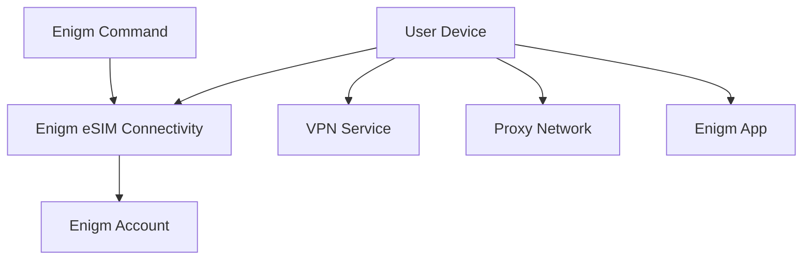

Enigm eSIM is the private connectivity product in the Enigm ecosystem. It is focused on global, privacy-oriented mobile data connectivity and can be combined with other Enigm privacy and security controls.

This document is intended for security auditors, enterprise customers, technical partners, and security engineers. It describes the public Enigm eSIM architecture without exposing third-party relationships, connectivity partner details, infrastructure relationships, commercial arrangements, activation backends, operational procedures, or implementation-sensitive details.

## Overview

The Enigm eSIM service provides global mobile data connectivity as a supporting platform component. It is data-only and does not provide traditional voice calling or SMS functionality.

Enigm eSIM is purchased and managed through Enigm Command. The eSIM lifecycle is linked to the user's Enigm account and can be deleted or unlinked by the user.

Enigm eSIM is separate from Enigm App cryptography, separate from end-to-end encryption, and separate from VPN functionality.

Mobile connectivity and message confidentiality are different security problems. Enigm eSIM connectivity can affect how a device reaches networks, but it does not define how message content is encrypted or how devices are trusted for secure messaging.

## Purpose

The Enigm eSIM service is designed to reduce dependence on traditional mobile identity workflows while providing mobile data connectivity.

Standard Enigm eSIM activation does not require:

- KYC verification.
- Email address.
- Phone number.
- Identity document.

The Enigm eSIM may help mitigate:

- Certain mobile identity exposure scenarios.
- Dependence on traditional subscriber workflows.
- Some forms of network visibility.

The Enigm eSIM service does not replace secure messaging, end-to-end encryption, Device Trust, VPN transport protection, Proxy Network traffic separation, or account security controls.

## Purchase And Activation

Enigm eSIM purchase and activation are performed through Enigm Command.

Purchase and activation workflows are designed around an identity-minimizing model:

- Users can purchase Enigm eSIM from Enigm Command.
- Users can manage Enigm eSIM lifecycle state from Enigm Command.
- Standard activation does not require KYC verification, email address, phone number, or identity document.
- The user-selected purchase country is handled as commercial lifecycle metadata.
- Enigm eSIM lifecycle state is linked to the user's Enigm account for management, deletion, unlinking, and support.

Activation state is connectivity lifecycle state. It does not provide access to message plaintext, secure call content, media content, attachment plaintext, user conversations, protected key material, or private key material.

## Mobile Data Connectivity

The Enigm eSIM service provides global mobile data connectivity for supported eSIM-capable devices.

Mobile data connectivity supports:

- Network access for Enigm App.
- Network access for optional VPN usage.
- Network access for Proxy Network usage where enabled.
- Network access for other supported Enigm platform components.
- Policy-aware connectivity behavior where managed configuration applies.

Connectivity behavior should be understood as a transport and access capability, not as a message confidentiality mechanism.

## Data-Only Model

Enigm eSIM is documented as a data-only connectivity product.

The public product model is:

- Mobile data connectivity.
- Internet access for supported devices.
- No traditional voice service.
- No traditional SMS service.
- No phone-number dependency for Enigm account creation.

Voice and video communication inside Enigm should use Enigm App secure calling workflows, not legacy mobile voice services. Secure messaging should use Enigm App secure messaging workflows, not SMS.

## Account Association

Enigm eSIM is associated with the user's Enigm account for lifecycle management.

Account association supports:

- Product entitlement state.
- Activation status.
- Connectivity lifecycle review.
- User-initiated unlinking.
- User-initiated deletion or retirement.
- Support and security review where required.

Account association does not convert Enigm eSIM into an identity verification product. Enigm account identity, Device Trust, protected key material, and message confidentiality remain separate trust domains.

## Lifecycle Management

Enigm eSIM lifecycle management is provided through Enigm Command.

Lifecycle workflows include:

- Purchase or activation.
- Activation state review.
- Enigm account association review.
- Device use review where required for support or policy.
- User-initiated unlinking.
- User-initiated deletion or retirement.
- Replacement or retirement.
- Policy assignment where managed configuration applies.
- Connectivity status visibility.
- Support workflows for eligible devices.

Lifecycle visibility should remain focused on connectivity and policy state. It must not become a message, call, media, attachment, or conversation visibility surface.

Deleting or retiring an Enigm eSIM removes the service from normal Enigm lifecycle operation, subject only to legal, security, or operational constraints.

## Relationship With Enigm App

Enigm App remains responsible for app-level security functions such as secure messaging, secure calls, key management, device association, verification workflows, and message expiration.

The Enigm eSIM service is linked to the user's Enigm account for lifecycle management. It does not replace protected key material, secure device storage, end-to-end encryption, or Device Trust decisions.

Enigm App should remain secure according to its app-level model whether Enigm eSIM connectivity is used or not.

## Relationship With VPN

The Enigm eSIM service is separate from VPN functionality and Proxy Network traffic separation.

Enigm eSIM provides mobile data connectivity. VPN Service provides an optional transport privacy layer where enabled. Proxy Network provides traffic separation where enabled. These components can be combined, but they address different parts of the security model.

Using Enigm eSIM does not imply VPN protection or proxy mediation. Using VPN Service or Proxy Network does not change the need to evaluate Device Trust, application-layer encryption, and message confidentiality separately.

## Relationship With Enigm Command

Enigm Command provides Enigm eSIM purchase, activation, lifecycle review, deletion, and retirement workflows.

Enigm Command workflows include:

- Purchasing Enigm eSIM.
- Activating Enigm eSIM.
- Reviewing Enigm eSIM status.
- Managing activation lifecycle.
- Reviewing Enigm account association.
- Supporting unlinking, deletion, replacement, or retirement workflows.
- Applying managed connectivity policy.

Administrative Enigm eSIM management must remain separate from protected communication content and private key material.

## Privacy Considerations

The Enigm eSIM service supports privacy objectives by reducing dependence on traditional mobile identity workflows.

Standard Enigm eSIM activation is identity-minimizing because it does not require KYC verification, email address, phone number, or identity document.

Privacy considerations include:

- Limit exposure of mobile connectivity lifecycle data.
- Avoid exposing unnecessary identity metadata.
- Separate connectivity state from message content.
- Keep administrative visibility focused on lifecycle and policy state.
- Avoid treating connectivity status as proof of message activity.

The Enigm eSIM service should be documented as a privacy-oriented connectivity layer, not as an identity-erasure claim. External networks, device behavior, payment flows, legal obligations, and user behavior can still create exposure outside the Enigm eSIM lifecycle model.

## Metadata Considerations

Mobile connectivity requires some metadata to function. The Enigm eSIM service should minimize metadata collection and exposure where possible.

Metadata may relate to:

- Connectivity state.
- Activation or deactivation lifecycle.
- Enigm account association.
- Device support or compatibility state where needed.
- Policy state.
- Support and audit lifecycle events.

Metadata related to connectivity should remain separate from secure messaging content, secure call content, private key material, and protected attachments.

## Security Limitations

The Enigm eSIM service does not mitigate:

- Device compromise.
- Malware with sufficient privileges.
- Message disclosure by trusted participants.
- Social engineering.
- Endpoint compromise.
- Weak Device Trust.
- Incorrect policy configuration.
- Plaintext exposure after authorized local decryption.
- Network availability limitations.
- External traffic correlation outside Enigm controls.
- Legal or regulatory obligations applicable to connectivity services.

The Enigm eSIM service does not replace secure messaging, end-to-end encryption, VPN protection, Proxy Network traffic separation, Device Trust, account security, or verification workflows.

## Threat Model Considerations

The Enigm eSIM service is relevant to mobile connectivity, mobile identity exposure, network visibility, and transport access scenarios.

Relevant threat-model areas include network-policy misuse, account and app compromise, device lifecycle abuse, secure messaging compromise attempts, secure call compromise attempts, and loss of audit visibility.

Public documentation must not expose third-party connectivity relationships, commercial arrangements, activation backends, deployment topology, or implementation-sensitive behavior.
