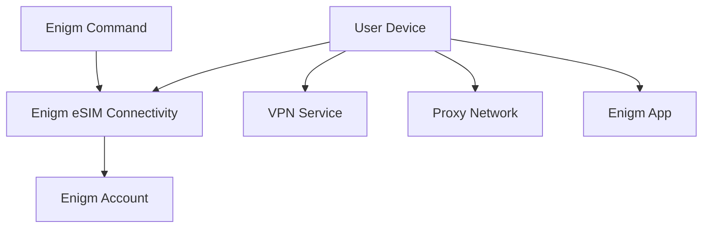

Enigm eSIM is the private connectivity product in the Enigm ecosystem. It is focused on privacy-oriented mobile data connectivity across supported coverage areas and can be combined with other Enigm privacy and security controls.

## Overview

The Enigm eSIM service provides mobile data connectivity as a supporting platform component across supported coverage areas. It is data-only and does not provide traditional voice calling or SMS functionality.

Enigm eSIM is purchased and managed through Enigm Command. The eSIM lifecycle is linked to the user's Enigm account and can be deleted or unlinked by the user.

Enigm provides Enigm eSIM as a commercial facilitation and lifecycle-management service. Enigm is not a mobile network operator, mobile virtual network operator, telecommunications carrier, radio access network operator, or direct issuer of the underlying carrier connectivity. Carrier infrastructure, carrier network operation, radio access, traffic transport, IP allocation, roaming behavior, and carrier-layer connectivity records are operated by an independent telecommunications infrastructure provider.

Enigm eSIM is separate from Enigm App cryptography, separate from end-to-end encryption, and separate from VPN functionality.

Mobile connectivity and message confidentiality are different security problems. Enigm eSIM connectivity can affect how a device reaches networks, but it does not define how message content is encrypted or how devices are trusted for secure messaging.

## Purpose

The Enigm eSIM service is designed to reduce dependence on traditional mobile identity workflows within the Enigm-side purchase and lifecycle-management flow while providing mobile data connectivity.

The Enigm-side purchase and lifecycle-management workflow does not collect:

- KYC verification.
- Email address.
- Phone number.
- Identity document.

The Enigm eSIM may help mitigate:

- Certain mobile identity exposure scenarios.
- Dependence on traditional subscriber workflows.
- Some forms of network visibility.

The Enigm eSIM service does not replace secure messaging, end-to-end encryption, Device Trust, VPN transport protection, Proxy Network traffic separation, or account security controls.

## Purchase And Activation

Enigm eSIM purchase and activation are performed through Enigm Command.

Purchase and lifecycle-management workflows are designed around an identity-minimizing model:

- Users can purchase Enigm eSIM from Enigm Command.
- Users can manage Enigm eSIM lifecycle state from Enigm Command.
- The Enigm-side workflow does not collect KYC verification, email address, phone number, or identity document.
- The user-selected purchase country is handled as commercial lifecycle metadata.
- Enigm eSIM lifecycle state is linked to the user's Enigm account for management, deletion, unlinking, and support.

For the current public country-level data consumption rate reference, see [eSIM Data Rates](/esim/data-rates).

Activation state is connectivity lifecycle state. It does not provide access to message plaintext, secure call content, media content, attachment plaintext, user conversations, protected key material, or private key material.

External carrier, roaming, or jurisdiction-specific requirements can vary outside the Enigm-side purchase and lifecycle-management workflow. Users and organizations remain responsible for evaluating local telecommunications and identity-registration requirements.

## Third-Party Carrier Disclaimer

Enigm eSIM depends on a trusted third-party carrier and independent telecommunications infrastructure provider for the underlying mobile data service.

Enigm does not operate the carrier network and does not control:

- Radio access infrastructure.
- Mobile network routing.
- Carrier roaming behavior.
- IP address allocation by the carrier network.
- Carrier-layer packet transport.
- Carrier network logs.
- Carrier authentication systems.
- Telecommunications regulatory registration systems.

Enigm's role is limited to commercial facilitation, Enigm account association, lifecycle visibility, purchase and entitlement state, user-initiated deletion or retirement workflows, and support coordination for eligible Enigm eSIM services.

This separation is important for legal, technical, and audit review. Enigm eSIM should not be interpreted as evidence that Enigm is an MNO, MVNO, telecommunications carrier, carrier network operator, or issuer of the underlying telecommunications profile.

## Carrier-Layer Data Availability

Enigm does not receive carrier-layer traffic records from the independent telecommunications infrastructure provider as part of normal Enigm eSIM operation.

Carrier-layer records include:

- Mobile network traffic logs.
- Carrier-side IP allocation records.
- Radio access records.
- Packet routing records.
- Carrier connection records.
- Carrier roaming records.
- Network usage records maintained by the carrier.

Because Enigm does not operate the carrier network and does not receive those carrier-layer records, Enigm cannot provide carrier network traffic records, carrier IP allocation logs, carrier connection logs, or carrier-side telecommunications records in response to legal, regulatory, support, or enterprise review requests.

Enigm can only review Enigm-held lifecycle data, such as purchase state, entitlement state, Enigm account association, Enigm eSIM activation state, unlinking state, deletion state, and support records retained under the documented retention model.

## Local Telecommunications Compliance

> **Compliance notice:** Enigm eSIM users are responsible for understanding and complying with the telecommunications, identity registration, import, export, sanctions, lawful-use, and network-use requirements that apply in the jurisdictions where they purchase, activate, or use mobile data connectivity. Enigm does not provide legal advice, does not represent that Enigm eSIM use is lawful in every jurisdiction, and does not assume responsibility for user misuse, prohibited use, or failure to comply with local telecommunications requirements.

Local regulatory requirements can vary by country, region, carrier, device class, user status, and use case. Users and organizations should evaluate local obligations before using Enigm eSIM in regulated environments.

Enigm eSIM availability, activation, renewal, support, deletion, replacement, or retirement can be limited by local law, carrier-layer requirements, sanctions, export-control obligations, fraud-prevention requirements, abuse-prevention requirements, technical availability, or independent telecommunications infrastructure constraints.

Enigm's privacy-oriented lifecycle model must not be interpreted as permission to evade local telecommunications law, identity-registration requirements, lawful-use restrictions, sanctions, network-use rules, or public safety obligations.

## Security Layer Separation

Enigm App and Enigm eSIM operate in separate security layers.

Enigm App provides application-layer security controls such as end-to-end encryption, protected key material, secure messaging, secure calls, Device Trust, and verification workflows.

Enigm eSIM provides mobile data connectivity through an independent telecommunications infrastructure provider. The carrier connectivity layer transports network traffic; it does not define Enigm App message encryption, does not receive Enigm App private key material, does not provide plaintext access to Enigm App messages, and does not weaken Enigm App end-to-end encryption.

This separation means that the confidentiality of Enigm App communications remains governed by the Enigm App security model, not by the carrier-layer connectivity provider.

## Mobile Data Connectivity

The Enigm eSIM service provides mobile data connectivity for supported eSIM-capable devices in supported coverage areas.

Mobile data connectivity supports:

- Network access for Enigm App.
- Network access for optional VPN usage.
- Network access for Proxy Network usage where enabled.
- Network access for other supported Enigm platform components.
- Policy-aware connectivity behavior where managed configuration applies.

Connectivity behavior should be understood as a transport and access capability, not as a message confidentiality mechanism.

## Data-Only Model

Enigm eSIM is documented as a data-only connectivity product.

The public product model is:

- Mobile data connectivity.
- Internet access for supported devices.
- No traditional voice service.
- No traditional SMS service.
- No phone-number dependency for Enigm account creation.

Voice and video communication inside Enigm should use Enigm App secure calling workflows, not legacy mobile voice services. Secure messaging should use Enigm App secure messaging workflows, not SMS.

## Account Association

Enigm eSIM is associated with the user's Enigm account for lifecycle management.

Account association supports:

- Product entitlement state.
- Activation status.
- Connectivity lifecycle review.
- User-initiated unlinking.
- User-initiated deletion or retirement.
- Support and security review where required.

Account association does not convert Enigm eSIM into an identity verification product. Enigm account identity, Device Trust, protected key material, and message confidentiality remain separate trust domains.

## Lifecycle Management

Enigm eSIM lifecycle management is provided through Enigm Command.

Lifecycle workflows include:

- Purchase or activation.
- Activation state review.
- Enigm account association review.
- Device use review where required for support or policy.
- User-initiated unlinking.
- User-initiated deletion or retirement.
- Replacement or retirement.
- Policy assignment where managed configuration applies.
- Connectivity status visibility.
- Support workflows for eligible devices.

Lifecycle visibility should remain focused on connectivity and policy state. It must not become a message, call, media, attachment, or conversation visibility surface.

Deleting or retiring an Enigm eSIM removes the service from normal Enigm lifecycle operation, subject only to legal, security, or operational constraints.

## Relationship With Enigm App

Enigm App remains responsible for app-level security functions such as secure messaging, secure calls, key management, device association, verification workflows, and message expiration.

The Enigm eSIM service is linked to the user's Enigm account for lifecycle management. It does not replace protected key material, secure device storage, end-to-end encryption, or Device Trust decisions.

The independent telecommunications infrastructure provider that enables carrier-layer data connectivity does not participate in Enigm App key management, message encryption, secure call encryption, Device Trust, account recovery, or protected content lifecycle decisions.

Enigm App should remain secure according to its app-level model whether Enigm eSIM connectivity is used or not.

## Relationship With VPN

The Enigm eSIM service is separate from VPN functionality and Proxy Network traffic separation.

Enigm eSIM provides mobile data connectivity. VPN Service provides an optional transport privacy layer where enabled. Proxy Network provides traffic separation where enabled. These components can be combined, but they address different parts of the security model.

Using Enigm eSIM does not imply VPN protection or proxy mediation. Using VPN Service or Proxy Network does not change the need to evaluate Device Trust, application-layer encryption, and message confidentiality separately.

## Relationship With Enigm Command

Enigm Command provides Enigm eSIM purchase, activation, lifecycle review, deletion, and retirement workflows.

Enigm Command workflows include:

- Purchasing Enigm eSIM.
- Activating Enigm eSIM.
- Reviewing Enigm eSIM status.
- Managing activation lifecycle.
- Reviewing Enigm account association.
- Supporting unlinking, deletion, replacement, or retirement workflows.
- Applying managed connectivity policy.

Administrative Enigm eSIM management must remain separate from protected communication content and private key material.

## Privacy Considerations

The Enigm eSIM service supports privacy objectives by reducing dependence on traditional mobile identity workflows.

The Enigm-side eSIM workflow is identity-minimizing because it does not collect KYC verification, email address, phone number, or identity document.

Privacy considerations include:

- Limit exposure of mobile connectivity lifecycle data.
- Avoid exposing unnecessary identity metadata.
- Separate connectivity state from message content.
- Keep administrative visibility focused on lifecycle and policy state.
- Avoid treating connectivity status as proof of message activity.

The Enigm eSIM service is a privacy-oriented connectivity layer, not an identity-erasure claim. External networks, device behavior, payment flows, legal obligations, and user behavior can still create exposure outside the Enigm eSIM lifecycle model.

## Metadata Considerations

Mobile connectivity requires some metadata to function. The Enigm eSIM service should minimize metadata collection and exposure where possible.

Metadata may relate to:

- Connectivity state.
- Activation or deactivation lifecycle.
- Enigm account association.
- Device support or compatibility state where needed.
- Policy state.
- Support and audit lifecycle events.

Metadata related to connectivity should remain separate from secure messaging content, secure call content, private key material, and protected attachments.

Carrier-layer network metadata remains outside Enigm's normal operational visibility when it is generated and retained by the independent telecommunications infrastructure provider. Enigm-held metadata is limited to Enigm eSIM lifecycle, entitlement, account association, deletion, support, and security records described in this documentation.

See [Platform Limitations](/legal/limitations).

## Threat Model Considerations

The Enigm eSIM service is relevant to mobile connectivity, mobile identity exposure, network visibility, and transport access scenarios.

Relevant threat-model areas include network-policy misuse, account and app compromise, device lifecycle abuse, secure messaging compromise attempts, secure call compromise attempts, and loss of audit visibility.

Third-party connectivity relationships, commercial arrangements, activation backends, deployment topology, and implementation-sensitive behavior remain outside the public documentation boundary.
