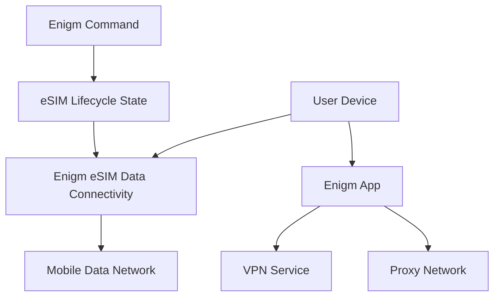

Enigm eSIM is the private connectivity product in the Enigm ecosystem. It provides global data-only mobile connectivity across supported coverage areas and can be combined with other Enigm privacy and security controls.

Enigm eSIM is purchased and managed through Enigm Command. The eSIM lifecycle is linked to the user's Enigm account and can be deleted, unlinked, replaced, or retired by the user where supported by lifecycle policy.

## Overview

The Enigm eSIM service provides mobile data connectivity as a supporting platform component. It is data-only and does not provide traditional voice calling or SMS functionality.

Enigm provides Enigm eSIM as a commercial facilitation and lifecycle-management service. Enigm is not a mobile network operator, mobile virtual network operator, telecommunications carrier, radio access network operator, or direct issuer of the underlying carrier connectivity.

Enigm eSIM is separate from Enigm App cryptography, separate from end-to-end encryption, and separate from VPN Service and Proxy Network functionality.

Mobile connectivity and message confidentiality are different security problems. Enigm eSIM connectivity can affect how a device reaches networks, but it does not define how message content is encrypted or how devices are trusted for secure messaging.

## Purpose

The Enigm eSIM service is designed to reduce dependence on traditional mobile identity workflows within the Enigm-side purchase and lifecycle-management flow while providing mobile data connectivity.

The Enigm-side purchase and lifecycle-management workflow does not collect:

- KYC verification.
- Email address.
- Phone number.
- Identity document.

The Enigm eSIM service does not replace secure messaging, end-to-end encryption, Device Trust, VPN transport protection, Proxy Network traffic separation, or account security controls.

## Documentation Map

- [Lifecycle and Compliance](/esim/lifecycle-compliance) explains purchase, activation, third-party carrier boundaries, local telecommunications compliance, lifecycle management, and metadata considerations.
- [Data Rates](/esim/data-rates) provides the current public country-level data consumption rate reference.

## Relationship With Enigm App

Enigm App remains responsible for app-level security functions such as secure messaging, secure calls, key management, device association, verification workflows, and message expiration.

The Enigm eSIM service is linked to the user's Enigm account for lifecycle management. It does not replace protected key material, secure device storage, end-to-end encryption, or Device Trust decisions.

The independent telecommunications infrastructure provider that enables carrier-layer data connectivity does not participate in Enigm App key management, message encryption, secure call encryption, Device Trust, account recovery, or protected content lifecycle decisions.

## Relationship With VPN Service And Proxy Network

Enigm eSIM provides mobile data connectivity. VPN Service provides an optional transport privacy layer where enabled. Proxy Network provides traffic separation where enabled. These components can be combined, but they address different parts of the security model.

Using Enigm eSIM does not imply VPN protection or proxy mediation. Using VPN Service or Proxy Network does not change the need to evaluate Device Trust, application-layer encryption, and message confidentiality separately.

## Privacy Considerations

The Enigm eSIM service supports privacy objectives by reducing dependence on traditional mobile identity workflows in the Enigm-side lifecycle flow.

Privacy considerations include:

- Limit exposure of mobile connectivity lifecycle data.
- Avoid exposing unnecessary identity metadata.
- Separate connectivity state from message content.
- Keep administrative visibility focused on lifecycle and policy state.
- Avoid treating connectivity status as proof of message activity.

The Enigm eSIM service is a privacy-oriented connectivity layer, not an identity-erasure claim. External networks, device behavior, payment flows, legal obligations, and user behavior can still create exposure outside the Enigm eSIM lifecycle model.

See [Platform Limitations](/legal/limitations).
