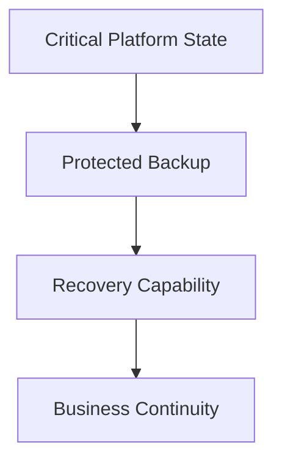

Backup and recovery are business continuity capabilities within the Enigm ecosystem. They exist to support continuity of critical platform functions, operational recovery, and platform resilience.

Backup and recovery are not designed as a user-content archival system and do not provide plaintext access to protected user communications.

This document is intended for security auditors, enterprise customers, technical partners, and security engineers.

## Overview

Backup and recovery exist to support continuity of critical platform functions.

The model is designed around:

- Service continuity.
- Operational recovery.
- Platform resilience.
- Risk reduction.
- Data minimization.
- Protection of recovery-critical state.

The diagram is conceptual and describes the continuity model at a public architecture level.

## Design Objectives

Backup and recovery are designed to support:

- Service continuity.
- Operational recovery.
- Platform resilience.
- Risk reduction.
- Recovery of critical operational functions.
- Protection of recovery-sensitive state.
- Minimized backup scope.

The objective is continuity of essential platform operation, not broad retention of user data.

## Business Continuity

Recovery capabilities are designed to support restoration of critical operational functions.

Business continuity may require recovery of selected platform state needed to restore service operation, security controls, identity workflows, device lifecycle functions, and operational integrity.

Business continuity does not require broad archival storage of user communications.

## Backup Scope

Enigm does not operate a broad archival backup model for user communications.

Backups are limited to the minimum platform components required for service continuity, security, and recovery.

Examples of recovery-relevant platform state may include:

- Identity state.
- Critical platform state.
- Essential operational records.
- Recovery-critical information.

Backup scope is intentionally described at a conceptual level suitable for public review.

## Recovery Scope

Recovery processes are intended to restore platform operation.

Recovery capabilities may support:

- Restoration of critical service state.
- Restoration of security-relevant operational state.
- Restoration of identity and device lifecycle continuity.
- Restoration of essential platform functions.

Recovery capabilities are not intended to bypass end-to-end encryption or provide plaintext access to protected user content.

Administrative recovery does not convert encrypted user communications into recoverable plaintext.

## Data Minimization

Backup scope is intentionally minimized.

The objective is continuity, not broad retention.

Data minimization principles include:

- Limit backup scope to recovery-critical platform state.
- Avoid broad archival storage of user communications.
- Preserve only information required for continuity, security, or legal obligations.
- Keep backup and recovery separate from message confidentiality.
- Review recovery scope as platform requirements evolve.

## Security Considerations

Protected recovery workflows are used to reduce unauthorized access risk.

Security considerations include:

- Restrict access to recovery-sensitive state.
- Protect backup material according to sensitivity.
- Validate recovery readiness at a governance level.
- Preserve accountability for recovery-relevant actions.
- Keep recovery capabilities separate from plaintext content access.
- Limit recovery scope to business continuity requirements.

Backup and recovery controls should be evaluated alongside access control, encryption, incident response, security monitoring, and governance.

## Security Limitations

Backups improve resilience but do not eliminate all recovery risk.

Limitations include:

- Recovery may depend on available platform state.
- Backups may not cover every non-critical system element.
- Recovery does not replace incident response.
- Recovery does not replace secure development or release validation.
- Recovery does not bypass end-to-end encryption.
- Recovery does not provide plaintext access to protected user communications.
- External systems may introduce continuity risks outside Enigm control.

Backup and recovery should be evaluated as business continuity capabilities within the broader Enigm security and operational resilience model.
