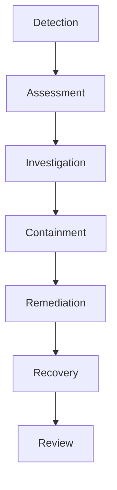

Enigm maintains a structured incident response capability intended to support security investigations, containment, remediation, service recovery, and protection of user privacy during security events.

This document explains governance and security philosophy. It does not describe operational response procedures.

This document is intended for security auditors, enterprise customers, technical partners, and security engineers.

## Overview

Incident response is part of Enigm’s broader security governance model.

The incident response model is designed to:

- Identify security-relevant events.
- Assess scope and impact.
- Support investigation.
- Contain ongoing risk.
- Remediate root causes.
- Restore service integrity.
- Improve future controls.

The diagram is conceptual and describes the incident lifecycle at a public governance level.

## Incident Response Objectives

Incident response is designed to support:

- Impact reduction.
- Service integrity restoration.
- User protection.
- Privacy protection.
- Security visibility.
- Controlled recovery.
- Continuous improvement.

The objective is to reduce risk and restore trusted operation while preserving security requirements.

## Incident Lifecycle

The incident lifecycle is documented conceptually as:

1. Detection.
2. Assessment.
3. Investigation.
4. Containment.
5. Remediation.
6. Recovery.
7. Review.

Each stage supports a different part of incident handling. The lifecycle is intended to provide structure without publishing operational instructions.

## Detection

Incidents may originate from:

- Security monitoring.
- Threat intelligence.
- Operational observations.
- Vulnerability disclosures.
- Internal reporting.

Detection is intended to identify security-relevant events that require assessment. Public documentation describes detection inputs by category only.

## Investigation

Security events are evaluated to determine:

- Scope.
- Impact.
- Confidence.
- Required response.

Investigation is intended to establish an evidence-based understanding of the event before containment, remediation, or communication decisions are made.

Investigation should preserve relevant evidence, limit unnecessary exposure of sensitive information, preserve content confidentiality, and support defensible decision making.

## Containment

Containment actions may be applied to reduce ongoing risk.

Containment is intended to limit impact while preserving service integrity where possible. Containment decisions should consider risk, confidence, operational impact, and user protection.

Public documentation does not describe specific containment mechanics.

## Remediation

Remediation focuses on removing root causes and reducing recurrence.

Remediation may include changes to software, configuration, access controls, validation coverage, monitoring, or security processes where appropriate.

Remediation should be evaluated through validation and review before being treated as complete.

## Recovery

Recovery focuses on restoring normal operation while maintaining security requirements.

Recovery should verify that affected systems or services are returned to an acceptable security state. Restoration should not bypass required validation, release, or access controls.

Recovery should also consider whether additional monitoring, review, or staged restoration is required.

## Communication

Security communication should balance:

- Transparency.
- Accuracy.
- Operational security.

Communication should provide useful information to appropriate audiences without exposing sensitive response details or increasing risk.

Communication may differ depending on impact, scope, legal requirements, customer obligations, and security sensitivity.

## Post-Incident Review

Incidents should be reviewed to improve controls, processes, and detection capabilities.

Post-incident review may evaluate:

- Root causes.
- Detection effectiveness.
- Response effectiveness.
- Remediation quality.
- Communication quality.
- Preventive control improvements.

The purpose of review is continuous improvement and risk reduction.

## Ongoing Security Validation

Enigm performs continuous and periodic security validation activities intended to improve incident readiness, detection visibility, and defensive control effectiveness.

Validation practices may include:

- Automated vulnerability assessment.
- Infrastructure exposure reviews.
- Security posture validation.
- Configuration reviews.
- Attack surface monitoring.
- Security control validation.
- Periodic adversarial testing.
- Simulated attack exercises.
- Continuous monitoring.
- Security review cycles.

### Periodic Security Assessments

Enigm performs recurring security assessments intended to identify vulnerabilities, misconfigurations, and exposure risks across supported environments.

Findings are prioritized according to risk, and remediation activities are tracked and verified where applicable.

### Adversarial Security Testing

Enigm performs periodic adversarial security exercises intended to simulate attacker behavior and evaluate detection, visibility, and defensive controls.

These exercises are intended to improve:

- Detection capabilities.
- Security monitoring.
- Incident response readiness.
- Defensive controls.
- Security posture.

### Continuous Security Validation

Security controls are reviewed on an ongoing basis through automated and manual validation processes.

Continuous validation helps evaluate whether detection, monitoring, response readiness, and defensive controls remain effective as the platform evolves.

### Governance

Security reviews occur regularly. Security posture is periodically reassessed, findings are prioritized according to risk, and remediation activities are tracked and verified where applicable.

### Compliance

Enigm maintains ISO 27001 certification as part of its information security governance program.

Incident readiness may be reviewed through:

- Information security governance programs.
- Periodic independent reviews.
- Annual compliance assessments and audit processes.
- Alignment with recognized security frameworks.
- Alignment with recognized NIST security guidance and standards where applicable.

Enigm incorporates post-quantum cryptographic algorithms standardized by NIST as part of its cryptographic architecture.

## Relationship With Enigm Intelligence

Enigm Intelligence supports visibility and investigation.

Enigm Intelligence may provide security context, event correlation, risk assessment, and defensive response support.

Incident Response remains a separate governance function. Enigm Intelligence supports incident handling, but it does not replace incident response governance, authorization, communication judgment, or post-incident review.

## Security Limitations

Incident response improves resilience but cannot eliminate all security risk.

Limitations include:

- Some incidents may not be detected immediately.
- Available evidence may be incomplete.
- Containment may involve operational tradeoffs.
- Remediation may require multiple validation steps.
- Recovery may depend on affected system state.
- Future unknown vulnerabilities may create new incidents.
- External systems may introduce risk outside Enigm control.

Incident response should be evaluated as a governance and resilience capability within the broader Enigm security architecture.
