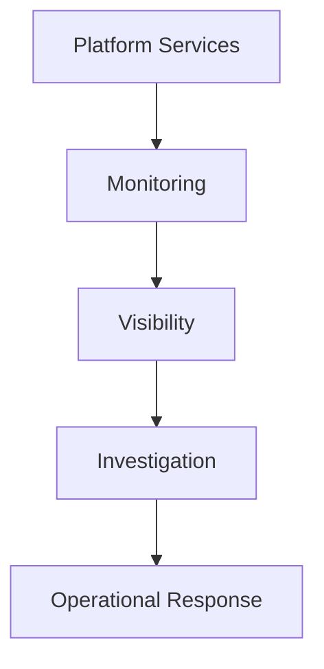

Monitoring is a visibility and operational awareness capability within the Enigm ecosystem. It exists to provide visibility into service health, operational state, and security posture.

This document is intended for security auditors, enterprise customers, technical partners, and security engineers.

## Overview

Monitoring supports reliability, availability, investigation, and security awareness.

Monitoring is designed to help Enigm understand:

- Service health.
- Operational state.
- Security posture.
- Reliability signals.
- Security-relevant activity.

The diagram is conceptual and describes the visibility flow at a public architecture level.

## Monitoring Objectives

Monitoring is designed to support:

- Reliability.
- Availability.
- Security visibility.
- Incident detection.
- Operational awareness.
- Investigation support.
- Risk identification.

Monitoring is a visibility control. It does not replace secure architecture, access controls, release validation, incident response, or defensive controls.

## Operational Visibility

Monitoring supports awareness of:

- Platform health.
- Service status.
- System behavior.
- Operational integrity.

Operational visibility helps identify reliability issues, service degradation, abnormal behavior, and conditions that may require review.

Operational monitoring should be scoped to service operation and should avoid unnecessary collection of user content.

## Security Visibility

Security monitoring contributes to:

- Security awareness.
- Threat visibility.
- Investigation support.
- Risk identification.

Security visibility helps identify events that may require assessment, correlation, risk evaluation, or defensive response.

Security visibility should be interpreted as decision support, not as an assurance that every security issue will be detected.

## Service Health

Monitoring supports understanding of service availability and operational state.

Service health monitoring may support:

- Availability review.
- Reliability review.
- Operational integrity review.
- Degradation detection.
- Incident response readiness.

Service health signals help operators understand whether platform services are functioning as expected.

## Security Monitoring

Monitoring may observe:

- Security events.
- Integrity signals.
- Operational anomalies.
- Risk indicators.

Security monitoring is designed to support detection, investigation, and risk identification without publishing sensitive analysis mechanics or operational detail.

Monitoring observations may contribute to Enigm Intelligence for correlation and security context generation.

## Privacy Considerations

Monitoring is designed around data minimization.

Monitoring is not intended to inspect:

- Message content.
- Media content.
- Calls.
- User conversations.

Privacy considerations include:

- Scope monitoring to reliability, operational, and security objectives.
- Avoid unnecessary identity metadata.
- Keep message confidentiality separate from monitoring visibility.
- Limit access to authorized workflows.
- Prefer aggregate or minimized signals where appropriate.

Monitoring should improve service and security visibility without converting user communications into monitoring inputs.

## Relationship With Enigm Intelligence

Monitoring provides visibility.

Enigm Intelligence provides correlation and security context.

These systems serve different purposes:

- Monitoring observes operational and security-relevant signals.
- Enigm Intelligence correlates signals, evaluates risk, and generates security context.

Monitoring may provide inputs to Enigm Intelligence, but Enigm Intelligence remains responsible for higher-level security correlation and defensive decision support.

## Security Limitations

Monitoring improves awareness, but it does not prevent every failure or attack.

Limitations include:

- Some failures may occur before monitoring detects them.
- Some attacks may produce limited observable signal.
- Monitoring may require investigation before a finding is understood.
- Visibility may depend on available evidence.
- Monitoring does not replace incident response.
- Monitoring does not replace secure development or release validation.
- Monitoring does not provide message plaintext access.

Monitoring should be evaluated as a visibility and awareness capability within Enigm’s broader security architecture.
