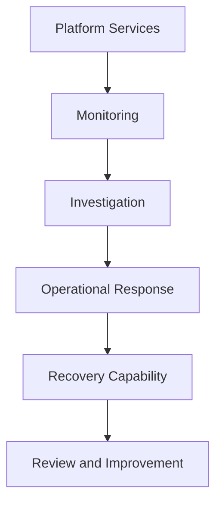

Enigm infrastructure operations are designed to support service reliability, security visibility, business continuity, and controlled recovery without exposing user communications or operational topology.

## Overview

Operations and resilience cover three related capabilities:

- Monitoring for service health, operational state, and security visibility.
- Incident response for assessment, containment, remediation, recovery, and review.
- Backup and recovery for continuity of critical platform functions.

## Monitoring

Monitoring provides visibility into service health, operational integrity, security posture, and anomalous behavior. It supports availability review, incident detection, investigation, risk identification, and operational awareness.

Security monitoring can observe security events, integrity signals, operational anomalies, risk indicators, and defensive outcomes. Monitoring is a visibility control; Enigm Intelligence provides deeper correlation and security context.

## Incident Response

Enigm maintains a structured incident response capability intended to reduce impact, protect users, restore service integrity, improve visibility, and support continuous improvement.

The incident lifecycle is conceptualized as detection, assessment, investigation, containment, remediation, recovery, and review. Communication should balance transparency, accuracy, user protection, and operational security.

## Backup and Recovery

Backup and recovery exist to support continuity of critical platform functions. Enigm does not operate a broad archival backup model for user communications.

Backup scope is intentionally minimized and focused on service continuity, security, and recovery-critical platform state such as identity state, critical platform state, essential operational records, and recovery-critical information. Recovery workflows are not intended to bypass end-to-end encryption or provide plaintext access to protected user content.

## Privacy Considerations

Operations data is scoped to reliability, security, fraud prevention, abuse prevention, legal, and recovery requirements. Monitoring and recovery are not intended to inspect messages, media, calls, attachments, or user conversations.

Operational records should be minimized, encrypted where appropriate, access-controlled, retained according to documented purpose, and deleted when no longer required.

## Relationship With Governance

Ongoing validation, periodic assessment, adversarial testing, compliance governance, and independent review are documented in [Security Governance](/security/governance).

See [Platform Limitations](/legal/limitations).
