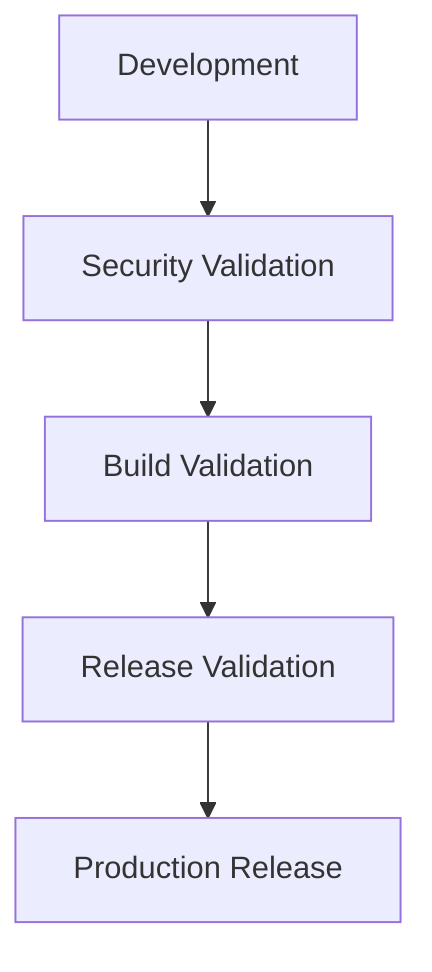

Enigm follows a security-focused software development lifecycle designed to reduce software supply chain risk, improve code quality, support secure release processes, and preserve privacy-oriented platform design.

## Overview

The Enigm Secure SDLC defines the security capabilities and controls used to guide software from development through production release.

The lifecycle is designed to support:

- Software risk reduction.
- Code quality improvement.
- Release integrity.
- Early vulnerability detection.
- Protection of development assets.
- Secure release governance.

The diagram is conceptual and describes lifecycle validation stages at a public architecture level.

## Security Objectives

The Secure SDLC is designed to:

- Reduce software risk.
- Improve release integrity.
- Detect vulnerabilities early.
- Protect development assets.
- Improve operational security.
- Support secure release authorization.
- Support controlled production rollout.
- Preserve privacy, data minimization, and content confidentiality requirements during product and platform changes.

The objective is risk reduction and continuous improvement across the software lifecycle.

## Development Security Principles

Enigm development security is guided by:

- Defense in depth.
- Least privilege.
- Secure defaults.
- Separation of duties.
- Verification before release.
- Continuous validation.
- Change review.
- Controlled release authorization.

These principles are intended to reduce the likelihood that insecure code, unsafe configuration, or unauthorized changes reach production.

## Source Code Security

The development process includes controls for source code security.

Conceptual controls include:

- Automated code analysis.
- Peer review.
- Security review.
- Change validation.

Source code security controls are intended to identify defects, unsafe patterns, and security-sensitive changes before release.

## Dependency Security

Third-party dependencies are reviewed, monitored, and assessed for security impact.

Dependency security focuses on:

- Identifying vulnerable dependencies.
- Reviewing dependency risk.
- Reducing unnecessary dependency exposure.
- Supporting remediation when security issues are identified.
- Preserving awareness of dependency impact on release risk.

Dependency security reduces supply chain risk but does not eliminate it.

## Sensitive Material Protection

The Secure SDLC includes controls intended to prevent accidental exposure of sensitive credential material.

Sensitive material protection focuses on:

- Reducing the likelihood of sensitive credential exposure.
- Preventing sensitive material from being stored in source code.
- Supporting review of changes that may affect credential handling.
- Limiting access to sensitive development assets.
- Encouraging rotation and remediation when exposure is suspected.

Sensitive material protection is a lifecycle control and must be supported by operational discipline.

## Build Security

Build processes are designed to support integrity, traceability, and controlled release workflows.

Build security focuses on:

- Build input validation.
- Build artifact integrity.
- Traceability between changes and release artifacts.
- Separation between build production and release authorization.
- Controlled promotion toward release validation.

Build security does not replace release signing or production validation.

## Release Security

Production releases require validation and authorization before publication.

Release security includes:

- Release validation.
- Release authorization.
- Release integrity checks.
- Controlled publication.
- Rollout readiness review.

Release security relates directly to:

- Release signing.
- OTA security.
- Production gates.

Release signing establishes release authenticity. OTA security protects delivery, eligibility, and device verification. Production gates define expected production security posture.

## Vulnerability Management

The platform supports vulnerability management as part of the Secure SDLC.

Vulnerability management includes:

- Vulnerability identification.
- Risk assessment.
- Prioritization.
- Remediation workflows.
- Verification of remediation.

Vulnerability management is intended to reduce exposure and improve response to known security issues across the software lifecycle.

## Security Monitoring

Security visibility extends across the software lifecycle and operational environment.

Security monitoring may support:

- Visibility into security-relevant events.
- Review of release-related security outcomes.
- Identification of suspicious activity.
- Support for vulnerability response.
- Support for incident visibility.

Monitoring is a defensive visibility control. It does not replace secure development, review, or release validation.

## Ongoing Security Validation

Ver [Security Governance](/security/governance).

## Incident Response

Security incidents are evaluated, investigated, and addressed through controlled response procedures.

Incident response supports:

- Event triage.
- Impact assessment.
- Risk reduction.
- Remediation coordination.
- Lessons learned.

Incident response is intended to reduce impact and improve future controls when security issues occur.

## Continuous Improvement

Security controls are continuously reviewed and refined.

Continuous improvement includes:

- Reviewing security outcomes.
- Updating controls when risks change.
- Improving validation coverage.
- Refining release readiness expectations.
- Strengthening development security practices.

The Secure SDLC should evolve as Enigm products, platform controls, and threat conditions evolve.

## Security Limitations

Ver [Platform Limitations](/legal/limitations).
