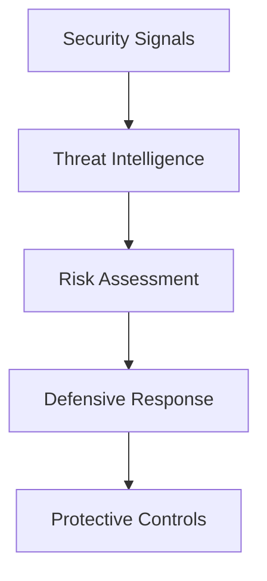

The Enigm defensive blocking architecture is a risk-reduction system. It exists to reduce risk from identified hostile or suspicious activity and to support defensive protection of the Enigm ecosystem.

## Overview

The blocking architecture uses security context and risk assessment to support defensive response.

The goal is to protect Enigm services, platform surfaces, and operational security from activity that has been identified as suspicious or hostile.

The diagram is conceptual and describes defensive response flow at a public architecture level.

## Design Objectives

The blocking architecture is designed to support:

- Risk reduction.
- Attack surface reduction.
- Platform protection.
- Automated response support.
- Security operations support.
- Resilience across multiple protection layers.
- Reliable defensive decision making.

The system is intended to reduce exposure while preserving service reliability and operational stability.

## Defensive Response Model

The platform may apply defensive controls when risk reaches defined operational criteria.

Responses may depend on:

- Context.
- Confidence.
- Recurrence.
- Operational impact.

The defensive response model is intended to apply proportionate controls based on security context. Public documentation does not describe exact decision mechanics.

## Risk-Based Actions

Not every observation results in a defensive action.

The platform is designed to balance:

- Security.
- Reliability.
- Operational stability.

Risk-based actions should be evaluated according to context and potential impact. A single low-context observation may only require visibility or review, while repeated or higher-confidence activity may require stronger defensive response.

## Automated Controls

Certain defensive actions may be performed automatically when predefined criteria are satisfied.

Examples of defensive control categories include:

- Access restrictions.
- Traffic controls.
- Protective filtering.
- Temporary defensive measures.

## Human Oversight

Automation is intended to support operators.

Human review remains important for sensitive decisions, exceptional cases, and actions with broader operational impact.

Sensitive defensive actions should remain governed by authorization, policy, and review requirements.

## Distributed Enforcement

Defensive controls may be applied across multiple protection layers within the Enigm ecosystem.

The objective is to improve resilience and reduce single points of failure. Distributed enforcement can help apply risk-reduction controls closer to the relevant protection surface while maintaining consistent defensive intent.

Distributed enforcement should be evaluated as part of the broader Enigm security architecture, including monitoring, risk assessment, defensive response, and operator visibility.

## Relationship With Threat Intelligence

Threat Intelligence provides context.

The blocking architecture provides defensive response.

These systems perform different functions:

- Threat Intelligence identifies, correlates, and explains security-relevant activity.
- Blocking architecture applies protective controls based on security context and risk.

Threat Intelligence should inform defensive decisions, but context generation and enforcement remain separate responsibilities.

## Relationship With Enyra

Enyra may provide visibility into defensive actions.

Enyra does not replace defensive enforcement systems.

Enyra can help authorized users understand why defensive measures were considered, summarize relevant risk context, and review security state. It should not be treated as the enforcement mechanism itself.

## Privacy Considerations

The blocking architecture is intended to operate on security context.

It is not intended to inspect:

- Message content.
- Call content.
- Media content.
- User conversations.

Privacy considerations include:

- Scope defensive response to security objectives.
- Avoid unnecessary identity metadata.
- Separate defensive controls from message confidentiality.
- Limit visibility to authorized workflows.
- Prefer security context over content inspection.

Defensive blocking should protect the platform without turning user communications into enforcement inputs.

See [Platform Limitations](/legal/limitations).
