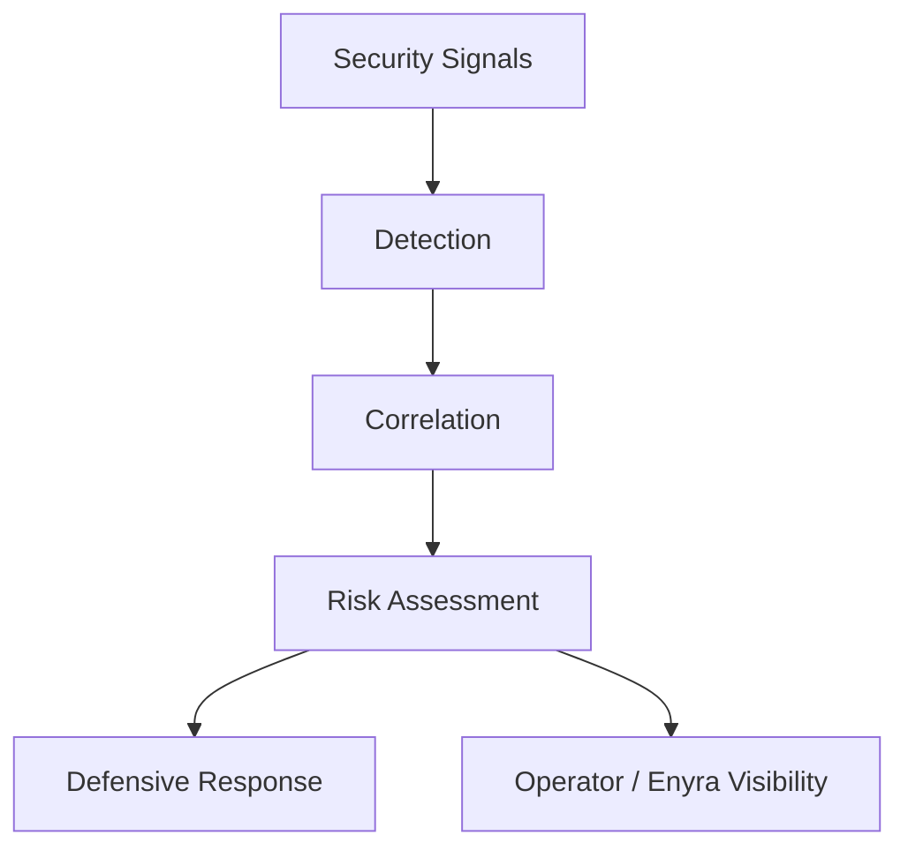

Enigm Intelligence transforms security observations into defensive context for authorized operators and higher-level security workflows. It is designed to support threat visibility, risk prioritization, investigation, and risk-reduction decisions without turning user communications into security inputs.

## Overview

The detection and response model has four responsibilities:

- Convert security signals into structured context.
- Correlate related activity across security domains.
- Classify risk for operational prioritization.
- Support proportionate defensive controls and operator review.

## Signal Processing

Security signals are scoped to platform protection, service integrity, Device Trust, monitoring, and defensive operations. They can include security telemetry, integrity signals, platform events, monitoring observations, defensive control outcomes, Trust state changes, and update or rollout security context.

Signals are normalized into a consistent representation so related observations can be compared, correlated, summarized, and reviewed. Normalization supports reliable security context generation without exposing internal rules, thresholds, or detection logic.

## Detection and Correlation

Detection identifies security-relevant activity for review and correlation. A single event may have limited meaning by itself, while related observations across time, infrastructure surfaces, device classes, or security domains can provide stronger context.

Correlation is designed to improve understanding of potentially related activity. It supports risk evaluation and investigation, but it should not be treated as final platform truth without context and authorized review where required.

## Risk Assessment

Risk assessment converts security context into operational prioritization. Conceptual classifications include Low, Medium, High, and Critical.

Risk evaluation can consider severity, context, recurrence, cross-surface activity, confidence, integrity changes, defensive history, and relevant historical observations. Classifications represent decision support rather than certainty; they do not prove attribution, intent, or compromise by themselves.

## Defensive Response

The defensive response model supports visibility, investigation, notification, access restrictions, traffic controls, protective filtering, and temporary defensive measures. Not every observation results in a control action.

Defensive actions are designed to balance security, reliability, privacy, and operational stability. Sensitive actions should remain governed by authorization, policy, and review requirements. Automation supports operators; it does not replace security governance.

## Relationship With Enyra

Enyra consumes security context produced by Enigm Intelligence. It helps authorized users understand events, summarize risk, retrieve relevant context, and review defensive activity using a conversational interface.

Enyra does not replace detection systems, correlation systems, risk evaluation, or enforcement mechanisms. It operates as an interface over security context, not as the source of platform truth.

## Privacy Considerations

The detection and response model is designed around minimization and aggregation where possible. It is not intended to inspect message content, call content, media content, attachments, documents, or user conversations.

Privacy controls include scoped signal collection, minimized identity metadata, separation between security visibility and message confidentiality, authorized access controls, and preference for security context over content inspection.

See [Platform Limitations](/legal/limitations).
