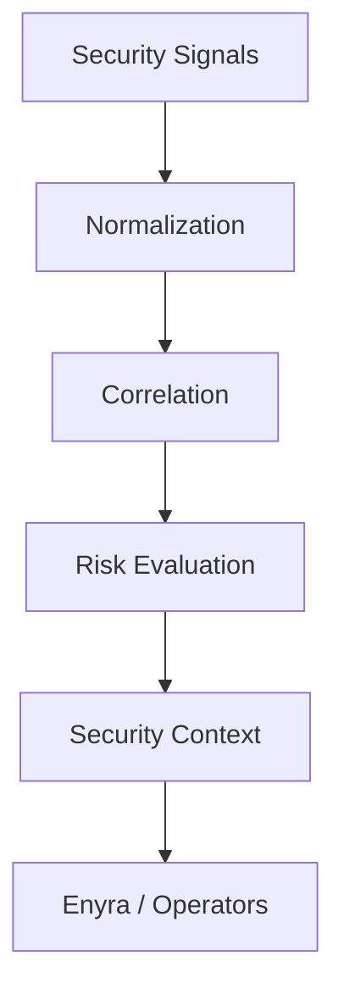

The Enigm Intelligence detection pipeline is a layered security signal processing architecture. It transforms raw security observations into security context that can be understood by authorized operators and higher-level systems.

## Overview

The detection pipeline converts security observations into structured context for detection, correlation, risk evaluation, and defensive decision support.

The pipeline is designed to support:

- Threat visibility.
- Event understanding.
- Context generation.
- Risk identification.
- Security awareness.

The diagram is conceptual and describes the high-level processing path from observations to security context.

## Detection Objectives

The detection pipeline is designed to support:

- Threat visibility.
- Event understanding.
- Context generation.
- Risk identification.
- Security awareness.
- Defensive decision support.

## Signal Collection

The platform may receive multiple categories of security signals.

Signal categories may include:

- Security telemetry.
- Monitoring signals.
- Integrity signals.
- Platform events.
- Security detections.

Signal collection is scoped to security visibility and defensive protection objectives. Public documentation describes signal categories only at a high level.

## Signal Normalization

Different signal categories are normalized into a consistent representation.

Normalization is intended to support:

- Reliable correlation.
- Consistent event interpretation.
- Risk evaluation.
- Security context generation.
- Operator review.

Normalization allows different categories of observations to be compared and understood within a common security model.

## Event Correlation

The platform may correlate observations across:

- Time.
- Infrastructure surfaces.
- Device classes.
- Security domains.

The objective is to improve understanding of related security activity. A single event may have limited meaning by itself, while related observations may provide stronger security context when evaluated together.

Correlation is described here conceptually. Public documentation does not disclose sensitive analysis methods.

## Risk Evaluation

Risk evaluation may consider:

- Severity.
- Context.
- Recurrence.
- Cross-surface activity.
- Historical patterns.

Risk evaluation is intended to support prioritization and operator understanding. It should be interpreted as security decision support, not as a substitute for authorized judgment.

## Security Context Generation

The output of the pipeline is security context rather than raw event volume.

Security context may include:

- Event summaries.
- Risk explanations.
- Related observations.
- Investigation context.
- Defensive decision support.

This context may be consumed by:

- Operators.
- Dashboards.
- Security workflows.
- Enyra.

Security context should be scoped to defensive visibility and should avoid unnecessary exposure of user content.

## Defensive Decision Support

The pipeline supports defensive decisions.

It may support:

- Prioritization.
- Investigation.
- Notification.
- Review.
- Risk reduction measures.

The pipeline does not automatically replace human judgement. Security-sensitive actions should remain subject to appropriate authorization and review.

## Relationship With Enyra

Enyra consumes security context produced by the detection pipeline.

Enyra is not the detection pipeline itself. It provides a conversational interface for authorized users to understand, summarize, and interact with security context generated by Enigm Intelligence.

Enyra should not be treated as the source of detection truth. It operates on context produced by the underlying security pipeline and related Enigm Intelligence systems.

## Privacy Considerations

The pipeline is designed around minimization and aggregation where possible.

The pipeline is not intended to collect:

- Message content.
- Call content.
- Media content.
- User conversations.

Privacy considerations include:

- Scope signal processing to security objectives.
- Prefer aggregated context where possible.
- Avoid unnecessary identity metadata.
- Separate security visibility from message confidentiality.
- Limit access to authorized workflows.

The pipeline should improve defensive visibility without converting user communications into security inputs.

See [Platform Limitations](/legal/limitations).
