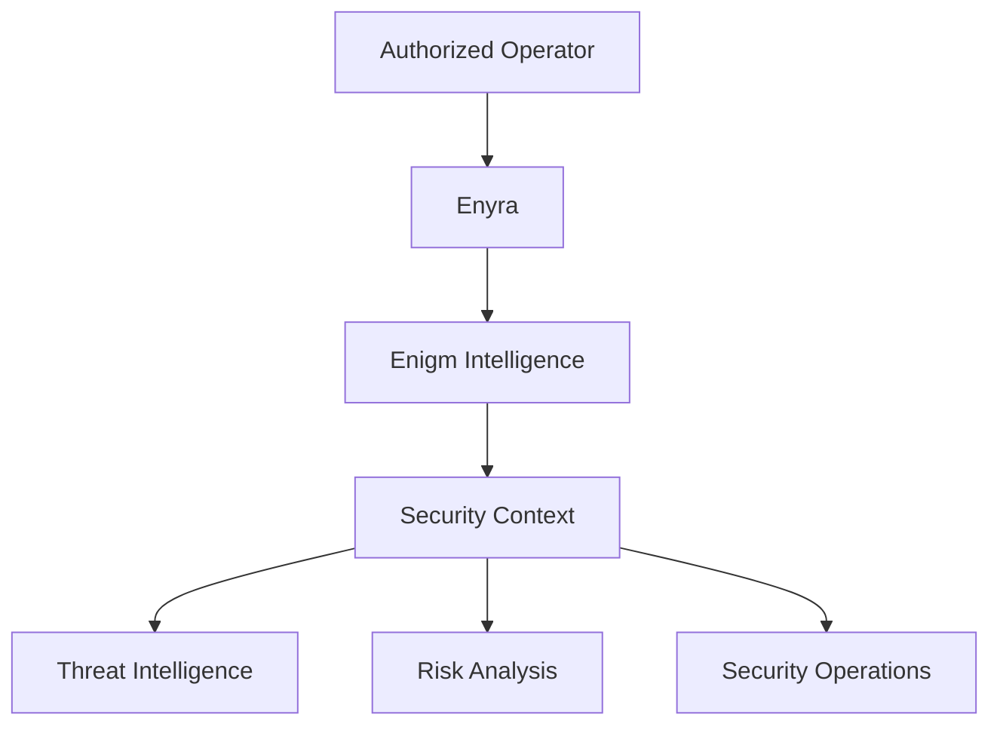

Enyra is the conversational security analyst layer of the Enigm ecosystem. It operates on top of Enigm Intelligence and helps authorized operators investigate security events, review threat intelligence, retrieve security context, summarize findings, analyze risk, and support defensive operations.

Enyra is not a standalone threat intelligence platform. It consumes authorized security context from Enigm Intelligence. It does not replace detection systems, correlation systems, defensive controls, or human authorization.

This document is intended for security auditors, enterprise customers, technical partners, and security engineers. It describes the public Enyra security architecture without exposing private model guidance, private instructions, non-public workflows, non-public interfaces, security policy internals, or private response methods.

## Overview

Enyra provides natural language interaction for security operations assistance.

Enyra is an interaction layer. It does not independently determine platform truth. Authoritative security context remains grounded in Enigm Intelligence, approved telemetry, audit records, risk assessment outputs, and authorized platform state.

## Security Analyst Model

Enyra acts as a conversational security analyst for authorized operators.

The analyst model supports:

- Security investigations.
- Threat intelligence access.
- Risk analysis.
- Event summarization.
- Security context retrieval.
- Human-assisted defensive decision making.
- Optional voice interaction where enabled.
- Mobile access where authorized.

Enyra can help operators ask questions about security events, obtain summaries, compare related findings, and understand risk categories. It should not be treated as an autonomous source of final security truth.

## Security Context

Enyra consumes security context from Enigm Intelligence.

Security context may include:

- Security telemetry.
- Detection signals.
- Correlated event groups.
- Risk scoring outputs.
- Incident visibility data.
- Defensive action history.
- Enigm Command lifecycle evidence.
- Device and account security state.

Enyra should present context in a form that is understandable to authorized operators while preserving access controls and data minimization.

## Mobile Access

Enyra may support mobile access for authorized users.

Mobile access should follow Enigm security expectations:

- Authenticated account context.
- Device association.
- Device trust evaluation.
- Session lifecycle controls.
- Optional Enigm OS Trust state where deployed.
- Audit visibility for sensitive operations.

Mobile access must not weaken access control for security context or sensitive actions.

## Conversational Security Operations

Conversational security operations allow authorized users to interact with security data using natural language.

Supported operation categories may include:

- Event summarization.
- Risk explanation.
- Security context retrieval.
- Threat intelligence review.
- Investigation support.
- Defensive decision support.

Enyra should preserve a separation between explanation, recommendation, and execution.

## Human Authorization

Security-sensitive actions may require additional authorization before execution.

Examples include:

- Blocking actions.
- Unblocking actions.
- Sensitive administrative actions.
- Device lifecycle actions.
- Account lifecycle actions.
- Policy changes.

Enyra may assist with context, explanation, and workflow preparation, but authorization-sensitive actions should remain policy-governed, auditable, and attributable.

## Privacy Considerations

Enyra should minimize exposure of security data according to the user role, request context, and authorization state.

Privacy considerations include:

- Limit access to security context according to role and policy.
- Avoid exposing protected message content, secure call content, private key material, or unnecessary identity metadata.
- Natural language interaction should not expand access beyond what the user is authorized to review.
- Sensitive queries and actions should remain auditable where policy requires it.
- Conversational artifacts should not retain unnecessary sensitive context.

## Security Limitations

Enyra is an analyst layer, not a replacement for the underlying security platform.

Important limitations:

- Enyra does not replace detection systems.
- Enyra does not replace correlation systems.
- Enyra does not replace defensive controls.
- Enyra does not independently determine platform truth.
- Enyra responses depend on available security context and authorized data access.
- Enyra must not expose private model guidance, non-public workflows, security policy internals, or private response methods.
- Sensitive actions may require additional authorization before execution.

## Threat Model References

Relevant threat-model areas include unauthorized security context access, intelligence manipulation, Enigm Command abuse, account and app compromise, defensive action misuse, and loss of audit visibility.
