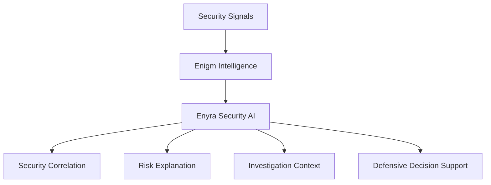

Enyra is the security AI and correlation layer of the Enigm Intelligence domain. It operates over security context to support threat correlation, risk explanation, investigation workflows, event summarization, and defensive decision support.

Enyra in the Intelligence section is not the Enigm Command Product Assistant. Product guidance, documentation guidance, configuration assistance, platform navigation, device assistance, and account assistance are documented under [Enigm Command](/command/overview).

Enyra does not replace the Threat Intelligence Platform, detection systems, correlation systems, defensive controls, or human authorization. It operates as an AI layer over authorized security context.

## Overview

Enyra supports security analysis over Enigm Intelligence outputs.

Enyra does not independently determine platform truth. Authoritative security context remains grounded in Enigm Intelligence, approved telemetry, audit records, risk assessment outputs, defensive control state, and authorized platform state.

## Security AI Model

Enyra applies AI-assisted analysis to security context produced by Enigm Intelligence.

The security AI model supports:

- Security investigations.
- Threat intelligence access.
- Risk analysis.
- Event summarization.
- Security context retrieval.
- Cross-signal correlation.
- Security narrative generation.
- Defensive response review.
- Human-assisted defensive decision making.

Enyra should be treated as an analytical layer over security context, not as an autonomous source of final truth.

## Security Context

Enyra consumes security context from Enigm Intelligence.

Security context may include:

- Security telemetry.
- Detection signals.
- Correlated event groups.
- Risk scoring outputs.
- Incident visibility data.
- Defensive action history.
- Enigm Command lifecycle evidence.
- Device and account security state.

Enyra should transform security context into summaries, correlations, risk explanations, and investigation support while preserving access controls and data minimization.

## Correlation Model

Enyra contributes to correlation by helping relate security observations across time, device classes, product surfaces, lifecycle events, and defensive outcomes.

Correlation inputs may include:

- Detection signals.
- Active Defense findings where authorized.
- Device Trust changes.
- Enigm Command lifecycle events.
- Enigm Server lifecycle events.
- Network-policy outcomes.
- Defensive control outcomes.
- Audit records.

Correlation improves security understanding, but it does not guarantee attribution, intent determination, or attack prevention.

## Conversational Security Operations

Where a natural language interface is exposed to authorized security workflows, Enyra can support conversational security operations over authorized security context.

Supported operation categories include:

- Event summarization.
- Risk explanation.
- Security context retrieval.
- Threat intelligence review.
- Investigation support.
- Defensive decision support.

This is different from Enyra Product Assistant in Enigm Command. Product assistance is limited to product guidance and command workflows; Enyra in Intelligence is focused on security analysis, correlation, and defensive support.

## Human Authorization

Security-sensitive actions may require additional authorization before execution.

Examples include:

- Blocking actions.
- Unblocking actions.
- Sensitive administrative actions.
- Device lifecycle actions.
- Account lifecycle actions.
- Policy changes.

Enyra may assist with context, explanation, and workflow preparation, but authorization-sensitive actions remain policy-governed, auditable, attributable, and subject to human authorization where required.

## Privacy Considerations

Enyra should minimize exposure of security data according to role, request context, authorization state, and security purpose.

Privacy considerations include:

- Limit access to security context according to role and policy.
- Avoid exposing protected message content, secure call content, private key material, or unnecessary identity metadata.
- AI-assisted analysis should not expand access beyond authorized security context.
- Sensitive queries and actions should remain auditable where policy requires it.
- Analytical artifacts should not retain unnecessary sensitive context.

See [Platform Limitations](/legal/limitations).

## Threat Model References

Relevant threat-model areas include unauthorized security context access, intelligence manipulation, Enigm Command abuse, account and app compromise, defensive action misuse, and loss of audit visibility.
