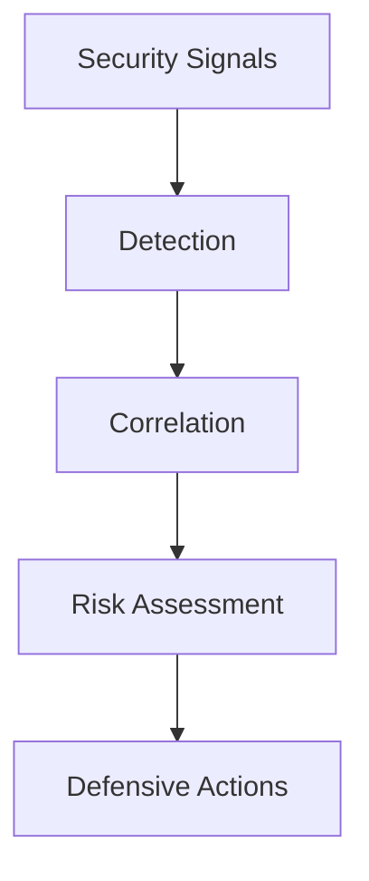

Enigm Intelligence is the security monitoring, threat detection, event correlation, risk assessment, and defensive response layer that protects the Enigm ecosystem while supporting privacy, data minimization, and metadata reduction objectives.

It supports security operations across Enigm App, Active Defense findings, platform services, network components, managed device workflows, public web surfaces, and operational security processes.

## Overview

Enigm Intelligence processes minimized security telemetry, detection signals, threat intelligence platform outputs, and defensive response signals.

The platform supports:

- Security monitoring.
- Threat detection.
- Event correlation.
- Risk assessment.
- Security analytics.
- Incident visibility.
- Defensive automation.
- Security operations support.
- Integration with Enyra.

## Security Objectives

Enigm Intelligence is designed to:

- Detect security-relevant events across the Enigm ecosystem.
- Correlate security telemetry into reviewable cases or risk categories.
- Support risk categorization for defensive decision-making.
- Provide incident visibility for authorized security teams.
- Support defensive automation where policy permits.
- Improve operational security posture through consistent security analytics.

## Threat Detection

Threat detection uses detection signals and security telemetry to identify suspicious activity, policy violations, misuse patterns, or security-relevant anomalies.

Detection is documented at the category level and is intended to support defensive review without expanding unnecessary data collection.

Detection categories may include:

- Account security signals.
- Device lifecycle signals.
- Active Defense findings.
- Network-policy signals.
- Secure messaging abuse indicators.
- Secure call abuse indicators.
- Public surface security signals.
- Platform integrity signals.

## Correlation Model

The correlation model groups related security events into higher-level security context.

Correlation may consider:

- Account context.
- Device lifecycle context.
- Privacy-preserving device identifiers.
- Network-policy context.
- Message or call lifecycle metadata where policy permits.
- Enigm Command administrative events.
- Public surface security events.
- Threat intelligence platform outputs.

Correlation logic is not exposed in public documentation.

## Risk Assessment

Risk assessment converts correlated security context into risk categories, review queues, policy outcomes, or defensive response inputs.

Risk categorization is intended to support consistent decision-making. It should be explainable at a category level to authorized reviewers.

Risk assessment may inform:

- Account review.
- Device review.
- Session review.
- Network-policy action.
- Blocking architecture.
- Incident escalation.
- Defensive automation.

Risk categories should be interpreted as decision support rather than absolute proof of intent or compromise.

## Defensive Controls

Defensive controls may respond to evaluated risk according to policy.

Defensive actions may include:

- Alerting.
- Session restriction.
- Device review.
- Device revocation recommendation.
- Network-policy adjustment.
- Blocking action.
- Enigm Command review workflow.
- Incident response escalation.

Defensive automation should be policy-governed, auditable, and reversible where appropriate. Public documentation does not expose private response procedures.

## Enyra Integration

Enyra is the security AI and correlation layer within the Enigm Intelligence domain. It integrates with Enigm Intelligence to support evaluated security outcomes, risk assessment, detection enrichment, cross-signal correlation, event summarization, and defensive response workflows.

Enyra outputs should be handled as security-sensitive intelligence. They may contribute to risk scoring, review workflows, or defensive automation according to policy.

Enyra should preserve access controls, data minimization, and content confidentiality when presenting security context.

## Privacy Considerations

Enigm Intelligence should minimize collection and exposure of security telemetry where possible.

Privacy considerations include:

- Separate protected content from security telemetry.
- Use privacy-preserving identifiers where possible.
- Limit access to intelligence outputs.
- Retain security telemetry according to policy.
- Avoid exposing protected message content, secure call content, private key material, or unnecessary identity metadata.

Security monitoring must be balanced with data minimization and authorized review boundaries.

See [Platform Limitations](/legal/limitations).

## Threat Model References

Relevant threat-model areas include intelligence manipulation, loss of audit visibility, account and app compromise, device lifecycle abuse, network-policy misuse, public surface exposure, secure messaging compromise attempts, and secure call compromise attempts.
