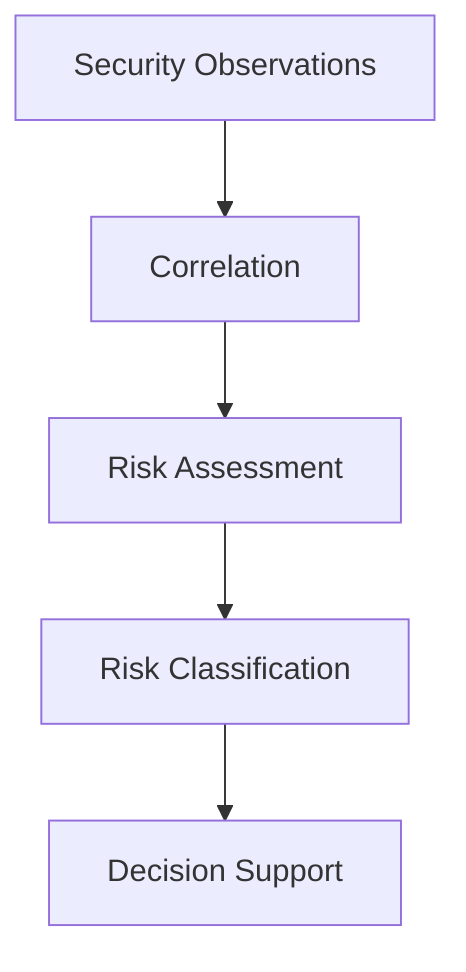

The Enigm Intelligence risk model is a decision-support framework. It helps transform security observations into actionable security understanding for authorized operators and defensive workflows.

The goal of the risk model is not to predict the future. The goal is to support defensive decision making through prioritization, context, and operational awareness.

This document is intended for security auditors, enterprise customers, technical partners, and security engineers.

## Overview

The risk model converts security observations and related context into operational prioritization.

The diagram is conceptual and describes how observations become decision-support context.

## Risk Assessment Objectives

The risk model is designed to support:

- Prioritization.
- Context generation.
- Threat visibility.
- Operational awareness.
- Decision support.
- Security review.
- Defensive workflow planning.

Risk assessment should help authorized users understand which security observations require attention and why.

## Risk Inputs

Risk evaluation may consider:

- Security events.
- Historical observations.
- Event relationships.
- Security context.
- Platform visibility.
- Activity recurrence.

These inputs are evaluated conceptually to support prioritization. Public documentation describes the risk model without publishing sensitive evaluation mechanics.

Risk inputs should be scoped to security visibility and defensive protection objectives.

## Risk Context

Individual events may appear low risk in isolation.

Related activity across multiple security domains may increase confidence that activity deserves attention. For example, repeated observations, correlated platform events, integrity changes, or cross-surface activity may provide more useful context than an isolated event.

Risk context is intended to help operators understand significance, not to provide absolute certainty.

## Risk Classification

Risk classifications represent operational prioritization rather than certainty.

Supported conceptual classifications include:

- Low.
- Medium.
- High.
- Critical.

Classifications help guide review urgency, investigation depth, notification behavior, and defensive decision support.

A classification does not prove attribution, intent, or compromise by itself.

## Risk Escalation

Risk may increase when:

- Related observations appear.
- Activity persists.
- Multiple security domains are involved.
- Confidence increases.
- Relevant historical observations exist.

Risk escalation is intended to help prioritize attention as context changes. Public documentation does not disclose escalation logic.

## Relationship With Detection

Detection produces observations.

Risk assessment produces prioritization.

These are different functions. Detection identifies security-relevant activity for review, while risk assessment evaluates context and urgency to support defensive decision making.

Detection output should not automatically be treated as final risk. Risk assessment uses detection context, correlation, and related observations to support prioritization.

## Relationship With Enyra

Enyra consumes risk context.

Enyra does not independently determine risk.

Enyra may help authorized users understand risk explanations, summarize relevant context, and navigate investigation workflows. It operates on security context produced by Enigm Intelligence rather than acting as the risk source of record.

## Relationship With Defensive Actions

Risk may influence:

- Visibility.
- Investigation.
- Notification.
- Defensive controls.

Risk alone does not imply automatic action.

Defensive actions should remain governed by authorization, policy, and review requirements. Risk context is intended to support those decisions, not replace them.

## Privacy Considerations

The risk model is intended to operate on security context rather than user communications.

The model is not designed to inspect:

- Messages.
- Calls.
- Media.
- Conversations.

Privacy considerations include:

- Scope risk evaluation to security objectives.
- Avoid unnecessary identity metadata.
- Prefer aggregated or minimized context where possible.
- Keep message confidentiality separate from security risk analysis.
- Limit risk context access to authorized workflows.

Risk assessment should support platform protection without turning user communications into risk inputs.

## Security Limitations

Risk assessment supports decisions, but it does not eliminate uncertainty.

Limitations include:

- It does not guarantee attribution.
- It does not guarantee intent determination.
- It does not guarantee attack prevention.
- It may depend on incomplete observations.
- It may require human interpretation.
- It may miss low-signal or novel activity.
- It may classify activity differently as context changes.

The risk model should be evaluated as a decision-support framework within Enigm Intelligence, not as a guarantee of complete security understanding.
