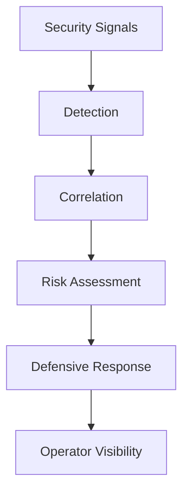

Enigm Intelligence is the security monitoring, detection, correlation, and defensive response layer that protects the Enigm ecosystem. It provides visibility into platform security events and supports defensive decision making.

Enigm Intelligence is a threat intelligence platform for security visibility, risk assessment, and defensive response support.

This document is intended for security auditors, enterprise customers, technical partners, and security engineers.

## Overview

Enigm Intelligence exists to provide visibility into platform security events and support defensive decision making across the Enigm ecosystem.

The platform supports:

- Security monitoring.
- Threat detection.
- Event correlation.
- Risk assessment.
- Security analytics.
- Incident visibility.
- Defensive response support.
- Integration with Enyra.

The diagram is conceptual and describes high-level defensive analysis flow.

## Security Objectives

Enigm Intelligence is designed to support:

- Threat visibility.
- Security monitoring.
- Event correlation.
- Risk identification.
- Defensive response support.
- Security analytics.
- Incident visibility.
- Operator decision support.

The objective is to improve understanding of security-relevant activity and support defensive actions without exposing detection logic, operational methods, or user content.

## Detection Model

The platform consumes multiple categories of security signals.

Signal categories may include:

- Security telemetry.
- Detection events.
- Platform events.
- Integrity signals.
- Monitoring events.

Detection is intended to identify security-relevant activity for further review, correlation, and risk assessment. Public documentation describes this capability at a high level.

Detection output should be treated as security context. It should not be interpreted as final platform truth without correlation, context, and operator review where required.

## Correlation Model

Individual security events may have limited value in isolation.

Enigm Intelligence is designed to correlate related activity across multiple security domains to improve risk understanding. Correlation can help identify patterns that are less visible when events are reviewed individually.

Correlation may consider:

- Related security events.
- Cross-surface activity.
- Timing relationships.
- Repeated observations.
- Integrity and monitoring context.
- Security posture changes.

Correlation is intended to support risk understanding. Public documentation describes the model conceptually.

## Risk Assessment

Enigm Intelligence evaluates risk to support operator decision making.

Risk assessment may consider:

- Severity.
- Context.
- Recurrence.
- Cross-surface activity.
- Historical observations.

Risk assessment is intended to help prioritize review, investigation, notification, and defensive response. It should be interpreted as decision support rather than an automatic substitute for authorized security judgment.

## Security Signals

Security signals are the inputs used to support detection, correlation, and risk assessment.

Signal categories may include:

- Device security signals.
- Platform security events.
- Integrity signals.
- Monitoring events.
- Defensive control outcomes.
- Trust state changes.
- Update and rollout security context.

Signals should be scoped to security and operational protection objectives. They should avoid unnecessary collection of user content or unrelated personal data.

## Defensive Response

Enigm Intelligence may support defensive response workflows.

Supported defensive response categories may include:

- Visibility.
- Investigation.
- Notification.
- Defensive actions.
- Risk reduction measures.

Defensive response is intended to reduce risk, improve security visibility, and support authorized decision making.

Security-sensitive actions should be governed by authorization, review, and applicable policy.

## Relationship With Enyra

Enyra consumes security context generated by Enigm Intelligence.

Enyra can help authorized users understand events, summarize security context, explain risk, and interact with security data using natural language.

Enyra does not replace detection systems.

Enyra does not replace correlation systems.

Enyra does not replace defensive controls.

Enyra should be understood as a conversational layer over security context, not as the source of platform truth.

## Privacy Considerations

Enigm Intelligence is designed around data minimization.

The platform is not intended to collect:

- Message content.
- Media content.
- Conversation content.
- User communications.
- Call content.
- Attachments.
- Documents.

Privacy considerations include:

- Scope signals to security and defensive objectives.
- Minimize unnecessary identity metadata.
- Avoid content inspection where device or platform posture signals are sufficient.
- Separate security visibility from message confidentiality.
- Limit access to authorized workflows.

Security monitoring should improve platform protection without turning message content or user communications into intelligence inputs.

## Security Limitations

Threat intelligence improves visibility but does not ensure prevention of every attack.

Limitations include:

- Detection may miss unknown or low-signal activity.
- Correlation may not identify every relationship between events.
- Risk assessment depends on available context.
- Defensive response may require human authorization.
- Malicious authorized users may still create risk.
- Vulnerabilities may exist before they are detected.
- External systems may introduce risk outside Enigm control.

Enigm Intelligence should be evaluated as a defensive visibility and response-support layer within the broader Enigm security architecture.
