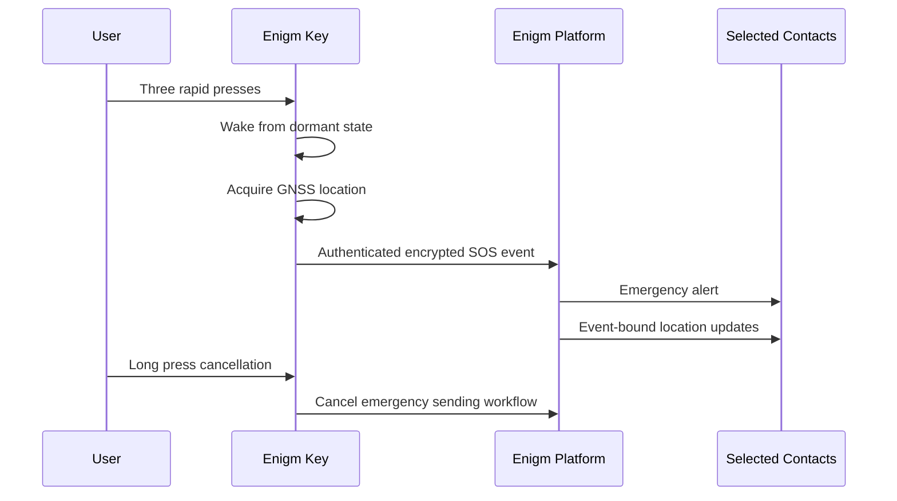

Enigm Key emergency workflows are user-controlled, event-bound, and purpose-limited. The workflow is designed to let a user notify selected trusted contacts quickly while minimizing routine data exposure during normal standby operation.

## Overview

The intended emergency workflow is:

1. The user performs three rapid button presses.
2. Enigm Key exits dormant standby mode.
3. The device acquires location using GNSS where available.
4. The device establishes mobile data connectivity.
5. The device authenticates with the Enigm platform.
6. The device sends an encrypted and signed SOS event.
7. The platform notifies selected emergency contacts.
8. Location sharing continues during the active emergency event.
9. The user cancels the emergency sending workflow with a long press or supported cancellation path.
10. The event is retired according to lifecycle and retention policy.

The diagram is conceptual and does not expose protocol messages, endpoint names, or operational routing.

## Activation Model

Enigm Key is activated through deliberate physical interaction.

The triple-press model is designed to reduce accidental activation while remaining simple enough for high-stress situations. A brief vibration confirms activation so the user receives local feedback without needing to unlock a phone or open an app.

## Cancellation Model

A long press is intended to cancel the emergency alerting workflow. Cancellation stops the emergency sending workflow and should stop event-bound location sharing for that active event.

Cancellation does not erase normal legal, security, or operational records where retention is required by the documented retention model.

## Emergency Contacts

Emergency contact configuration is controlled from Enigm App.

Emergency contact lifecycle management includes:

- Adding trusted emergency contacts.
- Reviewing configured contacts.
- Removing contacts.
- Replacing contacts.
- Reviewing emergency contact eligibility.
- Retiring emergency contact access when no longer required.

Selected contacts receive only the emergency context required for the active workflow. Emergency contact configuration should not expose normal messages, secure calls, media, attachments, or user conversations.

## Emergency Event Boundary

Emergency activation creates a bounded emergency workflow.

The emergency authorization boundary is limited to:

- The linked Enigm Key.
- The associated Enigm account.
- The active emergency event.
- User-selected emergency contacts.
- Event-bound location sharing.
- Emergency event status.

The emergency authorization boundary does not provide:

- Routine location tracking.
- Access to message plaintext.
- Access to secure call content.
- Access to media content.
- Access to attachments.
- Access to user conversations.
- Access to private key material.
- Authority to change normal Enigm App communication policy.

## Safety Boundary

Enigm Key is not an emergency service, public safety answering point, rescue dispatch service, medical service, law-enforcement dispatch service, or guaranteed response system.

Users are responsible for selecting appropriate emergency contacts, keeping contact configuration current, and ensuring that event-bound location sharing is used for a lawful and authorized safety purpose.

See [Platform Limitations](/legal/limitations).
