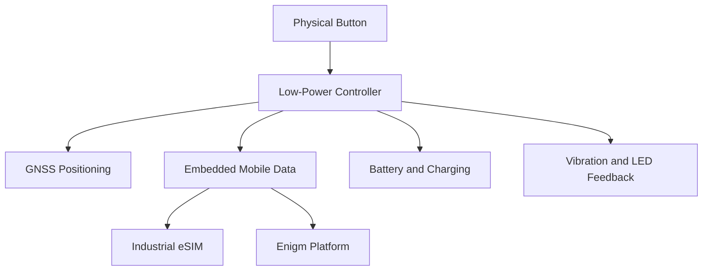

Enigm Key is designed as compact privacy-oriented emergency hardware. This page documents the public hardware model without exposing PCB layout, component sourcing, board-level routing, manufacturing details, or implementation-sensitive design files.

## Overview

The public Enigm Key hardware model includes:

- Compact physical key-device form factor.
- Dedicated physical activation button.
- Embedded mobile data connectivity.
- Integrated GNSS positioning capability.
- Low-power controller for dormant standby operation.
- Rechargeable battery system.
- Charging interface.
- Vibration feedback for activation confirmation.
- LED indicators for battery and charging state.
- Enclosure design target for everyday carry conditions.

The diagram is conceptual. It describes functional hardware blocks, not board layout or component placement.

## Physical Design Objectives

Enigm Key is designed for everyday carry scenarios such as keys, pockets, bags, light moisture exposure, vibration, and normal portable-device handling.

Public design objectives include:

- Compact key-device footprint.
- Premium physical appearance.
- Dedicated emergency activation button.
- Visual battery or charge-state feedback.
- Haptic confirmation after activation.
- Enclosure design target suitable for light moisture and everyday carry conditions.
- Low-power standby behavior intended to support more than one week of dormant operation under normal assumptions.

Water and dust resistance should be treated as an enclosure design target unless a specific production certification is published separately.

## Embedded Connectivity

Enigm Key includes embedded mobile data connectivity for emergency communication when the user's phone is unavailable, locked, unsafe to operate, or out of immediate reach.

The connectivity architecture is designed around:

- Embedded mobile data capability.
- Industrial embedded eSIM form factor.
- Soldered device integration rather than a removable SIM slot.
- Remote carrier-profile provisioning where supported by the connectivity layer.
- Cellular connectivity suitable for low-power IoT-style emergency communication.

Connectivity is a transport capability. It does not replace account security, device authentication, encrypted communication, or user-controlled emergency contact configuration.

## Positioning Model

Enigm Key uses GNSS positioning capability to support event-bound location sharing during active emergency workflows.

Positioning is intended to operate only as part of the emergency event lifecycle. Enigm Key is not documented as a continuous tracking device and should not perform routine location reporting while inactive.

GNSS availability can depend on environment, signal conditions, device state, battery state, and connectivity state.

## Power And Feedback Model

Enigm Key is designed around dormant standby behavior. During normal non-emergency operation, the device remains in a low-activity state to reduce unnecessary network activity, location exposure, and battery usage.

Public feedback behaviors include:

- Brief vibration confirmation after emergency activation.
- LED indication for low battery state.
- LED indication for charging or charged state when connected to power.

Feedback behavior is intended to help the user understand emergency activation and device readiness without turning the device into a continuous monitoring surface.

## Public Documentation Boundary

Public documentation intentionally excludes:

- PCB layout.
- Board routing.
- Test pads.
- Manufacturing files.
- Bill of materials.
- Component vendors.
- Exact component part numbers.
- Internal firmware details.
- Debug interfaces.
- Electrical schematics.
- Assembly process details.

These materials remain controlled hardware and supply-chain information.

See [Platform Limitations](/legal/limitations).
