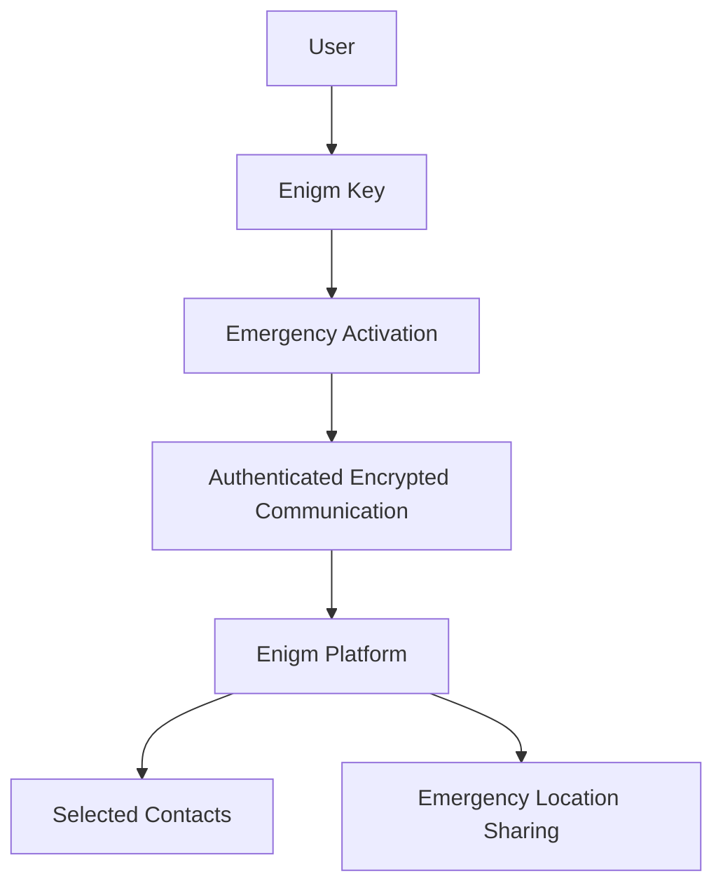

Enigm Key is the physical emergency key device in the Enigm ecosystem. It is designed to help a user trigger an SOS alert from a dedicated physical device without requiring phone unlock or direct app interaction at the moment of activation.

Enigm Key is a supporting platform component. It does not replace Enigm App, secure messaging, secure calls, Device Trust, or user account security. It is designed to link with an Enigm account through Enigm App and communicate securely with the Enigm platform when an emergency workflow is activated.

This document is intended for security auditors, enterprise customers, technical partners, security engineers, and product integrators.

## Overview

Enigm Key is a compact emergency device with embedded mobile data connectivity. It is intended for scenarios where a user may need to notify selected trusted contacts quickly and discreetly.

Enigm Key is administered as a device from Enigm Command and Enigm App. Initial linking and emergency contact configuration are Enigm App workflows.

When activated, Enigm Key is designed to:

- Send an emergency alert.
- Notify user-selected contacts inside the Enigm platform.
- Share the user's location during the active emergency workflow until the user cancels the emergency sending workflow.
- Authenticate device communication.
- Protect communication with encrypted and signed requests.
- Remain dormant during normal non-emergency operation to support user privacy.

The diagram is conceptual and describes the emergency alert flow at a public architecture level.

## Management Surfaces

Enigm Key has two management surfaces with different responsibilities.

### Enigm App

Enigm App is the primary Enigm Key configuration surface.

Enigm App controls:

- Initial Enigm Key linking.
- Enigm account association.
- Emergency contact configuration.
- Emergency contact lifecycle.
- Emergency event visibility.
- Device lifecycle review.
- Device loss handling.
- Device revocation.
- Device replacement workflows.

### Enigm Command

Enigm Command manages Enigm Key as an associated device after it is linked through Enigm App.

Enigm Command supports:

- Associated Enigm Key visibility.
- Device lifecycle visibility.
- Device loss handling.
- Device revocation.
- Device replacement state.
- Emergency event visibility where authorized.

Enigm Command is not the initial linking surface and is not the emergency contact configuration surface. Enigm Command visibility must remain limited to authorized lifecycle and event context; it must not become routine location tracking or protected communication visibility.

## Design Objectives

Enigm Key is designed to support:

- Emergency alerting from a dedicated physical device.
- Privacy-preserving standby behavior.
- Secure account association.
- Account linking through Enigm App.
- Authenticated device communication.
- Encrypted platform synchronization.
- User-selected emergency contacts.
- User-controlled emergency contact configuration through Enigm App.
- Device administration through Enigm App and Enigm Command.
- Event-bound location sharing during emergencies until user cancellation.
- Minimal routine data exposure.

The objective is to provide emergency communication capability while preserving Enigm's privacy-first design principles.

## Emergency Activation Model

Enigm Key is activated through a deliberate physical interaction.

The intended activation model is:

- The user presses the device button three times.
- The device exits dormant state for the emergency workflow.
- The device authenticates with the Enigm platform.
- The platform triggers alerts for the user's selected emergency contacts.
- Location sharing begins for the active emergency event.
- Location sharing continues until the user cancels the emergency sending workflow.

The activation model is designed to reduce accidental operation while remaining simple enough for high-stress situations.

## Connectivity Model

Enigm Key includes embedded mobile data connectivity designed to support emergency communication when the user's phone may be unavailable, locked, or unsafe to operate.

Connectivity is a transport capability. It does not replace account security, device authentication, encrypted communication, or user-controlled emergency contact configuration.

The connectivity layer should be treated as separate from Enigm App secure messaging and secure calls.

## Account Association

Enigm Key is associated with a user's Enigm account through an explicit synchronization workflow in Enigm App.

Account association is intended to:

- Bind the device to an authorized Enigm account.
- Allow the user to configure emergency contacts from Enigm App.
- Support device lifecycle review.
- Support revocation or replacement if the device is lost or retired.

Account association uses privacy-preserving identifiers for lifecycle and policy correlation. The device should not rely on unnecessary public identifiers for normal platform operation.

Enigm Command can provide device administration, lifecycle visibility, and revocation workflows after the key is associated with the account. Enigm Command should not be documented as the initial linking surface.

## Emergency Contact Workflow

The user configures which trusted contacts should receive emergency alerts from Enigm App.

Emergency contact configuration is an Enigm App workflow. Enigm Command provides lifecycle visibility for Enigm Key where authorized, but emergency contact configuration remains controlled from Enigm App.

When the emergency workflow is activated, selected contacts receive the emergency context required for the active workflow:

- Emergency alert state.
- User identity context required for the alert.
- Location updates during the active emergency event.
- Event status.

Emergency contact workflows should be explicit and user-controlled. Administrative systems should not convert emergency contact visibility into broad access to user communications.

Emergency contact lifecycle management may include:

- Adding trusted emergency contacts.
- Reviewing configured contacts.
- Removing contacts.
- Replacing contacts.
- Reviewing emergency contact eligibility.
- Retiring emergency contact access when no longer required.

Emergency contacts receive only the emergency context required for the active workflow. Emergency contact configuration should not expose normal messages, secure calls, media, attachments, or user conversations.

## Emergency Event Lifecycle

Enigm Key emergency events are user-controlled lifecycle events.

The emergency event lifecycle includes:

1. User activation through the deliberate physical interaction.
2. Device wake from dormant standby behavior.
3. Device authentication with the Enigm platform.
4. Emergency alert delivery to selected contacts.
5. Event-bound location sharing.
6. User cancellation of the emergency sending workflow.
7. Emergency event retirement according to retention and lifecycle policy.

Location sharing is intended to continue only during the active emergency workflow and until the user cancels the emergency sending workflow.

Emergency event state should remain separate from normal message content, secure calls, media, attachments, and user conversations.

## Emergency Authorization Boundary

Emergency activation creates a bounded emergency workflow.

The emergency authorization boundary is limited to:

- The linked Enigm Key.
- The associated Enigm account.
- The active emergency event.
- User-selected emergency contacts.
- Event-bound location sharing.
- Emergency event status.

The emergency authorization boundary does not provide:

- Routine location tracking.
- Access to message plaintext.
- Access to secure call content.
- Access to media content.
- Access to attachments.
- Access to user conversations.
- Access to private key material.
- Authority to change normal Enigm App communication policy.

Emergency contact visibility is event-bound and purpose-limited. It should not be treated as a general monitoring, device-management, or administrative access channel.

## Location Sharing

Enigm Key is designed to share location during an active emergency workflow.

Location sharing should be:

- Event-bound.
- Limited to selected contacts or authorized emergency workflows.
- Protected in transit.
- Stopped when the user cancels the emergency sending workflow.
- Retired according to the emergency event lifecycle and retention policy.
- Separated from routine standby behavior.

When Enigm Key is not activated, it is intended to remain dormant and avoid routine location reporting. This supports privacy and data minimization.

## Device Sleep And Privacy

Enigm Key is designed around dormant standby behavior.

During normal non-emergency operation, the device is intended to remain in a low-activity state. This reduces unnecessary network activity, location exposure, and battery usage.

Privacy principles include:

- No routine emergency-location sharing while inactive.
- Event-bound data transmission.
- Minimal standby communication.
- Purpose-limited emergency data.
- Account association using privacy-preserving identifiers.
- Separation between emergency alerts and message content.

Enigm Key should be documented as privacy-oriented emergency hardware, not as a continuous tracking device.

## Authentication And Request Integrity

Enigm Key communication is designed to be authenticated and protected.

The device uses device-bound authenticated signing material for platform authentication. At a public architecture level, this includes a unique per-device HMAC-based credential used to authenticate signed requests so the platform can verify that communication is associated with an authorized Enigm Key.

The security model is intended to support:

- Device authentication.
- Request integrity.
- Encrypted communication.
- Rejection of unauthenticated device traffic.
- Account-bound device association.
- Replay-resistant request validation where required.
- Device lifecycle revocation when the key is lost, retired, or replaced.

Public documentation describes this authentication model at a high level suitable for external review. It does not disclose HMAC secrets, request formats, headers, signature placement, API routes, replay windows, internal validation logic, or operational procedures.

## Relationship With Enigm App

Enigm App remains the primary user-facing product in the Enigm ecosystem.

Enigm App supports:

- Enigm Key account association.
- Initial Enigm Key linking.
- Emergency contact configuration.
- Emergency event visibility.
- Device lifecycle review.
- Revocation or replacement workflows.
- Device loss handling.
- Emergency contact lifecycle management.

Enigm Key does not replace Enigm App secure messaging, secure calls, protected key material, or trusted device workflows.

Initial linking and emergency contact configuration are performed from Enigm App. This keeps emergency-contact selection tied to the user's primary private messaging and account context.

## Relationship With Enigm Command

Enigm Command supports Enigm Key administration as an associated device.

Enigm Command workflows include:

- Associated device visibility.
- Device lifecycle actions.
- Device revocation.
- Device replacement state.
- Device loss handling.
- Security event visibility.
- Emergency event visibility where authorized.

Enigm Command should not be documented as the initial linking surface or emergency contact configuration surface. Initial linking and emergency contact configuration are controlled from Enigm App.

Enigm Command visibility must remain separate from message plaintext, secure call content, media content, attachments, user conversations, and routine location tracking.

## Device Revocation

Enigm Key revocation is available from Enigm App and Enigm Command.

Revocation is intended for lost, stolen, retired, or replaced devices. Once revoked, the device should no longer be trusted for future emergency workflows or platform communication.

Revocation affects future trust decisions. It does not imply access to previous emergency content, normal messages, secure calls, private key material, or user conversations.

## Threat Model References

Relevant threat-model areas include Enigm Key loss, unauthorized emergency activation attempts, emergency contact misuse, event-bound location exposure, device communication authentication failure, replay attempts, account compromise, Enigm Command lifecycle abuse, and user disclosure by selected emergency contacts.

## Security Limitations

Enigm Key reduces emergency communication friction, but it does not eliminate all personal safety, connectivity, or device security risk.

Limitations include:

- Emergency delivery may depend on available mobile connectivity.
- Location availability may depend on device state and environmental conditions.
- Location sharing depends on the user-controlled emergency lifecycle and user cancellation of the emergency sending workflow.
- Physical possession of the device remains security-relevant.
- Device loss should be handled through revocation or replacement workflows.
- Enigm Key does not replace emergency services.
- Enigm Key does not replace Enigm App end-to-end encryption.
- Enigm Key does not make compromised endpoints trustworthy.
- User-selected contacts may disclose information they receive.

Enigm Key should be evaluated as a privacy-oriented emergency alerting device within the broader Enigm ecosystem.
