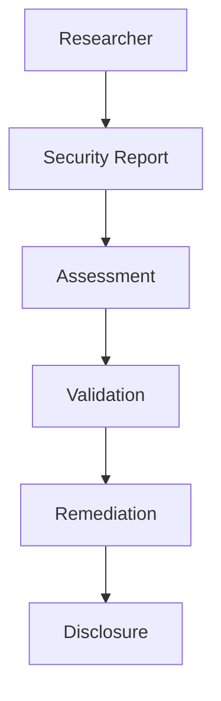

Enigm supports responsible security research and coordinated vulnerability disclosure. The objective is to improve platform security while protecting users, customer environments, and operational security.

This document is intended for security researchers, security auditors, enterprise customers, and technical partners.

## Overview

Responsible disclosure provides a professional process for reporting legitimate security concerns to Enigm.

The disclosure model is designed to:

- Support good-faith security research.
- Protect users while reports are assessed.
- Preserve confidentiality during validation and remediation.
- Encourage accurate technical reporting.
- Support coordinated security communication.

The diagram is conceptual and describes the responsible disclosure lifecycle.

## Security Research

Security researchers are encouraged to report legitimate security concerns.

Good-faith security research contributes to platform resilience by helping identify vulnerabilities, unsafe behaviors, or security gaps before they can affect users.

Research should be conducted responsibly and should avoid actions that disrupt services, access data without authorization, or expose other users to risk.

## Reporting Security Issues

Security issues should be reported through designated security reporting channels.

Use the [Security Contact](/legal/security-contact) page for current security communication details.

Reports should include enough information to support review, such as:

- Affected product or platform area.
- Description of the security concern.
- Potential impact.
- Safe reproduction information where appropriate.
- Relevant security context.

Do not include sensitive user data, credential material, or third-party confidential material unless specifically requested through an approved secure intake path.

## Disclosure Principles

Enigm responsible disclosure is guided by:

- Good faith.
- Confidentiality.
- Accuracy.
- Responsible communication.
- User protection.
- Coordinated remediation.
- Operational safety.

Reports should be handled in a way that supports technical validation while reducing unnecessary risk to users and systems.

## Investigation Process

Reported issues are reviewed, assessed, and prioritized according to risk.

Validated issues are tracked through remediation workflows. Assessment may consider impact, affected components, exploitability, user exposure, and available mitigations.

Public documentation describes the process at a governance level.

## Coordinated Disclosure

Enigm supports coordinated disclosure practices intended to balance transparency and user protection.

Coordinated disclosure may involve:

- Report validation.
- Remediation planning.
- Security update preparation.
- Advisory or communication planning where appropriate.
- Timing that reduces user risk.

Disclosure timing should be handled responsibly and should avoid exposing sensitive technical material before users can be protected.

## Good Faith Research

Good-faith research may include:

- Security testing.
- Vulnerability identification.
- Security analysis.
- Responsible reporting.

Good-faith research should respect user privacy, avoid disruption, and limit activity to the minimum necessary to demonstrate the security issue.

## Out-of-Scope Activities

The following activities are out of scope:

- Service disruption.
- Social engineering.
- Privacy violations.
- Unauthorized data access.
- Physical attacks against personnel.
- Attempts to access, modify, or destroy data belonging to others.
- Extortion, coercion, or threats.
- Public disclosure before coordinated handling.

This policy does not create a bug bounty program or imply monetary reward.

## Security Limitations

Not every report will necessarily result in a vulnerability finding.

Security assessments may require validation and reproduction before remediation decisions are made. Some reports may describe expected behavior, previously known issues, unsupported configurations, or risks outside Enigm control.

Responsible disclosure improves security collaboration, but it does not eliminate security risk or ensure that every vulnerability will be identified before exploitation.
