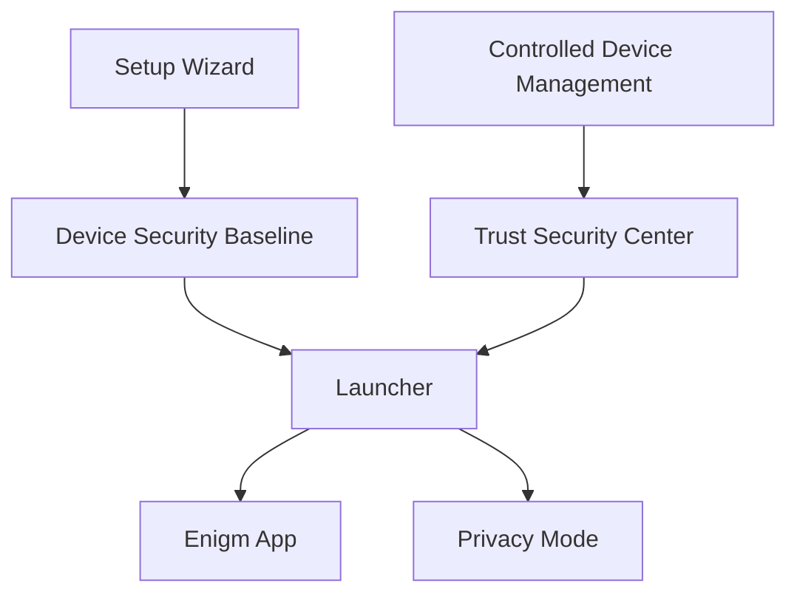

Enigm OS provides a controlled secure-device experience for users who require additional device trust, platform hardening, and operational security. This page consolidates onboarding, home experience, sensor privacy controls, and optional managed-device capabilities.

## Overview

Device experience and management cover four user-facing security layers:

- Setup Wizard for initial provisioning and secure baseline establishment.
- Launcher for security-oriented home experience and Trust visibility.
- Privacy Mode for fast-access camera and microphone blocking.
- Controlled Device Management for optional managed-device enrollment and remote operations.

## Setup Wizard

The Setup Wizard establishes a secure baseline before normal operation. The intended flow includes welcome, language and region, mobile connectivity, secure Wi-Fi, date and time, appearance, strong PIN setup, optional biometric enrollment, Privacy Mode introduction, terms and privacy, and transition into Enigm App.

Strong authentication is part of the baseline. The setup flow is designed to prevent weak credentials, prioritize authentication before normal use, and keep onboarding focused on Enigm platform functionality.

## Launcher

The Launcher is the primary security-oriented home experience for Enigm OS. It is not intended to behave like a general-purpose launcher.

The Launcher presents summarized Trust state from Trust Security Center, direct access to Enigm App, essential operational information, secure network state, Privacy Mode state, security notifications, and managed-device status where relevant. It does not calculate Trust itself.

User-visible Trust summaries include Device Protected, Device At Risk, and Protection Inactive.

## Privacy Mode

Privacy Mode provides rapid user control over sensitive sensor access. When active, camera access and microphone access are blocked.

Privacy Mode supports privacy assurance during normal operation, but it does not replace Device Trust, end-to-end encryption, secure messaging, operating-system hardening, or user security awareness.

## Controlled Device Management

Controlled Device Management is optional. Users can enroll a device into managed-device mode to enable lifecycle visibility and remote operations through Enigm Command.

Managed devices can report device integrity state, Trust state, security status, and management status. Remote wipe is intended for lost, stolen, or compromised devices. Remote wipe affects device access and lifecycle state; it does not provide access to protected content.

## Security and Privacy Boundaries

Trust reporting, Launcher visibility, Privacy Mode state, and managed-device operations are device-security controls. They do not inspect message content, media content, call content, attachments, documents, or user conversations.

Administrative device management remains separate from message confidentiality and protected key material.

See [Platform Limitations](/legal/limitations).
