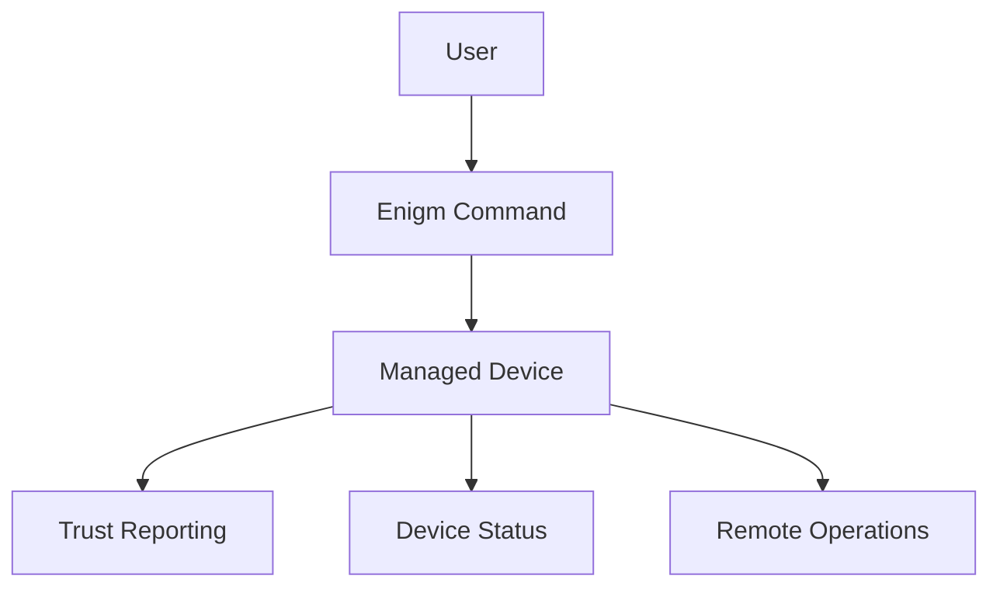

Enigm OS device management is an optional managed-device capability within the Enigm ecosystem. It is intended to let users manage trusted Enigm OS devices, review device posture, and perform supported lifecycle actions through explicit enrollment.

Device management is not mandatory for normal Enigm OS operation. Managed-device functionality becomes available only after explicit user enrollment.

## Overview

Device management provides an optional layer for managing enrolled Enigm OS devices through Enigm Command after the user enables managed-device mode.

Managed-device capabilities include:

- Device visibility.
- Device status.
- Device Trust state.
- Device lifecycle actions.
- Trust reporting.
- Remote operations.
- Remote wipe for enrolled managed devices.

Managed-device visibility is not message visibility. Device management does not provide access to Enigm App message plaintext.

## Design Objectives

Enigm OS device management is designed to:

- Support optional managed-device enrollment.
- Provide device lifecycle visibility.
- Support trusted device review.
- Surface Device Trust state.
- Support remote device operations for enrolled managed devices.
- Support remote wipe for lost, stolen, or compromised devices.
- Keep administrative control separate from message confidentiality.
- Preserve user choice for managed-device mode.

Device management supports operational control over enrolled devices without weakening Enigm App end-to-end encryption.

## Managed Device Model

Enigm OS supports an optional managed-device capability.

The goal is to allow users to manage trusted devices through the Enigm ecosystem. Managed-device mode can support visibility, lifecycle management, trust reporting, and remote operations for devices that users explicitly enroll.

Managed-device mode is not required for normal Enigm OS operation. A user may operate Enigm OS and Enigm App without enrolling the device into managed-device mode, subject to applicable deployment policy.

When the user activates managed-device mode, Enigm Command becomes the management surface for supported lifecycle actions.

## Device Enrollment

Enrollment is explicit.

Users may be offered managed-device enrollment after signing into the Enigm ecosystem. Enrollment is optional and should clearly communicate the capabilities that become available when managed-device mode is enabled.

Enrollment should establish that:

- The user has chosen managed-device mode.
- The device is associated with the user’s Enigm ecosystem context.
- Device status and trust reporting may become visible through supported management surfaces.
- Remote operations become available for enrolled managed devices according to managed-device policy.

Managed-device enrollment is separate from Enigm App account authentication and separate from message decryption.

## Device Trust Reporting

Managed devices may report security status information.

Examples of reported status categories include:

- Device integrity state.
- Trust state.
- Security status.
- Device management status.

Trust reporting exists to provide visibility, not message access.

Reported device state may support:

- User review of trusted devices.
- Enigm Command device visibility.
- Trust Security Center integration.
- Device lifecycle decisions.
- Managed device security review.

Device Trust reporting should be limited to security and lifecycle posture. It should not include message content, media content, call content, attachments, documents, or user conversations.

## Remote Device Operations

Managed devices support remote device operations according to managed-device policy.

Remote operations may include:

- Device lifecycle actions.
- Device status review.
- Trust state review.
- Managed device policy actions.
- Remote wipe initiation for enrolled managed devices.

Remote operations must remain bounded by the managed-Device Trust domain. Administrative device control does not imply access to Enigm App plaintext or user content.

## Remote Wipe

Managed devices support remote wipe functionality when remote wipe is enabled for the enrolled device.

Remote wipe is intended for lost, stolen, or compromised devices. It is a managed-device action designed to affect device access and reduce future risk from a device that should no longer be trusted.

Remote wipe:

- Is available only for enrolled managed devices with remote wipe enabled.
- Is intended to affect device access.
- Is intended to support device lifecycle security.
- Does not provide access to protected content.
- Does not bypass Enigm App end-to-end encryption.
- Does not recover message plaintext for administrators.

Remote wipe cannot provide assurance for content already exported, captured outside Enigm controls, or disclosed by authorized users before the action completes.

## Relationship With Enigm Command

Enigm Command acts as the management surface for enrolled Enigm OS managed devices.

Enigm Command provides:

- Device visibility.
- Device status.
- Device Trust state.
- Device lifecycle actions.
- Remote operation initiation for enrolled managed devices.
- Managed device review.

Enigm Command management functions must remain separate from message confidentiality. Administrative access to device status does not grant access to message plaintext.

## Relationship With Trust Security Center

Trust Security Center provides local Device Trust evaluation and posture visibility.

Managed-device workflows may use Trust Security Center state to support device reporting, lifecycle decisions, and security review. Trust Security Center may provide local posture signals, while Enigm Command may present management visibility for enrolled devices.

Trust Security Center does not inspect message content, and managed-device reporting must not convert trust visibility into plaintext access.

## Privacy Considerations

Device management should be limited to security and lifecycle information required for enrolled managed-device workflows.

Privacy considerations include:

- Enrollment is explicit.
- Managed-device mode is optional.
- Device reporting should avoid unnecessary identity metadata.
- Trust reporting should focus on device posture rather than user content.
- Administrative visibility should remain limited to device management and security state.
- Message content, media content, call content, attachments, documents, and user conversations must remain outside managed-device reporting.

Users should be able to understand what managed-device mode enables before enrollment.

See [Platform Limitations](/legal/limitations).
