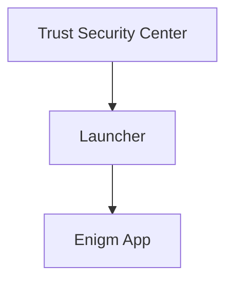

The Enigm OS Launcher is the primary security-oriented home experience of Enigm OS. It provides a reduced and controlled user surface focused on Device Trust visibility, essential operational information, and direct access to Enigm App.

The Launcher is not intended to function as a traditional general-purpose mobile launcher. It is designed as a secure entry point into the Enigm ecosystem.

This document is intended for Android engineers, security auditors, enterprise customers, and technical partners.

## Overview

The Launcher presents the primary home experience after Enigm OS setup. It is designed to keep the device experience focused on security posture, essential state, and Enigm App access.

The Launcher provides:

- Device Trust visibility.
- Security state visibility.
- Essential operational information.
- Direct access to Enigm App.
- A reduced and controlled user experience.

## Design Objectives

The Launcher is designed to:

- Provide a security-first home experience.
- Present summarized trust state consistently.
- Reduce unnecessary exposure of system functionality.
- Keep Enigm App as the primary user-facing application.
- Provide quick access to essential operational state.
- Avoid acting as a trust calculation engine.
- Support managed and controlled device experiences where enabled.

The Launcher should remain simple, predictable, and aligned with Enigm OS trust and privacy objectives.

## Security-First Home Experience

The Launcher prioritizes security state and Enigm ecosystem access over general-purpose customization.

Security-first design means:

- The user can see the current device protection state.
- The user can access Enigm App directly.
- Security-relevant notifications can be surfaced.
- Non-essential device surfaces are minimized.
- Trust visibility remains consistent across normal use.

This model is intended to reduce complexity and support operational clarity for users who rely on Enigm OS as a dedicated secure device platform.

## Device Trust Visibility

The Launcher consumes summarized trust state from Trust Security Center.

User-visible Launcher trust states are:

- Device Protected.
- Device At Risk.
- Protection Inactive.

The Launcher does not perform trust calculations. Trust calculations remain the responsibility of Trust Security Center.

### Trust Visibility

Trust visibility allows the Launcher to present whether the device appears to be operating in the expected Enigm OS security posture.

The mappings are:

- Protected -> Device Protected.
- Review Required -> Device At Risk.
- Inactive -> Protection Inactive.

These summaries are intended to help users understand whether the device is ready for sensitive workflows, requires attention, or cannot currently provide reliable trust visibility.

## Security Status Presentation

The Launcher may display security-relevant platform status such as:

- Device Trust state.
- Secure network status.
- Privacy mode state.
- Security notifications.
- Managed device status.

Security status presentation should be concise and should direct users to Trust Security Center for detailed findings.

The Launcher should not expose sensitive enforcement mechanics or low-level policy details. Its role is to present clear security posture, not to reveal how platform controls are evaluated.

## Relationship With Trust Security Center

Trust Security Center is responsible for trust evaluation.

The Launcher consumes the summarized state produced by Trust Security Center and presents it in the primary home experience. Detailed findings, recommendations, and trust explanations remain within Trust Security Center.

This separation keeps trust evaluation logic separate from home-screen presentation.

## Relationship With Enigm App

Enigm App remains the primary user-facing application in the Enigm ecosystem.

The Launcher acts as the secure entry point into Enigm App and the broader Enigm experience. It supports the device-level security context around Enigm App, but it does not replace Enigm App account workflows, secure messaging, secure calls, device association, or application-level cryptography.

## User Experience Principles

The Launcher user experience follows these principles:

- Security-first design.
- Reduced complexity.
- Controlled surface area.
- Consistent trust visibility.
- Direct access to Enigm App.
- Clear presentation of essential device state.
- Minimal exposure of non-essential system functionality.

### Reduced Attack Surface

The Launcher is designed to minimize unnecessary exposure of system functionality.

This is achieved conceptually through a reduced and controlled user surface, security-focused navigation, and prioritization of Enigm ecosystem workflows. The public documentation does not describe implementation-specific restrictions.

## Security Limitations

The Launcher is a security-oriented home experience, not a complete security control by itself.

Limitations include:

- It does not calculate trust state.
- It does not replace Trust Security Center.
- It does not replace Enigm App end-to-end encryption.
- It does not prevent unsafe user decisions.
- It does not ensure that all external systems are trustworthy.
- It does not remove risk from endpoint compromise.
- It does not provide message plaintext access.
- It does not make administrative state equivalent to message visibility.

The Launcher should be evaluated as a presentation and navigation layer within the Enigm OS security architecture. Device Trust remains dependent on Trust Security Center, Enigm OS security services, verified software state, policy compliance, and application-level controls.
