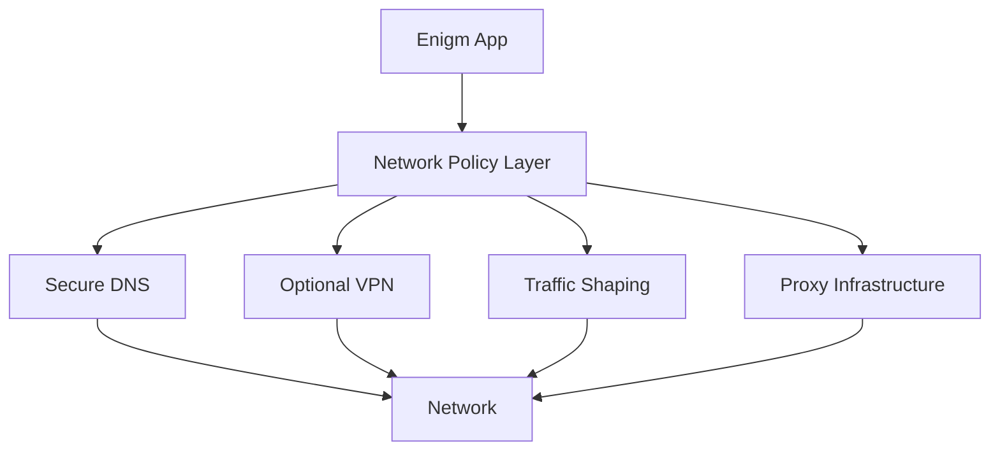

Enigm OS network policy defines how device networking is treated as a security and privacy control surface. The platform does not assume that networks are trustworthy, and it is designed to reduce exposure from monitored, hostile, or privacy-invasive network environments.

## Overview

Enigm OS approaches networking as a layered policy framework.

The network policy model covers:

- Network trust.
- DNS security.
- Transport protection.
- Network privacy.
- Metadata reduction.
- Network visibility reduction.
- Device networking controls.

The diagram is conceptual. It shows policy functions, not deployment topology.

## Design Objectives

The Enigm OS network policy is designed to:

- Treat local and public networks as untrusted by default.
- Reduce unnecessary network visibility.
- Protect name resolution through controlled secure-resolution policy.
- Support transport protection.
- Support metadata reduction objectives.
- Support traffic separation through platform controls.
- Provide device networking posture for Trust Security Center.
- Keep network controls separate from message plaintext.

Network policy is a complementary security layer. It does not replace Enigm App end-to-end encryption, protected key material, trusted device association, or user verification workflows.

## Network Trust Model

Enigm OS does not assume that networks are trustworthy.

The platform is designed around the assumption that:

- Local networks may be monitored.
- Public networks may be hostile.
- Network operators may observe traffic patterns.
- Intermediate network observers may attempt correlation using timing, frequency, or traffic volume.

Because of this model, Enigm OS network policy focuses on reducing exposure, enforcing secure defaults, and supporting privacy-preserving network paths where available.

Network trust is not equivalent to Device Trust. A device may be trusted while connected to an untrusted network, and network controls should continue to operate independently of the user’s current network environment.

## Secure Name Resolution

Secure name resolution is part of the Enigm OS network security model.

The model includes:

- Encrypted DNS.
- Controlled DNS policy.
- Trusted resolver model.
- Protection against simple DNS observation.
- Reduced exposure of name resolution behavior to local network observers.

Secure name resolution is intended to reduce the visibility of DNS queries and lower confidence in simple observation-based inference. It does not provide complete protection against all network-level analysis.

Public documentation describes the resolver model conceptually and avoids publishing deployable network parameters.

## Transport Protection

Transport protection reduces exposure between the device and supported services.

Transport protection may include:

- Encrypted transport for supported communication paths.
- Network policy enforcement.
- Optional VPN usage.
- Proxy infrastructure for traffic separation.
- Controls that reduce unnecessary direct exposure.

Transport protection is separate from Enigm App message confidentiality. Enigm App secure messaging and secure calls rely on application-level security and protected key material.

## Network Privacy

Network privacy in Enigm OS is based on layered controls.

Relevant controls include:

- Network-layer protections.
- Traffic separation.
- Transport protection.
- Metadata reduction goals.
- Secure name resolution.
- Optional VPN use.
- Proxy infrastructure.

These controls are designed to reduce exposure to local network observers, public network environments, and intermediate traffic analysis. They should be evaluated as privacy-enhancing controls, not as absolute privacy or traceability claims.

## Metadata Reduction

Metadata reduction is a core objective of the network policy model.

Enigm OS uses controls intended to reduce the amount, precision, or reliability of observable network metadata. These controls affect direct exposure, timing confidence, name resolution visibility, and correlation reliability.

### Traffic Analysis Considerations

The platform uses traffic-shaping techniques and additional network activity designed to reduce the reliability of simple communication-pattern analysis.

Traffic shaping is a complementary privacy control. It is intended to:

- Reduce confidence in basic timing-correlation techniques.
- Mitigate simple communication-pattern inference.
- Increase difficulty for observers attempting to map traffic bursts to user conversations.
- Lower confidence in analysis based on connection frequency or traffic timing.

Traffic shaping does not eliminate advanced traffic analysis or provide absolute traceability protection. Additional network activity should not be interpreted as proof of active user communication.

Communication confidentiality continues to rely on Enigm App end-to-end encryption and protected key material.

## Relationship With Enigm App

Enigm App remains the primary user-facing product in the Enigm ecosystem.

Enigm OS network policy can strengthen the network environment around Enigm App, but it does not replace application-level security. Secure messaging and secure calls depend on end-to-end encryption, protected key material, device association, and verification workflows.

Network policy does not provide access to message plaintext and does not inspect message content.

## Relationship With VPN

VPN is an optional network privacy and transport protection layer.

VPN and end-to-end encryption solve different problems:

- VPN can reduce visibility from local or intermediate network observers.
- End-to-end encryption protects message content between trusted endpoints.

VPN and traffic shaping are complementary controls. VPN may protect transport paths, while traffic shaping may reduce confidence in simple timing-based inference. Neither control makes a compromised endpoint trustworthy.

## Relationship With Proxy Infrastructure

Proxy infrastructure provides traffic separation and additional privacy boundaries.

Within the Enigm ecosystem, proxy infrastructure supports:

- Reduced direct exposure between devices and platform services.
- Traffic separation objectives.
- Metadata reduction objectives.
- Additional privacy boundaries.

Proxy infrastructure is separate from Enigm App encryption and does not replace protected key material or Device Trust.

## Relationship With Trust Security Center

Trust Security Center evaluates network policy compliance as part of device posture.

Network-related trust signals may include:

- Secure name resolution state.
- Protected network state.
- Policy compliance state.
- Optional VPN posture.
- Security service status.

Trust Security Center does not inspect message content, media content, call content, attachments, documents, or user conversations. Trust evaluates device and policy signals rather than user content.

See [Platform Limitations](/legal/limitations).
