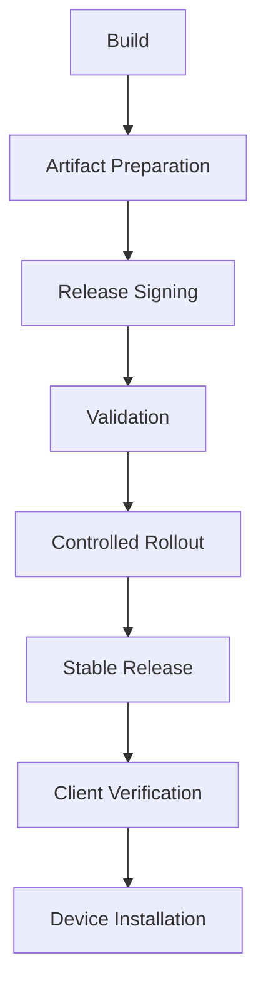
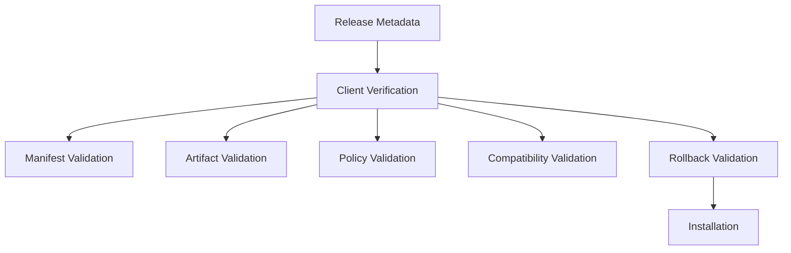

Enigm OS OTA Architecture securely delivers trusted software updates to eligible devices through controlled release governance, update verification, and staged rollout.

This page consolidates the OTA overview, release lifecycle, and client verification responsibilities.

## Overview

Enigm OS OTA is the controlled update architecture for delivering trusted software updates to eligible devices. OTA updates are part of the Enigm OS security model because Device Trust depends on software authenticity, software integrity, device eligibility, and governed rollout behavior.

## Design Objectives

OTA Architecture is designed to support:

- Secure software delivery.
- Controlled update distribution.
- Release authenticity.
- Release integrity.
- Device eligibility.
- Update trust.
- Rollout governance.
- Independent client verification before installation.

OTA delivery does not replace release signing, artifact verification, client-side validation, Device Trust, or production gates.

## OTA Purpose

OTA exists to securely deliver trusted software updates to eligible devices.

The architecture is designed to ensure that devices receive software released through authorized Enigm release workflows and that devices verify release authenticity, integrity, and policy compliance before accepting an update.

## Secure Software Delivery

Secure software delivery combines release governance, signing, validation, eligibility checks, rollout control, and device-side verification.

Secure delivery depends on:

- Authorized release workflows.
- Release metadata verification.
- Artifact integrity validation.
- Device eligibility.
- Rollout policy.
- Client verification.

## OTA Architecture

The OTA architecture separates release preparation, eligibility evaluation, device verification, and installation.

These functions are separate security responsibilities rather than a single trust decision.

## Release Objectives

OTA releases move through a controlled lifecycle before broad availability. The release lifecycle exists to reduce deployment risk, preserve software integrity, and maintain release accountability.

Release objectives include:

- Software authenticity.
- Release integrity.
- Compatibility validation.
- Rollout governance.
- Device eligibility enforcement.
- User and platform resilience.

## Release Stages

The release lifecycle is organized conceptually as:

1. Build creation.
2. Artifact preparation.
3. Manifest creation.
4. Release signing.
5. Release registration.
6. Validation.
7. Controlled rollout.
8. Stable release.
9. Device installation.

Each stage contributes to release governance. No single stage should be treated as sufficient to establish full update trust.

## Validation Process

Validation includes:

- Artifact integrity checks.
- Release verification.
- Eligibility verification.
- Device compatibility validation.
- Rollout policy validation.

Validation reduces deployment risk before a release is made broadly available.

## Rollout Strategy

OTA supports staged rollout models, including:

- Draft.
- Validation.
- Limited rollout.
- Stable rollout.
- Security rollout.

Not every eligible device receives a release simultaneously. Controlled rollout supports operational safety, compatibility review, and security prioritization.

## Device Eligibility

Not every device automatically receives every release.

Eligibility can depend on:

- Device identity.
- Device integrity.
- Enrollment status.
- Release channel.
- Rollout policy.
- Remote Attestation.
- Build compatibility.
- Device compatibility.

Device eligibility is separate from artifact verification. A device can be eligible for a release and still be required to verify release metadata and artifact integrity before installation.

## Device Installation

Eligible devices:

- Discover releases.
- Verify release authenticity.
- Verify release integrity.
- Verify policy requirements.
- Validate compatibility.
- Enforce rollback constraints.
- Install updates.

Installation should occur only after required checks succeed.

## Client Verification

The OTA client acts as an independent verification layer before software installation. The client must not blindly trust update availability information.

The client verifies:

- Release authenticity.
- Release integrity.
- Device eligibility.
- Policy compliance.
- Update compatibility.
- Rollback policy.

## Manifest Verification

The client verifies:

- Manifest authenticity.
- Manifest integrity.
- Release authorization.

The client rejects invalid, untrusted, or modified manifests.

## Artifact Verification

The client verifies:

- Artifact integrity.
- Expected hashes.
- Release consistency.

The client rejects corrupted artifacts, unexpected artifacts, and integrity failures.

## Policy Verification

The client verifies:

- Device eligibility.
- Release channel.
- Expiration policies.
- Rollout policies.
- Compatibility requirements.

Policy verification ensures that technically valid artifacts are still appropriate for the requesting device and release context.

## Rollback Protection

The client enforces rollback constraints where applicable. The client should not install releases that violate rollback policy.

Rollback protection supports software integrity by preventing devices from accepting releases that conflict with update policy or security requirements.

## Release Governance

Release publication is governed by:

- Signing requirements.
- Validation requirements.
- Eligibility controls.
- Rollout controls.
- Verification gates.

Release signing authorizes releases. Release lifecycle governs deployment. Client verification validates release acceptance before installation. These functions serve different purposes.

## Relationship With Trust Security Center

Trust Security Center evaluates local device integrity.

OTA evaluates release eligibility and software delivery.

These systems are related but serve different purposes. Trust Security Center can reflect local posture after update installation, while OTA governs update delivery and verification.

## Relationship With Remote Attestation

Remote Attestation contributes additional eligibility signals before protected releases are exposed.

Remote Attestation complements OTA security controls and can help determine enrollment, metadata access, artifact access, channel access, and rollout eligibility.

Client verification remains necessary even when Remote Attestation is used.

## Relationship With Release Signing

Release signing authorizes releases.

Release lifecycle governs release deployment.

Client verification validates acceptance before installation.

These functions remain separate so that delivery, authorization, eligibility, and installation do not collapse into one control.

## Relationship With OTA Security

OTA Architecture depends on:

- Transport authentication.
- Request validation.
- Manifest verification.
- Artifact verification.
- Device eligibility.
- Remote Attestation.
- Hardware-Backed Signing.
- Rollout controls.

The deeper security model is documented in [OTA Security](/os/ota-security).

## Limitations

See [Platform Limitations](/legal/limitations).
