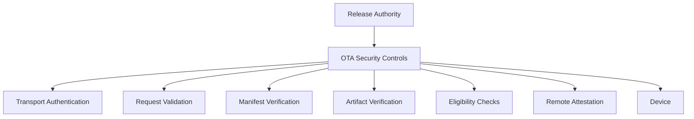
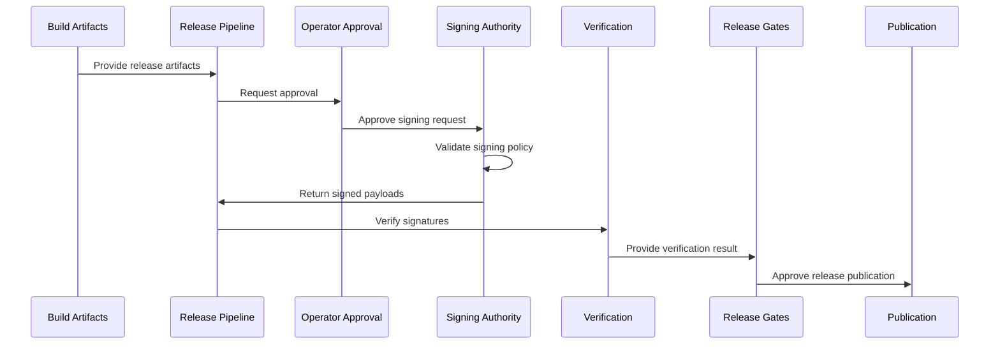
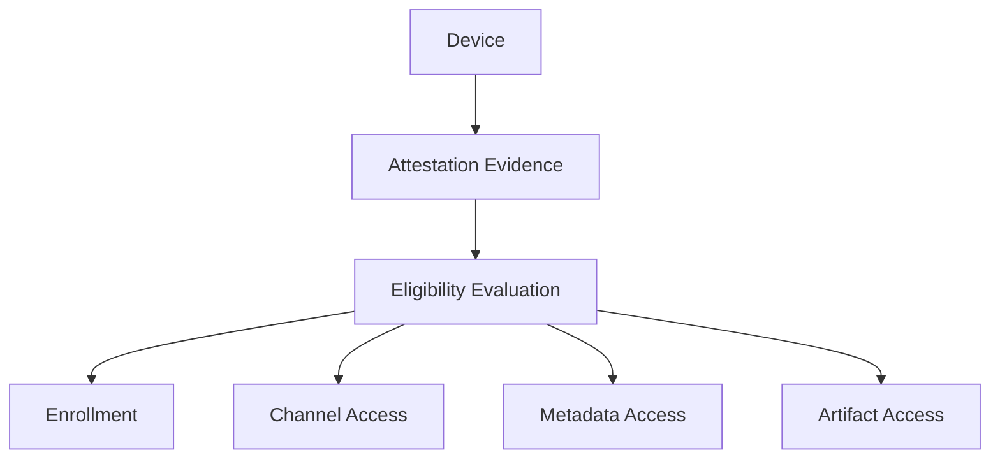

Enigm OS OTA security is a layered defense architecture. It relies on multiple independent controls across transport authentication, request validation, manifest trust, artifact verification, Device Eligibility, Remote Attestation, and Hardware-Backed Signing.

This page consolidates the OTA security model, signing architecture, and Remote Attestation model.

## Overview

OTA security reduces software delivery risk by separating release authority, request handling, metadata trust, artifact integrity, device eligibility, and device-side verification.

The diagram describes security responsibilities rather than implementation topology.

## Security Objectives

OTA security is designed to support:

- Release authenticity.
- Release integrity.
- Device eligibility.
- Request authentication.
- Replay resistance.
- Rollout governance.
- Software supply chain risk reduction.
- Privacy-preserving device correlation.
- Independent verification before installation.

## Defense-In-Depth Model

OTA security relies on multiple independent controls. No single control should be treated as sufficient.

### Layer 1: Transport Authentication

Transport authentication protects communication channels and reduces network tampering risk.

This layer supports:

- Authenticated transport.
- Protected communication channels.
- Request authentication.

Transport authentication alone is not sufficient to establish release trust.

### Layer 2: Request Verification

Request verification ensures that OTA requests are validated before release information is returned.

This layer supports:

- Request validation.
- Freshness validation.
- Replay resistance.
- Request integrity.

Request verification is evaluated with Device Trust, OTA Eligibility, and Remote Attestation when device-integrity evidence is required.

### Layer 3: Manifest Trust

Manifest trust protects release metadata.

This layer supports:

- Signed release metadata.
- Release authenticity.
- Release authorization.

Manifest verification does not replace artifact verification.

### Layer 4: Artifact Verification

Artifact verification protects the update payload.

This layer supports:

- Hash verification.
- Integrity validation.
- Corruption detection.

Artifact integrity reduces risk from corrupted or modified update content. It does not replace production signing or device eligibility.

### Layer 5: Device Eligibility

Device eligibility determines whether a device should receive a given release.

This layer supports:

- Enrollment status.
- Device Trust.
- Channel eligibility.
- Rollout policy.

Device eligibility is separate from artifact verification.

### Layer 6: Remote Attestation

Remote Attestation is an additional eligibility signal.

This layer supports:

- Device integrity validation.
- Enrollment verification.
- Protected metadata access decisions.
- Private artifact access decisions.
- Sensitive rollout channel decisions.

Remote Attestation complements OTA controls; it does not make unsigned metadata, unsigned artifacts, weak transport authentication, or uncontrolled rollout policy acceptable.

### Layer 7: Production Signing

Production signing establishes trusted release origin.

This layer supports:

- Release authorization.
- Hardware-Backed Signing.
- Trusted release origin.

Production signing is a release authenticity control. OTA delivery does not replace signing, and devices should only treat releases as trusted when required verification succeeds.

## Signing Authorities

Enigm OS separates signing authorities by purpose.

### Current Authority: OTA Manifest Signing Authority

The OTA Manifest Signing Authority authorizes OTA manifests and release metadata.

This authority is responsible for:

- Manifest authorization.
- Metadata authorization.
- Release metadata authenticity.
- Approval evidence for OTA release metadata.

This authority is not the same as the target production release-signing authority.

### Target Authority: Production Release-Signing Authority

The Production Release-Signing Authority is the target authority for production image and release artifact signing.

This authority is intended to be responsible for:

- Production image signing.
- OTA payload signing.
- Signing-critical release artifacts.
- Production release authorization.

This authority is intended to operate through a dedicated physical HSM and must remain distinct from the OTA Manifest Signing Authority.

## Current Production OTA Manifest Signing Model

The current Enigm OS OTA model uses PIV-backed hardware security key offline manifest signing.

This model provides:

- Hardware-backed offline signing.
- Physical operator participation.
- Non-exportable key material.
- Manifest and metadata authorization.
- Separation from release-signing workflows.

The current model authorizes OTA manifests and metadata. It provides release authenticity for the manifest layer, not full production image signing authority.

### Protected Signing Material

The manifest signing key must not be stored in Git repositories, CI/CD variables, build scripts, developer workstations, online object storage, or release artifacts.

The signing authority remains hardware-backed and operator-mediated. Systems that prepare manifests can request signing, but they must not gain access to private key material.

## Target Production HSM Release-Signing Architecture

The target Enigm OS production release-signing architecture is designed to use a dedicated physical HSM.

The target architecture is intended to support:

- Non-exportable production keys.
- Release authorization.
- Production image signing.
- OTA payload signing.
- Signing-critical release artifacts.

Intended production governance capabilities include:

- Dual control.
- Multi-party approval.
- Audit logs.
- Key ceremonies.
- Secure backup procedures.
- Release governance.

The target Production Release-Signing Authority is not the same authority as the current OTA Manifest Signing Authority. The target authority is intended to act as the release authorization root of trust for production artifacts.

## Production Signing Trust Boundary

Production signing has a clear trust boundary.

### Inside The Trust Boundary

- Physical HSM.
- Non-exportable private keys.
- Approved signing policies.
- Authenticated operators.
- Audit records.
- Key ceremonies.

### Outside The Trust Boundary

- Build systems.
- CI runners.
- Artifact repositories.
- OTA services.
- Developer workstations.
- Source repositories.
- Release scripts.

Systems outside the trust boundary can request signatures but must never access private keys.

## Signing Flow

The conceptual signing flow is:

1. Build artifacts are produced.
2. Release pipeline prepares signing payloads.
3. Operator approval occurs.
4. Signing authority validates policy.
5. Signing authority signs.
6. Verification occurs.
7. Release gates execute.
8. Release is published.

## Remote Attestation

Remote Attestation supports eligibility decisions based on device-produced security evidence.

Within the Enigm OS OTA model, Remote Attestation helps determine whether a device is eligible to:

- Enroll.
- Register.
- Access protected update metadata.
- Receive private update artifacts.
- Access sensitive rollout channels.

Remote Attestation is a production eligibility control for selected protected workflows. This documentation does not claim that every production device is attested on every request.

## Attestation Evidence

Attestation evidence can include:

- Hardware-backed device identity signals.
- Device integrity signals.
- Verified software state.
- Device lock state.
- Build identity.
- Patch level.
- Device model.
- Device eligibility.
- Freshness signals.

Attestation evidence is interpreted as security evidence for eligibility decisions. It is not a substitute for manifest verification, artifact verification, or release signing.

## Verification Requirements

Backend verification requirements include:

- Attestation authenticity.
- Certificate chain validity.
- Root of trust.
- Device integrity.
- Enrollment binding.
- Privacy-Preserving Device Handle binding.
- Freshness.
- Channel eligibility.
- Device eligibility.

Conceptual rejection conditions include invalid trust chain, unsupported device, ineligible build, stale attestation, replay attempt, or eligibility failure.

## Replay Protection

Attestation evidence is freshness-sensitive.

The server can require:

- Nonce.
- Challenge-response.
- Transaction binding.

Freshness controls reduce risk from reused evidence. Replay protection is evaluated together with request authentication, request integrity, and device eligibility.

## Relay Protection

A valid attestation proves that eligible hardware produced the evidence. It does not automatically prove that the current requester is the same enrolled device.

Additional bindings can include:

- Enrollment binding.
- Device handle binding.
- Transport identity binding.
- Request binding.

Relay protection reduces risk where valid evidence is forwarded, reused, or presented outside the expected device context.

## Privacy Model

OTA security uses Privacy-Preserving Device Handles for device correlation and minimizes device telemetry required for eligibility.

OTA security is not intended to collect:

- Message content.
- Media content.
- Contact data.
- User behavior telemetry.
- User conversations.
- Private key material.

Long-term storage should prefer policy outcomes rather than raw attestation payloads.

## Threat Model

OTA signing and security controls are intended to mitigate:

- Private key theft.
- CI compromise.
- Developer workstation compromise.
- Repository compromise.
- Unauthorized signing.
- Test-key misuse.
- Artifact replacement.
- Modified release metadata.
- Replay of stale eligibility evidence.

Residual risks include:

- Malicious source code.
- Authorized operator abuse.
- Misconfigured policy.
- Verification defects.
- Signing authority compromise.
- Vulnerable software released through authorized processes.
- Future unknown vulnerabilities.

Hardware-Backed Signing reduces key exposure and supports release authorization, but it does not prove that released software is free of defects or malicious logic introduced before signing.

## Relationship With Trust Security Center

Trust Security Center evaluates local integrity.

Remote Attestation evaluates OTA Eligibility.

These systems serve different purposes:

- Trust Security Center provides local device posture visibility.
- Remote Attestation provides server-evaluated eligibility evidence for selected workflows.

## Relationship With OTA Architecture

OTA Architecture governs release lifecycle, rollout, client verification, and installation flow.

OTA Security defines the layered controls that protect release trust, eligibility, signing, and attestation.

See [OTA Architecture](/os/ota-architecture).

## Limitations

See [Platform Limitations](/legal/limitations).
