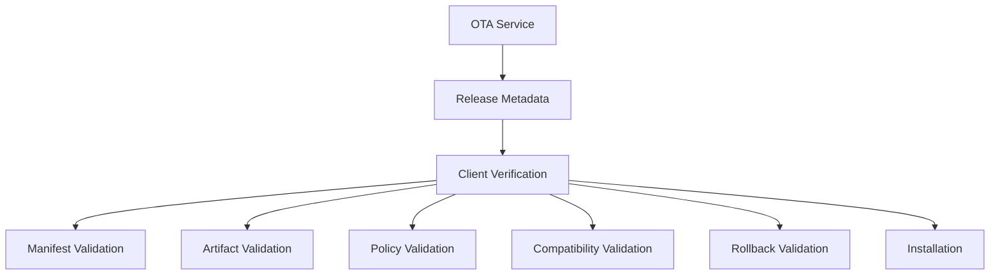

The Enigm OS OTA client acts as an independent verification layer before software installation. The client must not blindly trust update availability information.

The OTA client is responsible for validating release authenticity, integrity, eligibility, policy compliance, and compatibility before accepting an update for installation.

This document is intended for Android engineers, security auditors, enterprise customers, and technical partners.

## Overview

The OTA client verifies whether an available release should be trusted and installed on the device.

The client should verify release authenticity, release integrity, and policy compliance before accepting an update.

The diagram is conceptual and describes client-side verification responsibilities.

## Verification Objectives

The client should validate:

- Release authenticity.
- Release integrity.
- Device eligibility.
- Policy compliance.
- Update compatibility.

Client verification is intended to ensure that release availability, rollout eligibility, and installation trust are not treated as the same decision.

## Device Eligibility Validation

The OTA client should verify whether the update applies to the local device before installation.

The client should verify:

- Device compatibility.
- Build compatibility.
- Release channel compatibility.
- Enrollment requirements.
- Update applicability.

Device eligibility validation helps prevent installation of releases that are not intended for the device, deployment context, or release channel.

## Manifest Verification

The OTA client should verify release metadata before relying on it.

The client should verify:

- Manifest authenticity.
- Manifest integrity.
- Release authorization.

The client should reject:

- Invalid manifests.
- Untrusted manifests.
- Modified manifests.

Manifest verification supports trust in release metadata. It does not replace artifact verification.

## Artifact Verification

The OTA client should verify update artifacts before installation.

The client should verify:

- Artifact integrity.
- Expected hashes.
- Release consistency.

The client should reject:

- Corrupted artifacts.
- Unexpected artifacts.
- Integrity failures.

Artifact verification is intended to ensure that the update content matches the authorized release metadata.

## Policy Verification

The OTA client should verify release policy requirements before installation.

The client should verify:

- Device eligibility.
- Release channel.
- Expiration policies.
- Rollout policies.
- Compatibility requirements.

Policy verification helps ensure that a release is not installed outside its approved eligibility, timing, channel, or compatibility constraints.

## Rollback Protection

The OTA client should enforce rollback constraints for releases subject to rollback policy.

The client should not install releases that violate rollback policy.

Rollback protection is intended to reduce risk from downgrades to older or less secure software states. It should be evaluated alongside verified boot, update policy, and device-side installation controls.

## Relationship With Remote Attestation

Remote Attestation contributes server-side eligibility decisions.

Client verification remains necessary even when Remote Attestation is used.

Remote Attestation may help determine whether release metadata or artifacts should be exposed to a device. The client must still verify manifest trust, artifact integrity, policy requirements, compatibility, and rollback constraints before installation.

## Security Limitations

Client verification reduces update installation risk, but it does not eliminate all software supply-chain or device risk.

Client verification does not eliminate:

- Authorized but vulnerable releases.
- Future unknown vulnerabilities.
- Compromised trusted software supply chains.
- Malicious source changes approved before signing.
- Verification defects.
- Unsafe user decisions after installation.

Additional limitations:

- Client verification depends on correct verifier behavior.
- Server-side eligibility does not replace client-side checks.
- Manifest verification does not replace artifact verification.
- Artifact integrity does not prove that released software is defect-free.
- Rollback policy does not protect against all post-installation risk.
- Client verification does not provide message plaintext access.

Client verification should be evaluated as part of the Enigm OS OTA defense-in-depth model, alongside transport authentication, request validation, manifest trust, artifact integrity, device eligibility, Remote Attestation, release signing, and verified boot.
